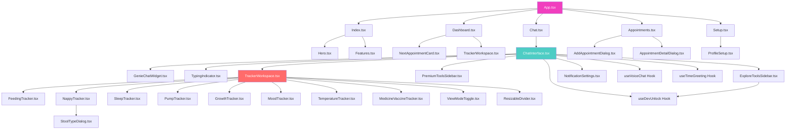
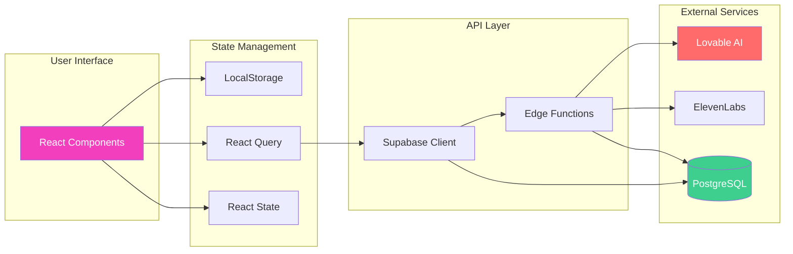
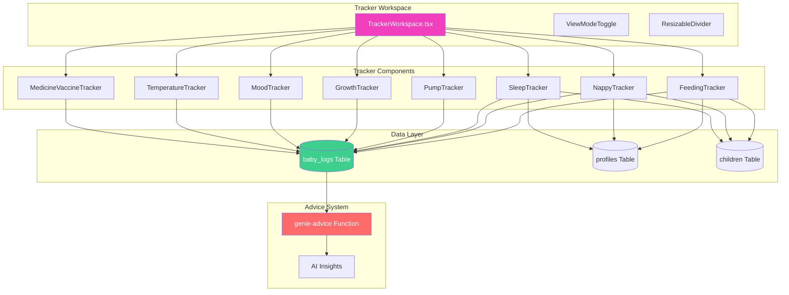
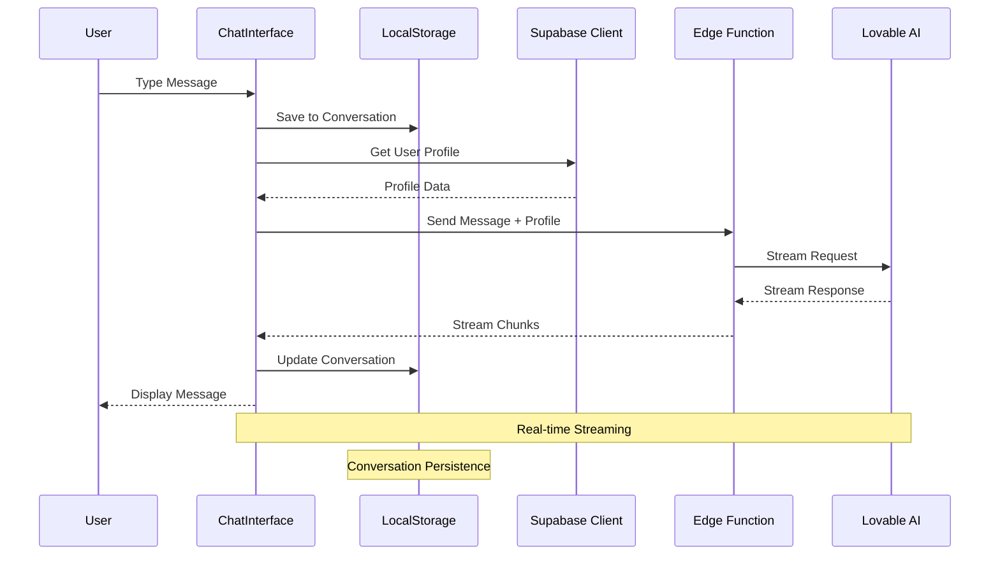
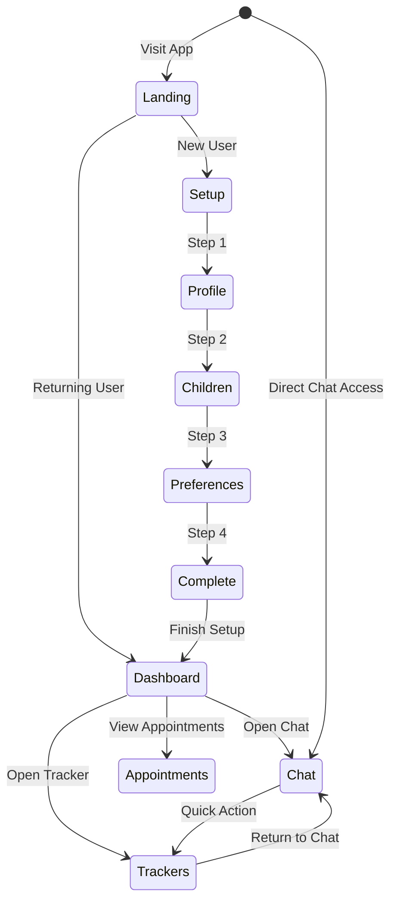
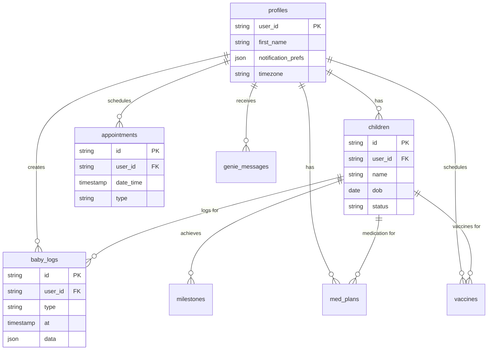
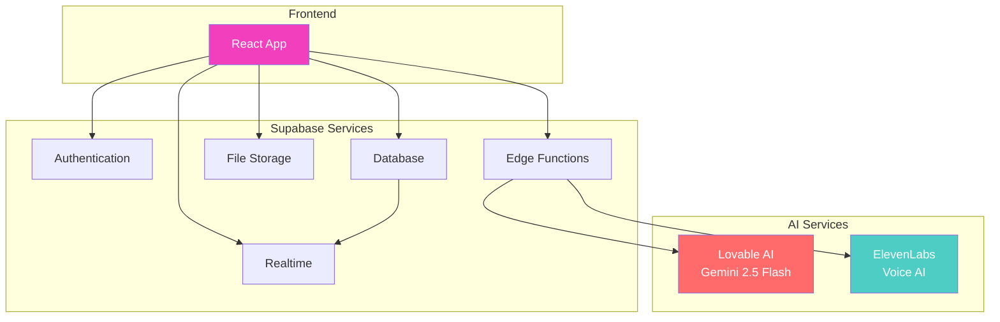

# Component Architecture & Relationships

## Component Dependency Graph

## Data Flow Diagram

## Tracker System Architecture

## Chat System Flow

## Authentication & User Flow

## Database Relationships

## Key Integration Points

---

## Component Categories

### **Page Components (6)**
- Index, Dashboard, Chat, Appointments, Setup, NotFound

### **Core UI Components (18)**
- ChatInterface, TrackerWorkspace, ProfileSetup, MilestoneTracker, etc.

### **Tracker Components (8)**
- All specialized tracker components

### **Appointment Components (3)**
- Add, Detail, Card components

### **Custom Hooks (3)**
- useVoiceChat, useTimeGreeting, useDevUnlock

### **Utility Libraries (5)**
- bubbles, celebration, floatingHearts, genieAdvice, utils

### **Backend Functions (5)**
- chat, dashboard-insights, elevenlabs-session, genie-advice, medicine-reminders

---

**Total Components: ~46 major components/files**

