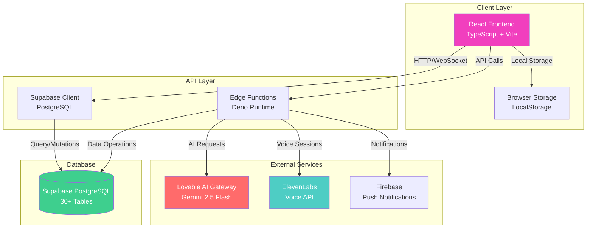
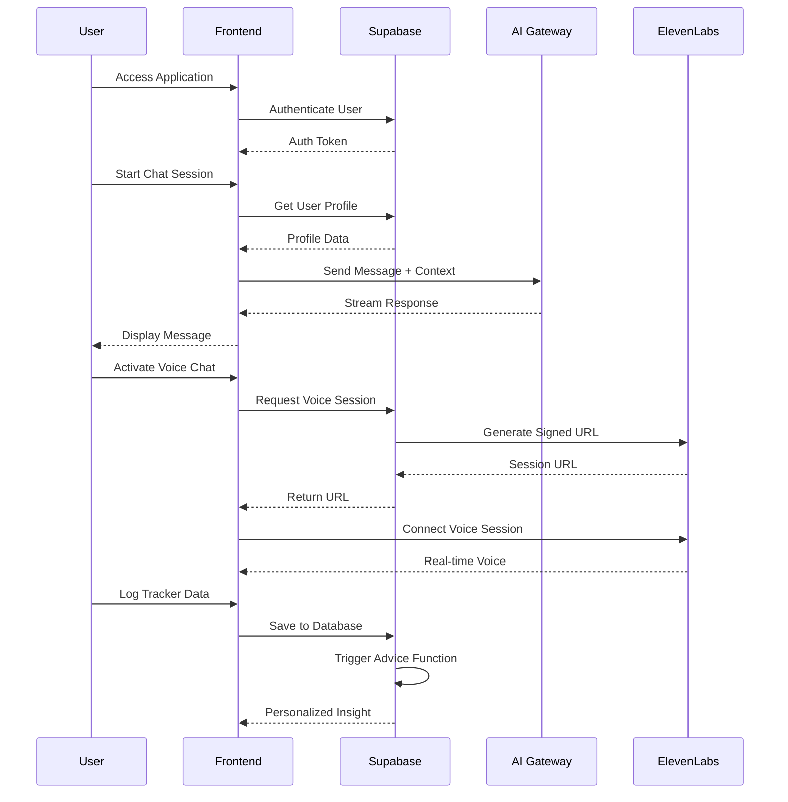
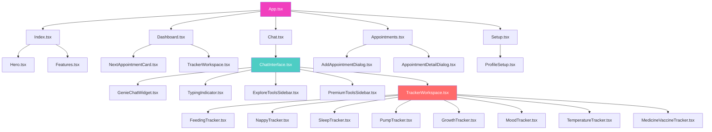
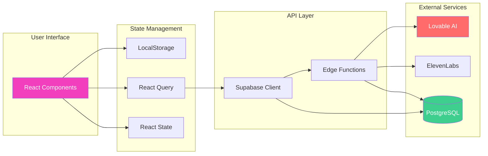
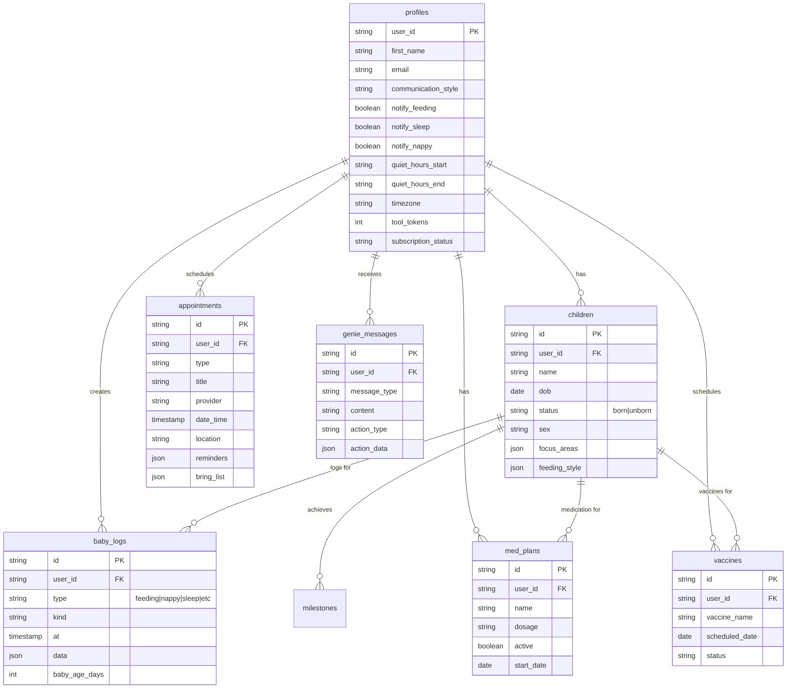

# Parenting Genie - AI-Powered Parenting Assistant

<div align="center">


**Your Personal 24/7 AI Parenting Assistant**

From pregnancy through age 5 • Voice-activated • Personalized guidance • Comprehensive tracking

[Features](#-features) • [Architecture](#-architecture) • [Getting Started](#-getting-started) • [Documentation](#-documentation)

</div>

---

## 📋 Table of Contents

- [Overview](#-overview)
- [Features](#-features)
- [Technology Stack](#-technology-stack)
- [Architecture](#-architecture)
- [Project Structure](#-project-structure)
- [Getting Started](#-getting-started)
- [Development](#-development)
- [API Documentation](#-api-documentation)
- [Database Schema](#-database-schema)
- [Deployment](#-deployment)
- [Contributing](#-contributing)
- [License](#-license)

---

## 🎯 Overview

**Parenting Genie** is a comprehensive, AI-powered parenting assistant application designed to support parents from pregnancy through their child's first 5 years. The application combines real-time tracking, AI-powered chat assistance, voice activation, appointment management, and personalized insights to provide evidence-based guidance and support.

### Key Highlights

- 🤖 **AI-Powered Assistant**: 24/7 chat support with personalized responses using Gemini 2.5 Flash
- 🎤 **Voice Activation**: Hands-free "Hey Genie" voice commands via ElevenLabs
- 📊 **8 Comprehensive Trackers**: Feeding, Nappy, Sleep, Pump, Growth, Mood, Temperature, Medicine & Vaccines
- 📅 **Appointment Management**: Schedule, track, and manage medical appointments
- 📱 **Real-time Dashboard**: AI-generated insights and tracker summaries
- 👤 **Multi-Child Support**: Track multiple children with personalized profiles
- 🔔 **Smart Notifications**: Customizable reminders and quiet hours

---

## ✨ Features

### 🤖 AI Chat Assistant (Genie)

- **24/7 Availability**: Always-on parenting support
- **Personalized Responses**: Context-aware advice based on user profile, children's ages, and preferences
- **Multi-Conversation Support**: Manage multiple chat threads with localStorage persistence
- **Streaming Responses**: Real-time AI response streaming for better UX
- **Action Buttons**: Quick access to trackers from chat responses
- **Message History**: Persistent conversation history

**Response Format:**

- Bullet points for easy reading
- Maximum 150 words per response
- 1-2 gentle emojis (🌸, 💕, 👶)
- Empathetic and encouraging tone

### 🎤 Voice Chat Integration

- **Hands-Free Activation**: "Hey Genie" voice commands
- **ElevenLabs Integration**: Conversational AI voice assistant
- **Real-time Transcription**: Voice-to-text and text-to-voice
- **Microphone Controls**: Volume and permission management

### 📊 Tracker System (8 Trackers)

#### 1. **Feeding Tracker**

- Track breastfeeding, bottle, and formula feeding
- Timer functionality for active feeds
- Volume tracking (ml/oz)
- Age-based feeding expectations
- Health alerts (dehydration warnings)
- Daily/weekly statistics

#### 2. **Nappy Tracker**

- Track wet, dirty, and both nappy changes
- Stool type classification (normal, loose, constipated, mucus/blood)
- Age-based expectations (wet/dirty counts)
- Progress tracking vs. expected values
- Stool log history with collapsible view
- Health alerts (hydration, bowel movement warnings)

#### 3. **Sleep Tracker**

- Track sleep sessions with start/end times
- Timer for active sleep sessions
- Total sleep hours calculation
- Age-based wake window recommendations
- Sleep pattern visualization
- Nap vs. night sleep tracking

#### 4. **Pump Tracker**

- Track pumping sessions
- Volume tracking (ml/oz)
- Left/right side tracking
- Daily totals and averages
- Pumping reminders
- Supply tracking over time

#### 5. **Growth Tracker**

- Weight, height, head circumference tracking
- Growth charts visualization
- Percentile calculations
- Age-based growth expectations
- Historical growth data
- Photo attachments

#### 6. **Mood Tracker**

- Baby mood tracking (happy, fussy, calm, etc.)
- Parent mood tracking
- Mood patterns over time
- Correlation analysis
- Daily mood summaries

#### 7. **Temperature Tracker**

- Temperature readings (Celsius/Fahrenheit)
- Fever detection and alerts
- Symptom tracking
- Medication correlation
- Temperature history
- Health alerts for high temperatures

#### 8. **Medicine & Vaccine Tracker**

- Medicine schedule management
- Dose tracking and reminders
- Vaccine schedule tracking
- Upcoming vaccine notifications
- Medication history
- Dosage calculations
- Automated reminder system

### 📅 Appointment Management

- Create, edit, and delete appointments
- Multiple appointment types (Pediatrician, MCHN, Lactation, Vaccine, etc.)
- Reminder system with customizable notifications
- Bring list management
- Check-in functionality
- Location and contact information
- Past/upcoming appointment filtering

### 📱 Dashboard & Insights

- Real-time tracker summaries (all 8 trackers)
- AI-generated daily insights based on tracker data
- Next appointment display
- Baby information card
- Quick access to all trackers
- Visual progress indicators
- Personalized recommendations

### 👤 Profile & Setup

- Multi-step onboarding (4 steps)
- Multi-child profile support
- Born vs. unborn child tracking
- Pregnancy information (for expecting parents)
- Communication preferences
- Notification settings
- Profile picture uploads
- Focus areas selection

### 🎯 Additional Features

- **Milestone Tracker**: Age-appropriate milestone tracking with photos
- **Formula Calculator**: Formula preparation calculations
- **Tips & Advice System**: Daily personalized tips based on tracker data
- **Notification System**: Per-tracker notification toggles with quiet hours
- **Premium Tools Integration**: Token-based access to external tools
- **Dev Unlock Mode**: Development testing features

---

## 🛠 Technology Stack

### Frontend

- **Framework**: React 18.3+ with TypeScript 5.8
- **Build Tool**: Vite 5.4
- **Routing**: React Router v6.30
- **State Management**:
  - React Query (TanStack Query) v5.83 for server state
  - React useState/useEffect for local state
  - localStorage for persistence
- **UI Library**: shadcn/ui (Radix UI primitives)
- **Icons**: Lucide React v0.462
- **Styling**: Tailwind CSS v3.4
- **Date Handling**: date-fns v3.6
- **Charts**: Recharts v2.15
- **Forms**: React Hook Form v7.61 + Zod v3.25

### Backend

- **Database**: Supabase (PostgreSQL)
- **Authentication**: Supabase Auth
- **API**: Supabase Edge Functions (Deno runtime)
- **Real-time**: Supabase Realtime subscriptions
- **Storage**: Supabase Storage for file uploads

### External Services

- **AI Chat**: Lovable AI Gateway → Google Gemini 2.5 Flash
- **Voice AI**: ElevenLabs Conversational AI
- **Push Notifications**: Firebase (configured)

### Development Tools

- **TypeScript**: Full type safety
- **Path Aliases**: `@/` for src directory
- **ESLint**: Code quality and linting
- **PostCSS**: CSS processing
- **Autoprefixer**: CSS vendor prefixing

---

## 🏗 Architecture

### System Architecture



### Application Flow



### Component Architecture



### Data Flow



---

## 📁 Project Structure

```
genieaudit/
├── App.tsx                          # Root component, routing configuration
├── main.tsx                         # Application entry point
├── index.html                       # HTML template
├── index.css                        # Global styles
│
├── pages/                           # Page components
│   ├── Index.tsx                    # Landing page
│   ├── Dashboard.tsx                # Main dashboard with insights
│   ├── Chat.tsx                     # Chat page wrapper
│   ├── Appointments.tsx             # Appointments management page
│   ├── Setup.tsx                    # Setup/onboarding page
│   └── NotFound.tsx                 # 404 error page
│
├── components/                      # UI components
│   ├── ChatInterface.tsx            # Main chat UI with conversation management
│   ├── TrackerWorkspace.tsx         # Unified tracker container
│   ├── ProfileSetup.tsx             # Multi-step profile setup
│   ├── MilestoneTracker.tsx         # Milestone tracking component
│   ├── FormulaCalculator.tsx        # Formula calculation tool
│   ├── GenieChatWidget.tsx          # Floating chat widget
│   ├── TipOfDay.tsx                 # Full tip display
│   ├── CompactTipOfDay.tsx          # Compact tip widget
│   ├── NotificationSettings.tsx     # Notification preferences
│   ├── ExploreToolsSidebar.tsx      # External tools access
│   ├── PremiumToolsSidebar.tsx      # Premium features sidebar
│   ├── DevUnlockBadge.tsx           # Development unlock badge
│   ├── Hero.tsx                     # Landing page hero section
│   ├── Features.tsx                # Features showcase
│   ├── ViewModeToggle.tsx           # View mode switcher
│   ├── ResizableDivider.tsx         # Resizable panel divider
│   ├── TypingIndicator.tsx          # Chat typing animation
│   ├── StoolTypeDialog.tsx          # Stool type selection dialog
│   │
│   ├── trackers/                    # Tracker components
│   │   ├── FeedingTracker.tsx       # Feeding session tracker
│   │   ├── NappyTracker.tsx         # Nappy change tracker
│   │   ├── SleepTracker.tsx         # Sleep session tracker
│   │   ├── PumpTracker.tsx          # Breast pumping tracker
│   │   ├── GrowthTracker.tsx        # Growth measurements tracker
│   │   ├── MoodTracker.tsx          # Mood tracking component
│   │   ├── TemperatureTracker.tsx   # Temperature & fever tracker
│   │   └── MedicineVaccineTracker.tsx # Medicine & vaccine tracker
│   │
│   └── appointments/               # Appointment components
│       ├── AddAppointmentDialog.tsx # Add new appointment
│       ├── AppointmentDetailDialog.tsx # View/edit appointment
│       └── NextAppointmentCard.tsx   # Dashboard appointment card
│
├── hooks/                           # Custom React hooks
│   ├── useVoiceChat.tsx             # Voice chat integration hook
│   ├── useTimeGreeting.tsx          # Time-based greeting hook
│   ├── useDevUnlock.tsx             # Development unlock hook
│   ├── use-mobile.tsx               # Mobile detection hook
│   └── use-toast.ts                 # Toast notification hook
│
├── lib/                             # Utility libraries
│   ├── bubbles.ts                   # Bubble animation effects
│   ├── celebration.ts               # Celebration animations
│   ├── floatingHearts.ts            # Heart animation effects
│   ├── genieAdvice.ts               # Advice generation logic
│   └── utils.ts                     # General utility functions
│
├── integrations/                   # Third-party integrations
│   └── supabase/
│       ├── client.ts                # Supabase client configuration
│       └── types.ts                 # TypeScript database types (3000+ lines)
│
├── assets/                          # Static assets
│   ├── tracker-*.png                # Tracker illustration images
│   └── parenting-genie-logo.png     # Application logo
│
├── supabase/
│   └── functions/                   # Supabase Edge Functions
│       ├── chat/
│       │   └── index.ts             # AI chat completion endpoint
│       ├── dashboard-insights/
│       │   └── index.ts             # AI insights generation
│       ├── elevenlabs-session/
│       │   └── index.ts             # Voice session management
│       ├── genie-advice/
│       │   └── index.ts             # Automated advice triggers
│       └── medicine-reminders/
│           └── index.ts             # Medicine reminder automation
│
├── package.json                     # Dependencies and scripts
├── tsconfig.json                    # TypeScript configuration
├── vite.config.ts                   # Vite build configuration
├── tailwind.config.ts               # Tailwind CSS configuration
├── postcss.config.js                # PostCSS configuration
└── eslint.config.js                 # ESLint configuration
```

### Component Statistics

- **Pages**: 6 components
- **Main Components**: 18 components
- **Tracker Components**: 8 components
- **Appointment Components**: 3 components
- **Custom Hooks**: 5 hooks
- **Utility Libraries**: 5 files
- **Backend Functions**: 5 edge functions
- **Total**: ~46 major components/files
- **Estimated Lines of Code**: 15,000+ lines
- **TypeScript Coverage**: ~100%

---

## 🚀 Getting Started

### Prerequisites

- **Node.js**: v18+ (recommended: use [nvm](https://github.com/nvm-sh/nvm))
- **npm** or **yarn** or **pnpm**
- **Supabase Account**: For database and authentication
- **API Keys**:
  - Lovable AI API Key (for chat functionality)
  - ElevenLabs API Key (for voice features)

### Installation

1. **Clone the repository**

```bash
git clone <YOUR_GIT_URL>
cd genieaudit
```

2. **Install dependencies**

```bash
npm install
# or
yarn install
# or
pnpm install
```

3. **Set up environment variables**

Create a `.env.local` file in the root directory:

```env
VITE_SUPABASE_URL=your_supabase_url
VITE_SUPABASE_ANON_KEY=your_supabase_anon_key
VITE_LOVABLE_API_KEY=your_lovable_api_key
VITE_ELEVENLABS_API_KEY=your_elevenlabs_api_key
```

4. **Configure Supabase**

- Set up your Supabase project
- Run database migrations (if available)
- Configure Row Level Security (RLS) policies
- Set up Edge Functions with environment variables:
  - `LOVABLE_API_KEY`
  - `ELEVENLABS_API_KEY`
  - `SUPABASE_URL`
  - `SUPABASE_SERVICE_ROLE_KEY`

5. **Start the development server**

```bash
npm run dev
# or
yarn dev
# or
pnpm dev
```

The application will be available at `http://localhost:8080`

---

## 💻 Development

### Available Scripts

```bash
# Start development server
npm run dev

# Build for production
npm run build

# Build for development
npm run build:dev

# Preview production build
npm run preview

# Run ESLint
npm run lint
```

### Development Guidelines

1. **TypeScript**: All code should be written in TypeScript with proper type definitions
2. **Component Structure**: Follow the existing component organization pattern
3. **Path Aliases**: Use `@/` prefix for imports from the src directory
4. **Code Style**: Follow ESLint rules and existing code patterns
5. **State Management**:
   - Use React Query for server state
   - Use React hooks for local state
   - Use localStorage for persistence when appropriate

### Project Configuration

- **Path Aliases**: Configured in `vite.config.ts` and `tsconfig.json`
  - `@/` → `./src/` (if src directory exists) or root directory
- **TypeScript**: Strict mode disabled for flexibility (can be enabled)
- **Tailwind CSS**: Configured with custom theme colors
- **ESLint**: Configured with React and TypeScript rules

---

## 📡 API Documentation

### Supabase Edge Functions

#### 1. Chat Function

**Endpoint**: `POST /functions/v1/chat`

**Purpose**: AI chat completion with personalized responses

**Request Body**:

```typescript
{
  messages: Array<{
    role: "user" | "assistant";
    content: string;
  }>;
  userProfile: {
    first_name?: string;
    communication_style?: string;
    children?: Array<{
      name: string;
      age_days: number;
    }>;
    focus_areas?: string[];
  };
}
```

**Response**: Streaming text response

**Features**:

- Personalized system prompts
- Context injection (children, preferences)
- Response format: Bullet points, max 150 words, 1-2 emojis

#### 2. Dashboard Insights

**Endpoint**: `POST /functions/v1/dashboard-insights`

**Purpose**: Generate AI insights from tracker data

**Request Body**:

```typescript
{
  trackerData: {
    feeding: {
      count: number;
      lastTime: string | null;
    }
    nappy: {
      wet: number;
      dirty: number;
    }
    sleep: {
      totalHours: number;
    }
    mood: {
      baby: string | null;
      parent: string | null;
    }
    temperature: {
      count: number;
      hasFever: boolean;
    }
    medicine: {
      dosesDue: number;
      vaccinesUpcoming: number;
    }
    milestones: {
      recent: number;
      total: number;
    }
  }
}
```

**Response**: Personalized insight message (max 2 sentences, 40 words)

#### 3. ElevenLabs Session

**Endpoint**: `POST /functions/v1/elevenlabs-session`

**Purpose**: Create voice chat session

**Request Body**:

```typescript
{
  userProfile: {
    first_name?: string;
    communication_style?: string;
    children?: Array<{ name: string; age_days: number }>;
  };
}
```

**Response**: Signed URL for ElevenLabs voice session

#### 4. Genie Advice

**Endpoint**: `POST /functions/v1/genie-advice`

**Purpose**: Automated advice based on tracker events

**Request Body**:

```typescript
{
  logType: string;
  logData: any;
  userId: string;
  babyAge: number;
}
```

**Response**: Advice message or notification

**Features**:

- Age-based expectations
- Quiet hours respect
- Per-tracker notification preferences

#### 5. Medicine Reminders

**Endpoint**: `POST /functions/v1/medicine-reminders` (Cron-triggered)

**Purpose**: Automated medicine and vaccine reminders

**Response**: List of notifications to send

**Features**:

- Checks due medicine doses
- Upcoming vaccine reminders (7-day window)
- Quiet hours respect (10 PM - 7 AM)

---

## 🗄 Database Schema

### Core Tables



### Key Database Features

- **Row Level Security (RLS)**: User-specific data access
- **Real-time Subscriptions**: Live updates for tracker data
- **Database Functions**: Automated calculations and triggers
- **Storage**: File uploads for profile pictures, milestone photos
- **30+ Tables**: Comprehensive data model for all features

---

## 🚢 Deployment

### Build for Production

```bash
npm run build
```

This creates an optimized production build in the `dist/` directory.

### Deployment Options

1. **Lovable Platform**:

   - Use Lovable's built-in deployment
   - Navigate to Share → Publish in Lovable dashboard

2. **Vercel**:

   ```bash
   npm install -g vercel
   vercel
   ```

3. **Netlify**:

   - Connect repository to Netlify
   - Set build command: `npm run build`
   - Set publish directory: `dist`

4. **Custom Server**:
   - Serve the `dist/` directory with any static file server
   - Configure environment variables on the server

### Environment Variables

Ensure all environment variables are set in your deployment platform:

- `VITE_SUPABASE_URL`
- `VITE_SUPABASE_ANON_KEY`
- `VITE_LOVABLE_API_KEY` (if needed client-side)
- `VITE_ELEVENLABS_API_KEY` (if needed client-side)

### Supabase Edge Functions Deployment

Deploy edge functions using Supabase CLI:

```bash
supabase functions deploy chat
supabase functions deploy dashboard-insights
supabase functions deploy elevenlabs-session
supabase functions deploy genie-advice
supabase functions deploy medicine-reminders
```

Set environment variables for each function in Supabase dashboard.

---

## 🤝 Contributing

### Development Workflow

1. Create a feature branch from `main`
2. Make your changes following the code style
3. Test your changes thoroughly
4. Submit a pull request with a clear description

### Code Style

- Use TypeScript for all new code
- Follow existing component patterns
- Use functional components with hooks
- Add proper TypeScript types
- Follow ESLint rules

### Testing

- Test all user flows
- Verify mobile responsiveness
- Check accessibility
- Test with different user profiles

---

## 📄 License

[Add your license information here]

---

## 📞 Support

For questions, issues, or feature requests:

- **Email**: [Your Email]
- **Documentation**: [Documentation URL]
- **Issues**: [GitHub Issues URL]

---

## 🙏 Acknowledgments

- **Lovable AI**: For AI chat integration
- **ElevenLabs**: For voice AI capabilities
- **Supabase**: For backend infrastructure
- **shadcn/ui**: For UI component library
- **React Community**: For excellent tooling and libraries

---

<div align="center">

**Built with ❤️ for parents everywhere**

[Back to Top](#parenting-genie---ai-powered-parenting-assistant)

</div>
