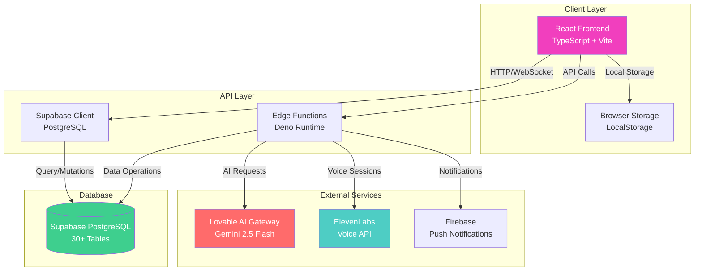
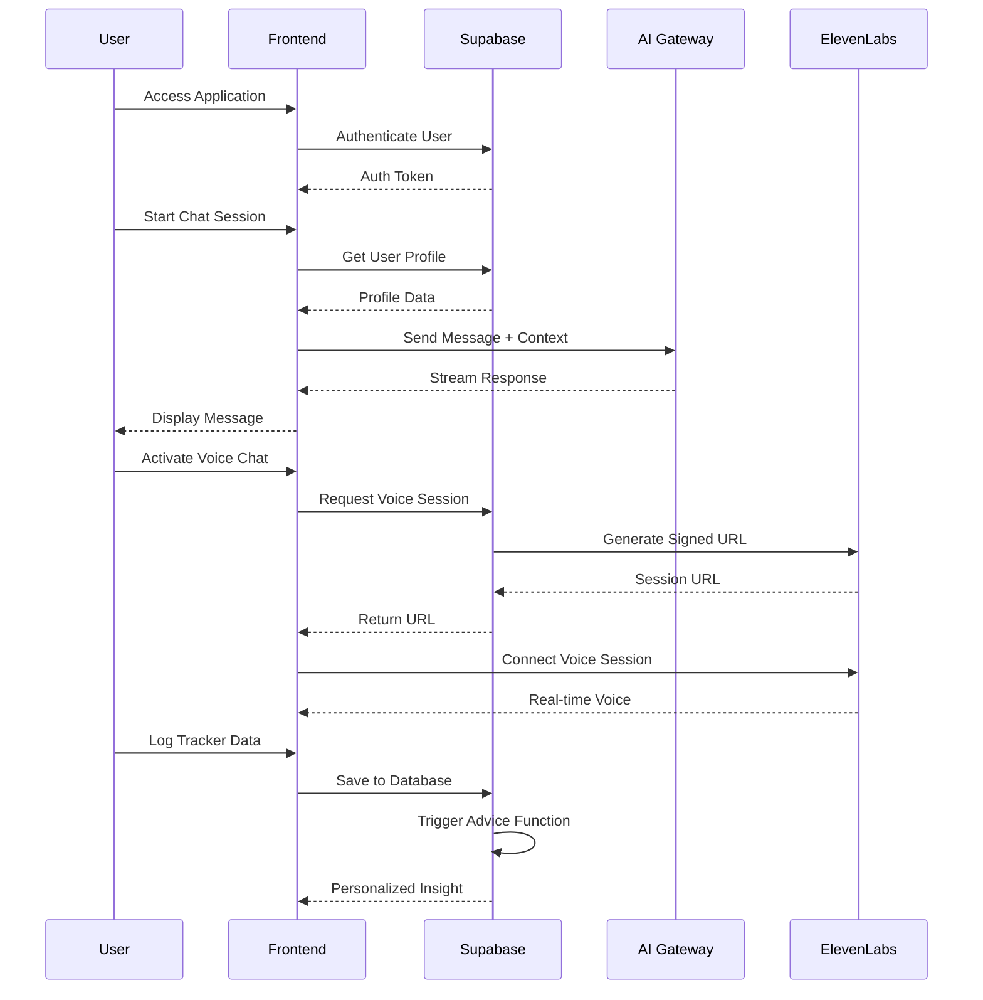
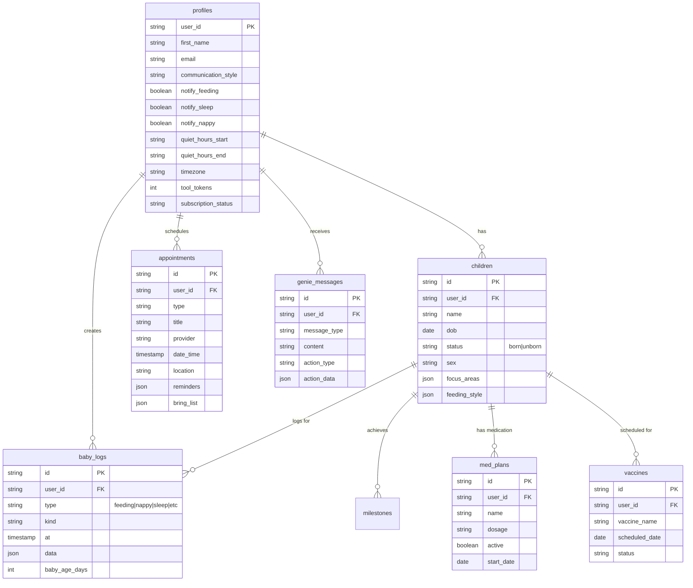

# Parenting Genie - Project Scope, Breakdown & Quote

**Prepared for:** Client Review  
**Date:** December 2024  
**Project Type:** Full-Stack Parenting Assistant Application

---

## Executive Summary

**Parenting Genie** is a comprehensive AI-powered parenting assistant application designed to support parents from pregnancy through age 5. The application features real-time tracking, AI chat assistance, voice activation, appointment management, and personalized insights.

**Technology Stack:**
- **Frontend:** React + TypeScript (Vite)
- **Backend:** Supabase (PostgreSQL + Edge Functions)
- **AI/ML:** Lovable AI Gateway (Gemini 2.5 Flash), ElevenLabs Voice
- **Authentication:** Supabase Auth
- **UI Framework:** shadcn/ui components
- **State Management:** React Query (TanStack Query)

**Current Status:** Production-ready application with organized codebase structure

---

## 1. Project Architecture

### 1.1 System Architecture Diagram



### 1.2 Application Flow Diagram



---

## 2. Feature Breakdown

### 2.1 Core Features

#### **A. AI Chat Assistant (Genie)**
- **Description:** 24/7 AI-powered parenting assistant with personalized responses
- **Components:**
  - `ChatInterface.tsx` - Main chat UI with conversation management
  - `GenieChatWidget.tsx` - Floating chat widget
  - `TypingIndicator.tsx` - Real-time typing animations
  - `supabase/functions/chat/index.ts` - Chat API endpoint

- **Features:**
  - Multi-conversation support with localStorage persistence
  - Streaming responses from AI
  - Personalized system prompts based on user profile
  - Context-aware responses (remembers children, preferences)
  - Action buttons for quick tracker access
  - Message history management

- **Technical Details:**
  - Uses Lovable AI Gateway with Gemini 2.5 Flash model
  - Response format: Bullet points, max 150 words, 1-2 emojis
  - Personalized based on: Parent name, communication style, children's ages, focus areas

#### **B. Voice Chat Integration**
- **Description:** Hands-free "Hey Genie" voice activation
- **Components:**
  - `hooks/useVoiceChat.tsx` - Voice chat hook
  - `supabase/functions/elevenlabs-session/index.ts` - Voice session management

- **Features:**
  - ElevenLabs conversational AI integration
  - Microphone permission handling
  - Real-time voice transcription
  - Voice-activated commands
  - Volume control

#### **C. Dashboard & Insights**
- **Description:** Centralized view of all tracking data and insights
- **Components:**
  - `pages/Dashboard.tsx` - Main dashboard
  - `supabase/functions/dashboard-insights/index.ts` - AI insights generation

- **Features:**
  - Real-time tracker summaries (8 trackers)
  - AI-generated daily insights
  - Next appointment display
  - Baby information card
  - Quick access to all trackers
  - Visual progress indicators

#### **D. Tracker System (8 Trackers)**

##### **1. Feeding Tracker**
- **File:** `components/trackers/FeedingTracker.tsx`
- **Features:**
  - Track feeding sessions (breastfeeding, bottle, formula)
  - Timer functionality for active feeds
  - Track feeding method and volume
  - Age-based feeding expectations
  - Last feeding time display
  - Daily/weekly statistics
  - Health alerts (dehydration warnings)

##### **2. Nappy Tracker**
- **File:** `components/trackers/NappyTracker.tsx`
- **Features:**
  - Track wet, dirty, and both nappy changes
  - Stool type classification (normal, loose, constipated, mucus/blood)
  - Age-based expectations (wet/dirty counts)
  - Progress tracking vs. expected values
  - Stool log history with collapsible view
  - Health alerts (hydration, bowel movement warnings)
  - Visual progress bars

##### **3. Sleep Tracker**
- **File:** `components/trackers/SleepTracker.tsx`
- **Features:**
  - Track sleep sessions with start/end times
  - Timer for active sleep sessions
  - Total sleep hours calculation
  - Age-based wake window recommendations
  - Sleep pattern visualization
  - Nap vs. night sleep tracking
  - Sleep quality indicators

##### **4. Pump Tracker**
- **File:** `components/trackers/PumpTracker.tsx`
- **Features:**
  - Track pumping sessions
  - Volume tracking (ml/oz)
  - Left/right side tracking
  - Daily totals and averages
  - Pumping reminders
  - Supply tracking over time

##### **5. Growth Tracker**
- **File:** `components/trackers/GrowthTracker.tsx`
- **Features:**
  - Weight, height, head circumference tracking
  - Growth charts visualization
  - Percentile calculations
  - Age-based growth expectations
  - Historical growth data
  - Photo attachments

##### **6. Mood Tracker**
- **File:** `components/trackers/MoodTracker.tsx`
- **Features:**
  - Baby mood tracking (happy, fussy, calm, etc.)
  - Parent mood tracking
  - Mood patterns over time
  - Correlation analysis
  - Daily mood summaries

##### **7. Temperature Tracker**
- **File:** `components/trackers/TemperatureTracker.tsx`
- **Features:**
  - Temperature readings (Celsius/Fahrenheit)
  - Fever detection and alerts
  - Symptom tracking
  - Medication correlation
  - Temperature history
  - Health alerts for high temperatures

##### **8. Medicine & Vaccine Tracker**
- **File:** `components/trackers/MedicineVaccineTracker.tsx`
- **Features:**
  - Medicine schedule management
  - Dose tracking and reminders
  - Vaccine schedule tracking
  - Upcoming vaccine notifications
  - Medication history
  - Dosage calculations
  - `supabase/functions/medicine-reminders/index.ts` - Automated reminders

#### **E. Tracker Workspace**
- **File:** `components/TrackerWorkspace.tsx`
- **Features:**
  - Unified interface for all 8 trackers
  - View mode toggle (chat-focused, balanced, tracker-focused)
  - Resizable divider between chat and tracker
  - Day selection for historical data
  - Mobile-responsive design
  - URL-based tracker activation

#### **F. Appointment Management**
- **Files:**
  - `pages/Appointments.tsx` - Main appointments page
  - `components/appointments/AddAppointmentDialog.tsx` - Add appointment
  - `components/appointments/AppointmentDetailDialog.tsx` - View/edit appointment
  - `components/appointments/NextAppointmentCard.tsx` - Dashboard card

- **Features:**
  - Create, edit, delete appointments
  - Appointment types (Pediatrician, MCHN, Lactation, Vaccine, etc.)
  - Reminder system
  - Bring list management
  - Check-in functionality
  - Location and contact information
  - Past/upcoming appointment filtering

#### **G. Profile Setup & Management**
- **File:** `components/ProfileSetup.tsx`
- **Features:**
  - Multi-step onboarding (4 steps)
  - Parent information collection
  - Multi-child profile support
  - Born vs. unborn child tracking
  - Pregnancy information (for expecting parents)
  - Communication preferences
  - Notification settings
  - Profile picture uploads
  - Focus areas selection

#### **H. Milestone Tracker**
- **File:** `components/MilestoneTracker.tsx`
- **Features:**
  - Age-appropriate milestone tracking
  - Achievement logging
  - Photo attachments
  - Milestone categories (motor, cognitive, social, etc.)
  - Progress visualization

#### **I. Notification System**
- **File:** `components/NotificationSettings.tsx`
- **Features:**
  - Per-tracker notification toggles
  - Quiet hours configuration
  - Timezone support
  - Push notification preferences
  - Notification history

#### **J. Premium Tools Integration**
- **Files:**
  - `components/ExploreToolsSidebar.tsx` - External tools access
  - `components/PremiumToolsSidebar.tsx` - Premium features
  - `components/DevUnlockBadge.tsx` - Development unlock

- **Features:**
  - Token-based access system
  - Subscription status checking
  - External tool integration (Baby Tracker, Lullaby Generator, Story Maker, etc.)
  - Dev unlock mode for testing

#### **K. Formula Calculator**
- **File:** `components/FormulaCalculator.tsx`
- **Features:**
  - Formula preparation calculations
  - Water and powder measurements
  - Multiple bottle sizes
  - Age-based recommendations

#### **L. Tips & Advice System**
- **Files:**
  - `components/TipOfDay.tsx` - Full tip display
  - `components/CompactTipOfDay.tsx` - Compact tip widget
  - `lib/genieAdvice.ts` - Advice generation logic
  - `supabase/functions/genie-advice/index.ts` - Automated advice triggers

- **Features:**
  - Daily personalized tips
  - Context-aware advice based on tracker data
  - Age-specific recommendations
  - Focus area customization

---

## 3. Database Schema

### 3.1 Core Tables (30+ Tables)



### 3.2 Key Database Features

- **User Authentication:** Supabase Auth with email/password and OAuth
- **Row Level Security (RLS):** User-specific data access
- **Real-time Subscriptions:** Live updates for tracker data
- **Database Functions:** Automated calculations and triggers
- **Storage:** File uploads for profile pictures, milestone photos

---

## 4. Backend Functions (Supabase Edge Functions)

### 4.1 Function Breakdown

#### **A. Chat Function** (`supabase/functions/chat/index.ts`)
- **Purpose:** AI chat completion endpoint
- **Input:** Messages array, user profile
- **Output:** Streaming AI responses
- **Features:**
  - Personalized system prompts
  - Context injection (children, preferences)
  - Rate limiting handling
  - Error handling

#### **B. Dashboard Insights** (`supabase/functions/dashboard-insights/index.ts`)
- **Purpose:** Generate AI insights from tracker data
- **Input:** Tracker data summary
- **Output:** Personalized insight message
- **Features:**
  - Analyzes all tracker data
  - Prioritizes urgent matters
  - Generates encouraging tips
  - Max 2 sentences, 40 words

#### **C. ElevenLabs Session** (`supabase/functions/elevenlabs-session/index.ts`)
- **Purpose:** Create voice chat session
- **Input:** User profile
- **Output:** Signed URL for ElevenLabs
- **Features:**
  - Personalized voice agent instructions
  - Session management
  - Security token generation

#### **D. Genie Advice** (`supabase/functions/genie-advice/index.ts`)
- **Purpose:** Automated advice based on tracker events
- **Input:** Log type, log data, user ID, baby age
- **Output:** Advice message or notification
- **Features:**
  - Age-based expectations (feeding intervals, wake windows, nappy counts)
  - Quiet hours respect
  - Per-tracker notification preferences
  - Action triggers (start feeding, start sleep, etc.)

#### **E. Medicine Reminders** (`supabase/functions/medicine-reminders/index.ts`)
- **Purpose:** Automated medicine and vaccine reminders
- **Input:** None (scheduled cron job)
- **Output:** Notification list
- **Features:**
  - Checks due medicine doses
  - Upcoming vaccine reminders (7-day window)
  - Quiet hours respect (10 PM - 7 AM)
  - Integration ready for push notifications

---

## 5. Component Structure

### 5.1 File Organization

```
genieaudit/
├── App.tsx                          # Root component, routing
├── pages/                           # Page components
│   ├── Index.tsx                    # Landing page
│   ├── Dashboard.tsx                # Main dashboard
│   ├── Chat.tsx                     # Chat page wrapper
│   ├── Appointments.tsx             # Appointments page
│   ├── Setup.tsx                    # Setup/onboarding
│   └── NotFound.tsx                 # 404 page
│
├── components/                     # UI components
│   ├── ChatInterface.tsx            # Main chat UI
│   ├── TrackerWorkspace.tsx         # Tracker container
│   ├── ProfileSetup.tsx             # Profile setup
│   ├── MilestoneTracker.tsx         # Milestones
│   ├── FormulaCalculator.tsx        # Formula calc
│   ├── GenieChatWidget.tsx          # Floating widget
│   ├── TipOfDay.tsx                 # Tips display
│   ├── NotificationSettings.tsx     # Notifications
│   ├── ExploreToolsSidebar.tsx      # External tools
│   ├── PremiumToolsSidebar.tsx      # Premium features
│   │
│   ├── trackers/                    # Tracker components
│   │   ├── FeedingTracker.tsx
│   │   ├── NappyTracker.tsx
│   │   ├── SleepTracker.tsx
│   │   ├── PumpTracker.tsx
│   │   ├── GrowthTracker.tsx
│   │   ├── MoodTracker.tsx
│   │   ├── TemperatureTracker.tsx
│   │   └── MedicineVaccineTracker.tsx
│   │
│   └── appointments/                # Appointment components
│       ├── AddAppointmentDialog.tsx
│       ├── AppointmentDetailDialog.tsx
│       └── NextAppointmentCard.tsx
│
├── hooks/                           # Custom React hooks
│   ├── useVoiceChat.tsx             # Voice chat hook
│   ├── useTimeGreeting.tsx           # Time-based greetings
│   └── useDevUnlock.tsx              # Dev unlock feature
│
├── lib/                             # Utility libraries
│   ├── bubbles.ts                   # Animation effects
│   ├── celebration.ts               # Celebration animations
│   ├── floatingHearts.ts            # Heart animations
│   ├── genieAdvice.ts               # Advice logic
│   └── utils.ts                     # General utilities
│
├── integrations/                    # Third-party integrations
│   └── supabase/
│       ├── client.ts                # Supabase client
│       └── types.ts                # TypeScript types (3000+ lines)
│
└── supabase/
    └── functions/                   # Edge functions
        ├── chat/index.ts
        ├── dashboard-insights/index.ts
        ├── elevenlabs-session/index.ts
        ├── genie-advice/index.ts
        └── medicine-reminders/index.ts
```

### 5.2 Component Count

- **Pages:** 6 components
- **Main Components:** 18 components
- **Tracker Components:** 8 components
- **Appointment Components:** 3 components
- **Hooks:** 3 custom hooks
- **Utility Libraries:** 5 files
- **Backend Functions:** 5 edge functions
- **Total:** ~46 major components/files

---

## 6. Technology Stack Details

### 6.1 Frontend Stack
- **Framework:** React 18+ with TypeScript
- **Build Tool:** Vite
- **Routing:** React Router v6
- **State Management:** 
  - React Query (TanStack Query) for server state
  - React useState/useEffect for local state
  - localStorage for persistence
- **UI Library:** shadcn/ui (Radix UI primitives)
- **Icons:** Lucide React
- **Styling:** Tailwind CSS
- **Date Handling:** date-fns
- **Animations:** CSS animations + custom libraries

### 6.2 Backend Stack
- **Database:** Supabase (PostgreSQL)
- **Authentication:** Supabase Auth
- **API:** Supabase Edge Functions (Deno runtime)
- **Real-time:** Supabase Realtime subscriptions
- **Storage:** Supabase Storage

### 6.3 External Services
- **AI Chat:** Lovable AI Gateway → Gemini 2.5 Flash
- **Voice AI:** ElevenLabs Conversational AI
- **Push Notifications:** Firebase (configured, not fully implemented)

### 6.4 Development Tools
- **TypeScript:** Full type safety
- **Path Aliases:** `@/` for src directory
- **Code Organization:** Feature-based folder structure

---

## 7. Scope of Work

### 7.1 Code Review & Analysis

#### **A. Architecture Review**
- ✅ Review current folder structure (COMPLETED - files organized)
- Review component architecture and patterns
- Analyze state management approach
- Evaluate performance optimization opportunities
- Review security implementations (RLS, authentication)

#### **B. Code Quality Assessment**
- TypeScript type safety review
- Component reusability analysis
- Code duplication identification
- Error handling patterns review
- Testing coverage assessment (if tests exist)

#### **C. Database Schema Review**
- Table structure optimization
- Index analysis for performance
- Relationship integrity review
- Query performance assessment
- Migration strategy review

#### **D. API/Backend Review**
- Edge function performance
- Error handling in functions
- Rate limiting implementation
- Security best practices
- API response optimization

#### **E. Frontend Review**
- Component performance (React.memo, useMemo, useCallback)
- Bundle size optimization
- Loading states and error boundaries
- Accessibility compliance
- Mobile responsiveness review

#### **F. Integration Review**
- AI service integration patterns
- Voice chat implementation review
- External tool integration
- Third-party service error handling

### 7.2 Documentation

#### **A. Technical Documentation**
- API documentation for edge functions
- Component documentation
- Database schema documentation
- Integration guides
- Deployment documentation

#### **B. Code Documentation**
- Inline code comments where needed
- Function/method documentation
- Complex logic explanations
- Architecture decision records (ADRs)

### 7.3 Optimization Opportunities

#### **A. Performance Optimization**
- Database query optimization
- Component rendering optimization
- Bundle size reduction
- Image optimization
- Caching strategies

#### **B. User Experience Enhancement**
- Loading state improvements
- Error message improvements
- Animation performance
- Mobile UX enhancements
- Accessibility improvements

#### **C. Code Quality Improvements**
- Refactoring opportunities
- Type safety improvements
- Error handling standardization
- Code organization improvements

---

## 8. Deliverables

### 8.1 Phase 1: Comprehensive Review & Analysis

**Deliverable 1.1: Architecture Review Report**
- System architecture analysis
- Component structure review
- State management evaluation
- Performance bottlenecks identification
- Security assessment

**Deliverable 1.2: Code Quality Report**
- TypeScript type safety analysis
- Component reusability assessment
- Code duplication report
- Error handling review
- Best practices compliance

**Deliverable 1.3: Database Review Report**
- Schema optimization recommendations
- Index performance analysis
- Query optimization suggestions
- Migration recommendations

**Deliverable 1.4: API/Backend Review Report**
- Edge function performance analysis
- Error handling assessment
- Security review
- Rate limiting evaluation

**Deliverable 1.5: Frontend Review Report**
- Component performance analysis
- Bundle size analysis
- Mobile responsiveness review
- Accessibility audit

**Deliverable 1.6: Integration Review Report**
- AI service integration review
- Voice chat implementation review
- External service integration analysis

### 8.2 Phase 2: Documentation

**Deliverable 2.1: Technical Documentation**
- Complete API documentation
- Component library documentation
- Database schema documentation
- Integration guides

**Deliverable 2.2: Code Documentation**
- Inline documentation improvements
- Architecture decision records
- Complex logic explanations

### 8.3 Phase 3: Optimization Recommendations

**Deliverable 3.1: Performance Optimization Plan**
- Detailed optimization recommendations
- Implementation priority matrix
- Expected performance gains
- Implementation estimates

**Deliverable 3.2: Code Quality Improvement Plan**
- Refactoring recommendations
- Type safety improvements
- Error handling standardization
- Code organization improvements

---

## 9. Timeline & Estimates

### 9.1 Phase 1: Comprehensive Review (Week 1-2)

| Task | Estimated Hours | Description |
|------|----------------|-------------|
| Architecture Review | 16 hours | System architecture, component structure, state management |
| Code Quality Assessment | 12 hours | TypeScript review, component analysis, code duplication |
| Database Review | 10 hours | Schema analysis, query optimization, index review |
| API/Backend Review | 10 hours | Edge functions, error handling, security |
| Frontend Review | 12 hours | Performance, bundle size, mobile, accessibility |
| Integration Review | 8 hours | AI services, voice chat, external tools |
| **Subtotal** | **68 hours** | |

### 9.2 Phase 2: Documentation (Week 3)

| Task | Estimated Hours | Description |
|------|----------------|-------------|
| Technical Documentation | 16 hours | API docs, component docs, database docs |
| Code Documentation | 8 hours | Inline comments, ADRs, explanations |
| **Subtotal** | **24 hours** | |

### 9.3 Phase 3: Optimization Recommendations (Week 4)

| Task | Estimated Hours | Description |
|------|----------------|-------------|
| Performance Optimization Plan | 12 hours | Detailed recommendations with priorities |
| Code Quality Improvement Plan | 8 hours | Refactoring recommendations, improvements |
| **Subtotal** | **20 hours** | |

### 9.4 Total Estimated Hours

**Total: 112 hours**

**Timeline: 4 weeks** (assuming 28 hours/week availability)

---

## 10. Pricing Structure

### 10.1 Hourly Rate Options

**Option A: Standard Rate**
- **Rate:** $X per hour (to be determined)
- **Total Estimate:** 112 hours × $X = **$X,XXX**

**Option B: Fixed Price Package**
- **Phase 1 (Review):** $X,XXX (68 hours)
- **Phase 2 (Documentation):** $X,XXX (24 hours)
- **Phase 3 (Optimization Plan):** $X,XXX (20 hours)
- **Total Fixed Price:** **$X,XXX**

### 10.2 Payment Structure

**Recommended Payment Schedule:**
- **30%** upon project initiation
- **40%** upon completion of Phase 1 (Review)
- **30%** upon final delivery (Phases 2 & 3)

### 10.3 Additional Services (Optional)

- **Implementation of Optimizations:** Quoted separately based on recommendations
- **Additional Testing:** $X per hour
- **Emergency Support:** $X per hour (outside normal hours)
- **Extended Documentation:** $X per hour

---

## 11. Assumptions & Exclusions

### 11.1 Assumptions

1. **Access Provided:**
   - Full codebase access (GitHub/GitLab repository)
   - Supabase project access (read-only for review)
   - Development/staging environment access
   - Documentation of current deployment process

2. **Current State:**
   - Application is in production or near-production state
   - Basic functionality is working
   - No critical bugs blocking review

3. **Scope:**
   - Review and analysis only (no implementation)
   - Documentation creation
   - Optimization recommendations

### 11.2 Exclusions

1. **Not Included:**
   - Implementation of optimizations
   - Bug fixes (unless critical security issues)
   - Feature development
   - Testing implementation
   - Deployment changes
   - Third-party service configuration changes

2. **Out of Scope:**
   - UI/UX redesign
   - Major architecture changes
   - New feature development
   - Performance optimization implementation
   - Database migration execution

---

## 12. Next Steps

### 12.1 Client Action Items

1. **Review this scope document**
2. **Confirm access requirements:**
   - Repository access (GitHub/GitLab)
   - Supabase project access
   - Environment credentials (if needed)
   - Documentation access

3. **Confirm pricing and payment terms**
4. **Provide project timeline preferences**
5. **Identify priority areas** (if any specific focus needed)

### 12.2 Project Initiation

Upon approval:
1. **Kickoff Meeting:** 1-hour session to align on priorities
2. **Access Setup:** Repository and environment access
3. **Review Commencement:** Begin Phase 1 analysis

---

## 13. Contact & Questions

For questions or clarifications regarding this scope:
- **Email:** [Your Email]
- **Response Time:** Within 24 hours

---

## Appendix A: Key Metrics

### Application Statistics
- **Total Components:** ~46 major components
- **Database Tables:** 30+ tables
- **Edge Functions:** 5 functions
- **Tracker Types:** 8 trackers
- **Lines of Code (Estimated):** 15,000+ lines
- **TypeScript Coverage:** ~100%

### Feature Complexity
- **High Complexity:** AI Chat, Voice Integration, Tracker System
- **Medium Complexity:** Dashboard, Appointments, Profile Management
- **Low Complexity:** UI Components, Utilities, Animations

---

**Document Version:** 1.0  
**Last Updated:** December 2024  
**Status:** For Client Review

