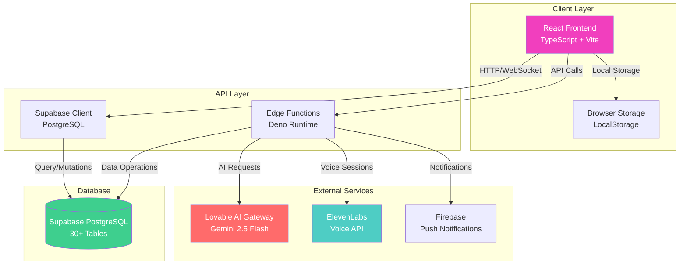
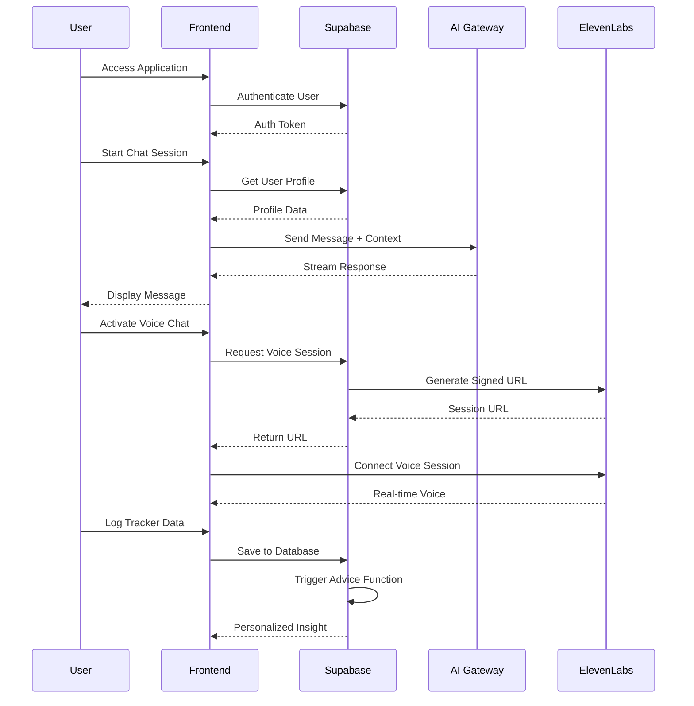
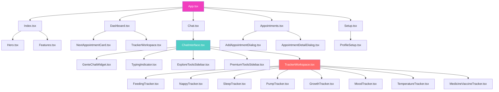
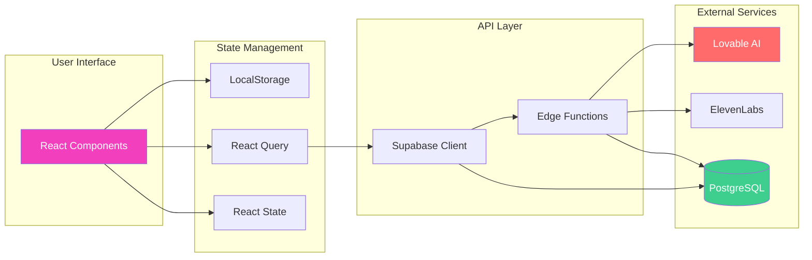
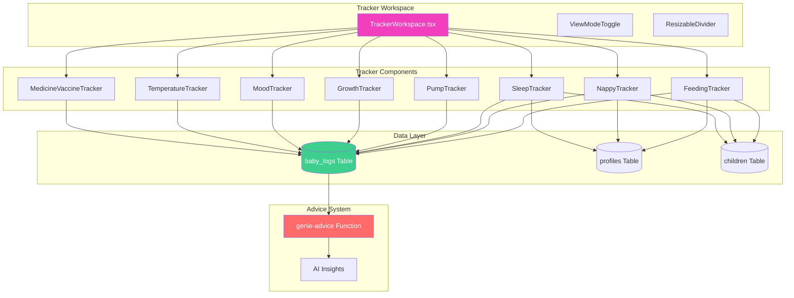
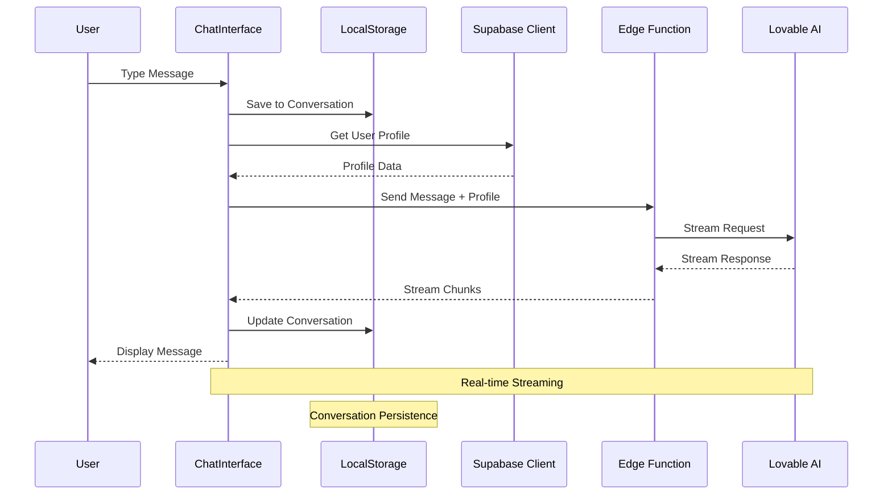
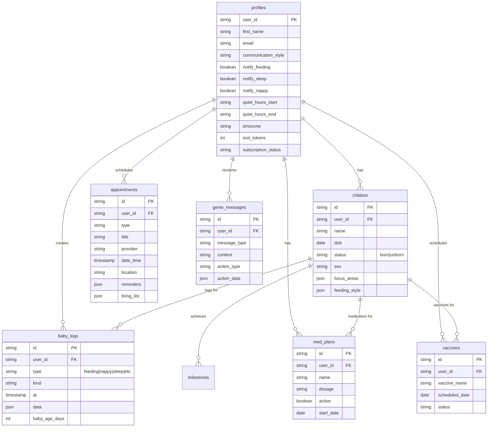

# Parenting Genie - AI-Powered Parenting Assistant

<div align="center">


**Your Personal 24/7 AI Parenting Assistant**

From pregnancy through age 5 • Voice-activated • Personalized guidance • Comprehensive tracking

[Features](#-features) • [Architecture](#-architecture) • [Getting Started](#-getting-started) • [Project Scope](#-project-scope--breakdown)

</div>

---

## 📋 Table of Contents

- [Overview](#-overview)
- [Features](#-features)
- [Technology Stack](#-technology-stack)
- [Architecture](#-architecture)
- [Project Structure](#-project-structure)
- [Project Scope & Breakdown](#-project-scope--breakdown)
- [Getting Started](#-getting-started)
- [Development](#-development)
- [API Documentation](#-api-documentation)
- [Database Schema](#-database-schema)
- [Deployment](#-deployment)
- [Support](#-support)

---

## 🎯 Overview

**Parenting Genie** is a comprehensive, AI-powered parenting assistant application designed to support parents from pregnancy through their child's first 5 years. The application combines real-time tracking, AI-powered chat assistance, voice activation, appointment management, and personalized insights to provide evidence-based guidance and support.

### What This App Does (For Non-Technical Users)

Think of Parenting Genie as your personal parenting assistant that:

- **Answers Your Questions**: Ask anything about parenting, from feeding schedules to sleep training, and get instant, personalized advice
- **Tracks Everything**: Log feeding times, nappy changes, sleep patterns, growth measurements, moods, temperatures, and medications all in one place
- **Reminds You**: Never miss a feeding, medicine dose, or doctor's appointment with smart reminders
- **Learns About Your Family**: The AI remembers your children's ages, preferences, and history to give you personalized tips
- **Works Hands-Free**: Say "Hey Genie" to activate voice commands while you're busy with your baby
- **Shows Insights**: Get daily summaries and insights about your baby's patterns and health

### Key Highlights

- 🤖 **AI-Powered Assistant**: 24/7 chat support with personalized responses using Google Gemini 2.5 Flash
- 🎤 **Voice Activation**: Hands-free "Hey Genie" voice commands via ElevenLabs
- 📊 **8 Comprehensive Trackers**: Feeding, Nappy, Sleep, Pump, Growth, Mood, Temperature, Medicine & Vaccines
- 📅 **Appointment Management**: Schedule, track, and manage medical appointments
- 📱 **Real-time Dashboard**: AI-generated insights and tracker summaries
- 👤 **Multi-Child Support**: Track multiple children with personalized profiles
- 🔔 **Smart Notifications**: Customizable reminders and quiet hours

---

## ✨ Features

### 🤖 AI Chat Assistant (Genie)

The heart of Parenting Genie is an intelligent AI assistant that provides personalized parenting advice.

**Key Capabilities:**

- **24/7 Availability**: Always-on parenting support, day or night
- **Personalized Responses**: Context-aware advice based on:
  - User profile and communication preferences
  - Children's ages and development stages
  - Historical tracker data
  - Focus areas and preferences
- **Multi-Conversation Support**: Manage multiple chat threads with localStorage persistence
- **Streaming Responses**: Real-time AI response streaming for better user experience
- **Action Buttons**: Quick access to trackers directly from chat responses
- **Message History**: Persistent conversation history across sessions

**Response Format:**

- Bullet points for easy reading
- Maximum 150 words per response
- 1-2 gentle emojis (🌸, 💕, 👶)
- Empathetic and encouraging tone
- Evidence-based guidance

**Technical Implementation:**

- Uses Lovable AI Gateway → Google Gemini 2.5 Flash
- Personalized system prompts based on user profile
- Context injection from tracker data and children's information
- Streaming response handling for real-time updates

### 🎤 Voice Chat Integration

Hands-free interaction with Genie using voice commands.

**Features:**

- **Hands-Free Activation**: "Hey Genie" voice commands
- **ElevenLabs Integration**: Conversational AI voice assistant
- **Real-time Transcription**: Voice-to-text and text-to-voice conversion
- **Microphone Controls**: Volume and permission management
- **Session Management**: Secure voice session creation and management

**Use Cases:**

- Ask questions while feeding or holding your baby
- Log tracker data using voice commands
- Get advice while driving or multitasking

### 📊 Tracker System (8 Comprehensive Trackers)

#### 1. **Feeding Tracker**

Track all feeding activities with detailed logging and health monitoring.

**Features:**

- **Multiple Feeding Types**: Breastfeeding, bottle feeding, formula feeding
- **Timer Functionality**: Active feed timers with pause/resume
- **Volume Tracking**: ml/oz measurements for bottle/formula feeds
- **Age-Based Expectations**: Automatic feeding interval recommendations based on baby's age
- **Health Alerts**: Dehydration warnings if feeding intervals exceed recommendations
- **Daily/Weekly Statistics**: Comprehensive feeding summaries
- **Side Tracking**: Left/right breast tracking for breastfeeding
- **Feeding History**: Complete log of all feeding sessions

**Expected Values by Age:**

- 0-1 months: Every 2 hours
- 1-2 months: Every 3 hours
- 2-3 months: Every 3 hours
- 3-4 months: Every 3.5 hours
- 4-6 months: Every 4 hours
- 6+ months: Every 4.5 hours

#### 2. **Nappy Tracker**

Comprehensive nappy change tracking with stool type classification and health monitoring.

**Features:**

- **Change Types**: Track wet, dirty, or both nappy changes
- **Stool Type Classification**:
  - Normal
  - Loose
  - Constipated
  - Mucus/Blood (with health alerts)
- **Age-Based Expectations**: Expected wet/dirty counts based on baby's age
- **Progress Tracking**: Visual progress bars showing actual vs. expected values
- **Stool Log History**: Collapsible history view with timestamps
- **Health Alerts**:
  - Hydration warnings (no wet nappy in 6+ hours)
  - Bowel movement alerts (less than 1 dirty nappy in 24h for babies 6+ days)
- **Today's Summary**: Quick view of total changes and breakdown

**Expected Values:**

- Babies over 5 days: 6-8 wet nappies, 2-3 dirty nappies daily
- Newborns may have different patterns

#### 3. **Sleep Tracker**

Monitor sleep patterns and get age-appropriate wake window recommendations.

**Features:**

- **Sleep Session Tracking**: Start/end times with automatic duration calculation
- **Timer for Active Sessions**: Real-time tracking of ongoing sleep
- **Total Sleep Hours**: Daily and weekly sleep totals
- **Age-Based Wake Windows**: Recommendations based on baby's age
- **Sleep Pattern Visualization**: Charts showing sleep patterns over time
- **Nap vs. Night Sleep**: Distinguish between different sleep types
- **Sleep History**: Complete log of all sleep sessions

**Wake Window Recommendations:**

- 0-1 months: 45-60 minutes
- 1-2 months: 60-90 minutes
- 2-3 months: 75-90 minutes
- 3-4 months: 90-120 minutes
- 4-6 months: 2-2.5 hours
- 6-9 months: 2.5-3 hours
- 9-12 months: 3-4 hours
- 12+ months: 4-5 hours

#### 4. **Pump Tracker**

Track breast pumping sessions with detailed volume and supply monitoring.

**Features:**

- **Pumping Session Tracking**: Log individual pumping sessions
- **Volume Tracking**: ml/oz measurements per session
- **Left/Right Side Tracking**: Track pumping from each breast separately
- **Daily Totals and Averages**: Calculate daily pumping output
- **Pumping Reminders**: Customizable reminders for pumping sessions
- **Supply Tracking**: Monitor supply trends over time
- **Pumping History**: Complete log of all pumping sessions

#### 5. **Growth Tracker**

Monitor your baby's growth with measurements and percentile tracking.

**Features:**

- **Multi-Metric Tracking**:
  - Weight (kg/lbs)
  - Height/Length (cm/inches)
  - Head Circumference (cm/inches)
- **Growth Charts Visualization**: Visual growth charts with percentile lines
- **Percentile Calculations**: Automatic percentile calculations based on WHO/CDC standards
- **Age-Based Growth Expectations**: Expected growth ranges
- **Historical Growth Data**: Complete growth history
- **Photo Attachments**: Attach photos to growth entries
- **Growth Alerts**: Notifications for significant growth changes

#### 6. **Mood Tracker**

Track both baby and parent moods to identify patterns and correlations.

**Features:**

- **Baby Mood Tracking**: Happy, fussy, calm, sleepy, playful, etc.
- **Parent Mood Tracking**: Track your own mood alongside baby's
- **Mood Patterns**: Visualize mood patterns over time
- **Correlation Analysis**: Identify correlations between baby and parent moods
- **Daily Mood Summaries**: Quick overview of daily mood trends
- **Mood History**: Complete log of all mood entries

#### 7. **Temperature Tracker**

Monitor body temperature with fever detection and health alerts.

**Features:**

- **Temperature Readings**: Log temperature in Celsius or Fahrenheit
- **Fever Detection**: Automatic fever alerts (typically >38°C or 100.4°F)
- **Symptom Tracking**: Log associated symptoms
- **Medication Correlation**: Link temperature readings with medication
- **Temperature History**: Complete log of all temperature readings
- **Health Alerts**: Immediate alerts for high temperatures
- **Temperature Trends**: Visualize temperature patterns over time

#### 8. **Medicine & Vaccine Tracker**

Comprehensive medication and vaccination schedule management.

**Features:**

- **Medicine Schedule Management**: Create and manage medication schedules
- **Dose Tracking**: Log each dose given with timestamps
- **Vaccine Schedule Tracking**: Track all scheduled and completed vaccines
- **Upcoming Vaccine Notifications**: 7-day advance reminders for vaccines
- **Medication History**: Complete log of all medications given
- **Dosage Calculations**: Age and weight-based dosage recommendations
- **Automated Reminder System**: Smart reminders for due doses
- **Medicine Plans**: Create recurring medication plans
- **Vaccine Status**: Track vaccine completion status

### 📅 Appointment Management

Comprehensive appointment scheduling and management system.

**Features:**

- **Create, Edit, Delete**: Full CRUD operations for appointments
- **Multiple Appointment Types**:
  - Pediatrician visits
  - MCHN (Maternal and Child Health Nurse) visits
  - Lactation consultations
  - Vaccine appointments
  - Specialist visits
  - Other medical appointments
- **Reminder System**: Customizable notifications with multiple reminder times
- **Bring List Management**: Create and manage items to bring to appointments
- **Check-in Functionality**: Mark appointments as completed
- **Location and Contact Information**: Store provider details
- **Past/Upcoming Filtering**: Filter appointments by date
- **Next Appointment Display**: Quick view on dashboard

### 📱 Dashboard & Insights

Centralized view of all tracker data with AI-generated insights.

**Features:**

- **Real-time Tracker Summaries**: Quick view of all 8 trackers
- **AI-Generated Daily Insights**: Personalized insights based on tracker data
- **Next Appointment Display**: Upcoming appointment card
- **Baby Information Card**: Quick access to child profiles
- **Quick Access to Trackers**: One-click navigation to any tracker
- **Visual Progress Indicators**: Progress bars and charts
- **Personalized Recommendations**: AI-suggested actions based on data

**Insight Generation:**

- Analyzes all tracker data
- Prioritizes urgent matters (fever, overdue medicine)
- Focuses on what's going well
- Provides gentle suggestions
- Respects quiet hours

### 👤 Profile & Setup

Comprehensive user and child profile management.

**Features:**

- **Multi-Step Onboarding**: 4-step setup process
  1. Parent Information (name, type, communication style, languages)
  2. Children Information (name, DOB, status, sex, feeding style, focus areas)
  3. Engagement Preferences (tip frequency, notification times, update types)
  4. Review and Complete
- **Multi-Child Profile Support**: Track multiple children in one account
- **Born vs. Unborn Child Tracking**: Support for expecting parents
- **Pregnancy Information**: Track pregnancy details for unborn children
- **Communication Preferences**: Customize how Genie communicates
- **Notification Settings**: Per-tracker notification toggles
- **Profile Picture Uploads**: Upload photos for parent and children
- **Focus Areas Selection**: Choose areas of interest for personalized advice
- **Quiet Hours**: Set quiet hours (default: 10 PM - 7 AM)

### 🎯 Additional Features

- **Milestone Tracker**: Age-appropriate milestone tracking with photos
- **Formula Calculator**: Formula preparation calculations
- **Tips & Advice System**: Daily personalized tips based on tracker data
- **Notification System**: Per-tracker notification toggles with quiet hours
- **Premium Tools Integration**: Token-based access to external tools
- **Dev Unlock Mode**: Development testing features
- **View Mode Toggle**: Switch between chat-focused, balanced, and tracker-focused views
- **Resizable Panels**: Adjustable chat and tracker panel sizes
- **Mobile Responsive**: Fully responsive design for mobile devices

---

## 🛠 Technology Stack

### Frontend

- **Framework**: React 18.3+ with TypeScript 5.8
- **Build Tool**: Vite 5.4 (fast development and optimized builds)
- **Routing**: React Router v6.30 (client-side routing)
- **State Management**:
  - React Query (TanStack Query) v5.83 for server state
  - React useState/useEffect for local state
  - localStorage for persistence
- **UI Library**: shadcn/ui (Radix UI primitives)
  - Accessible, customizable components
  - Dark/light mode support
- **Icons**: Lucide React v0.462
- **Styling**: Tailwind CSS v3.4
- **Date Handling**: date-fns v3.6
- **Charts**: Recharts v2.15 (for growth charts and visualizations)
- **Forms**: React Hook Form v7.61 + Zod v3.25 (form validation)

### Backend

- **Database**: Supabase (PostgreSQL)
  - 30+ tables for comprehensive data storage
  - Row Level Security (RLS) for data protection
  - Real-time subscriptions
- **Authentication**: Supabase Auth
  - Email/password authentication
  - Google OAuth support
- **API**: Supabase Edge Functions (Deno runtime)
  - 5 edge functions for various operations
- **Real-time**: Supabase Realtime subscriptions
- **Storage**: Supabase Storage for file uploads
  - Profile pictures
  - Milestone photos
  - Growth photos

### External Services

- **AI Chat**: Lovable AI Gateway → Google Gemini 2.5 Flash
  - Personalized AI responses
  - Context-aware advice
- **Voice AI**: ElevenLabs Conversational AI
  - Voice session management
  - Real-time voice interaction
- **Push Notifications**: Firebase (configured)
  - Medicine reminders
  - Appointment reminders
  - Tracker notifications

### Development Tools

- **TypeScript**: Full type safety across the application
- **Path Aliases**: `@/` for clean imports
- **ESLint**: Code quality and linting
- **PostCSS**: CSS processing
- **Autoprefixer**: CSS vendor prefixing

---

## 🏗 Architecture

### System Architecture



### Application Flow



### Component Architecture



### Data Flow



### Tracker System Architecture



### Chat System Flow



---

## 📁 Project Structure

```
genieaudit/
├── App.tsx                          # Root component, routing configuration
├── main.tsx                         # Application entry point
├── index.html                       # HTML template
├── index.css                        # Global styles
│
├── pages/                           # Page components
│   ├── Index.tsx                    # Landing page
│   ├── Dashboard.tsx                # Main dashboard with insights
│   ├── Chat.tsx                     # Chat page wrapper
│   ├── Appointments.tsx             # Appointments management page
│   ├── Setup.tsx                    # Setup/onboarding page
│   └── NotFound.tsx                 # 404 error page
│
├── components/                      # UI components
│   ├── ChatInterface.tsx            # Main chat UI with conversation management
│   ├── TrackerWorkspace.tsx         # Unified tracker container
│   ├── ProfileSetup.tsx             # Multi-step profile setup
│   ├── MilestoneTracker.tsx         # Milestone tracking component
│   ├── FormulaCalculator.tsx        # Formula calculation tool
│   ├── GenieChatWidget.tsx          # Floating chat widget
│   ├── TipOfDay.tsx                 # Full tip display
│   ├── CompactTipOfDay.tsx          # Compact tip widget
│   ├── NotificationSettings.tsx     # Notification preferences
│   ├── ExploreToolsSidebar.tsx      # External tools access
│   ├── PremiumToolsSidebar.tsx      # Premium features sidebar
│   ├── DevUnlockBadge.tsx           # Development unlock badge
│   ├── Hero.tsx                     # Landing page hero section
│   ├── Features.tsx                # Features showcase
│   ├── ViewModeToggle.tsx           # View mode switcher
│   ├── ResizableDivider.tsx         # Resizable panel divider
│   ├── TypingIndicator.tsx          # Chat typing animation
│   ├── StoolTypeDialog.tsx          # Stool type selection dialog
│   │
│   ├── trackers/                    # Tracker components
│   │   ├── FeedingTracker.tsx       # Feeding session tracker
│   │   ├── NappyTracker.tsx         # Nappy change tracker
│   │   ├── SleepTracker.tsx         # Sleep session tracker
│   │   ├── PumpTracker.tsx          # Breast pumping tracker
│   │   ├── GrowthTracker.tsx        # Growth measurements tracker
│   │   ├── MoodTracker.tsx          # Mood tracking component
│   │   ├── TemperatureTracker.tsx   # Temperature & fever tracker
│   │   └── MedicineVaccineTracker.tsx # Medicine & vaccine tracker
│   │
│   └── appointments/               # Appointment components
│       ├── AddAppointmentDialog.tsx # Add new appointment
│       ├── AppointmentDetailDialog.tsx # View/edit appointment
│       └── NextAppointmentCard.tsx   # Dashboard appointment card
│
├── hooks/                           # Custom React hooks
│   ├── useVoiceChat.tsx             # Voice chat integration hook
│   ├── useTimeGreeting.tsx          # Time-based greeting hook
│   ├── useDevUnlock.tsx             # Development unlock hook
│   ├── use-mobile.tsx               # Mobile detection hook
│   └── use-toast.ts                 # Toast notification hook
│
├── lib/                             # Utility libraries
│   ├── bubbles.ts                   # Bubble animation effects
│   ├── celebration.ts               # Celebration animations
│   ├── floatingHearts.ts            # Heart animation effects
│   ├── genieAdvice.ts               # Advice generation logic
│   └── utils.ts                     # General utility functions
│
├── integrations/                   # Third-party integrations
│   └── supabase/
│       ├── client.ts                # Supabase client configuration
│       └── types.ts                 # TypeScript database types (3000+ lines)
│
├── assets/                          # Static assets
│   ├── tracker-*.png                # Tracker illustration images
│   └── parenting-genie-logo.png     # Application logo
│
├── supabase/
│   └── functions/                   # Supabase Edge Functions
│       ├── chat/
│       │   └── index.ts             # AI chat completion endpoint
│       ├── dashboard-insights/
│       │   └── index.ts             # AI insights generation
│       ├── elevenlabs-session/
│       │   └── index.ts             # Voice session management
│       ├── genie-advice/
│       │   └── index.ts             # Automated advice triggers
│       └── medicine-reminders/
│           └── index.ts             # Medicine reminder automation
│
├── package.json                     # Dependencies and scripts
├── tsconfig.json                    # TypeScript configuration
├── vite.config.ts                   # Vite build configuration
├── tailwind.config.ts               # Tailwind CSS configuration
├── postcss.config.js                # PostCSS configuration
└── eslint.config.js                 # ESLint configuration
```

### Component Statistics

- **Pages**: 6 components
- **Main Components**: 18 components
- **Tracker Components**: 8 components
- **Appointment Components**: 3 components
- **Custom Hooks**: 5 hooks
- **Utility Libraries**: 5 files
- **Backend Functions**: 5 edge functions
- **Total**: ~46 major components/files
- **Estimated Lines of Code**: 15,000+ lines
- **TypeScript Coverage**: ~100%

---

## 📊 Project Scope & Breakdown

### Overview

This project is a comprehensive, production-ready parenting assistant application with AI integration, real-time tracking, voice capabilities, and extensive feature set. The application is built using modern web technologies and follows best practices for scalability, maintainability, and user experience.

### Feature Breakdown

#### 1. Core Application Infrastructure (Completed)

**Components:**

- React application setup with TypeScript
- Routing system (6 pages)
- State management (React Query + local state)
- Authentication system (Supabase Auth)
- Database integration (Supabase PostgreSQL)
- File structure organization

**Estimated Effort:** 40-60 hours
**Status:** ✅ Completed

#### 2. AI Chat System (Completed)

**Components:**

- Chat interface with conversation management
- AI integration (Lovable AI → Gemini 2.5 Flash)
- Streaming response handling
- Personalized system prompts
- Context injection from user profile
- Message history persistence
- Multi-conversation support
- Action buttons in responses

**Estimated Effort:** 60-80 hours
**Status:** ✅ Completed

#### 3. Voice Chat Integration (Completed)

**Components:**

- ElevenLabs integration
- Voice session management
- "Hey Genie" activation
- Real-time voice transcription
- Microphone controls
- Session security

**Estimated Effort:** 40-50 hours
**Status:** ✅ Completed

#### 4. Tracker System (8 Trackers) (Completed)

**Components:**

- Unified tracker workspace
- 8 specialized tracker components:
  1. Feeding Tracker
  2. Nappy Tracker
  3. Sleep Tracker
  4. Pump Tracker
  5. Growth Tracker
  6. Mood Tracker
  7. Temperature Tracker
  8. Medicine & Vaccine Tracker
- Age-based expectations
- Health alerts
- Progress tracking
- Data visualization
- History logging

**Estimated Effort:** 120-150 hours
**Status:** ✅ Completed

#### 5. Dashboard & Insights (Completed)

**Components:**

- Dashboard page with tracker summaries
- AI-generated insights (Edge Function)
- Next appointment display
- Baby information cards
- Quick navigation
- Visual progress indicators

**Estimated Effort:** 40-50 hours
**Status:** ✅ Completed

#### 6. Appointment Management (Completed)

**Components:**

- Appointment CRUD operations
- Multiple appointment types
- Reminder system
- Bring list management
- Check-in functionality
- Location and contact storage
- Filtering and sorting

**Estimated Effort:** 30-40 hours
**Status:** ✅ Completed

#### 7. Profile & Setup System (Completed)

**Components:**

- Multi-step onboarding (4 steps)
- Parent profile management
- Multi-child support
- Born/unborn child tracking
- Pregnancy information
- Communication preferences
- Notification settings
- Profile picture uploads
- Focus areas selection

**Estimated Effort:** 50-60 hours
**Status:** ✅ Completed

#### 8. Backend Infrastructure (Completed)

**Components:**

- 5 Supabase Edge Functions:
  1. Chat function
  2. Dashboard insights
  3. ElevenLabs session
  4. Genie advice
  5. Medicine reminders
- Database schema (30+ tables)
- Row Level Security (RLS) policies
- Real-time subscriptions
- File storage configuration

**Estimated Effort:** 60-80 hours
**Status:** ✅ Completed

#### 9. UI/UX Components (Completed)

**Components:**

- shadcn/ui component library integration
- Custom components (18+)
- Responsive design
- Dark/light mode support
- Animations and effects
- Mobile optimization
- Accessibility features

**Estimated Effort:** 80-100 hours
**Status:** ✅ Completed

#### 10. Additional Features (Completed)

**Components:**

- Milestone tracker
- Formula calculator
- Tips & advice system
- Notification system
- Premium tools integration
- Dev unlock mode
- View mode toggle
- Resizable panels

**Estimated Effort:** 40-50 hours
**Status:** ✅ Completed

### Total Project Scope

**Total Estimated Development Time:** 560-720 hours

**Breakdown by Category:**

- Frontend Development: 300-380 hours
- Backend Development: 120-160 hours
- AI Integration: 100-130 hours
- UI/UX Design: 80-100 hours
- Testing & Debugging: 60-80 hours (estimated for future)

### Current Status

**✅ Completed Features:**

- All core features are implemented
- Application is functional and ready for use
- Database schema is complete
- All edge functions are deployed
- UI components are complete

**⚠️ Potential Future Enhancements:**

- Comprehensive testing suite
- Performance optimization
- Additional analytics
- Export functionality
- Social features
- Advanced reporting

### Project Complexity Assessment

**Complexity Level:** High

**Reasons:**

1. **Multiple Integrations**: AI services, voice API, database, real-time features
2. **Complex State Management**: Multiple trackers, conversations, user profiles
3. **Real-time Features**: Chat streaming, voice sessions, live updates
4. **Data Relationships**: 30+ database tables with complex relationships
5. **Age-Based Logic**: Complex calculations for different age groups
6. **Personalization**: AI context injection, user preferences, multi-child support

### Technology Stack Complexity

- **Frontend**: React + TypeScript (moderate to high complexity)
- **Backend**: Supabase (moderate complexity)
- **AI Integration**: Multiple AI services (high complexity)
- **Real-time**: WebSocket connections (moderate complexity)
- **State Management**: Multiple patterns (moderate complexity)

---

## 💰 Project Quote & Estimation

### Development Cost Breakdown

Based on the project scope and complexity, here's a detailed breakdown:

#### Option 1: Fixed Price Quote

**Total Project Value:** $28,000 - $36,000 USD

**Breakdown:**

- Core Infrastructure: $2,000 - $3,000
- AI Chat System: $3,000 - $4,000
- Voice Integration: $2,000 - $2,500
- Tracker System (8 trackers): $6,000 - $7,500
- Dashboard & Insights: $2,000 - $2,500
- Appointment Management: $1,500 - $2,000
- Profile & Setup: $2,500 - $3,000
- Backend Infrastructure: $3,000 - $4,000
- UI/UX Components: $4,000 - $5,000
- Additional Features: $2,000 - $2,500

**Assumptions:**

- Hourly rate: $50-75/hour
- Total hours: 560-720 hours
- Includes: Development, basic testing, documentation

#### Option 2: Hourly Rate

**Rate:** $50-75/hour (depending on experience level)

**Estimated Hours:** 560-720 hours

**Total Range:** $28,000 - $54,000 USD

### Ongoing Maintenance & Support

**Monthly Maintenance:** $500 - $1,000/month

- Bug fixes
- Security updates
- Minor feature enhancements
- Technical support

**Additional Services:**

- New feature development: $75-100/hour
- Major refactoring: $60-80/hour
- Performance optimization: $60-80/hour
- Comprehensive testing: $50-75/hour

### Third-Party Service Costs (Client Responsibility)

**Monthly Operating Costs:**

- Supabase: $25-100/month (depending on usage)
- Lovable AI: Variable (based on API usage)
- ElevenLabs: Variable (based on voice usage)
- Firebase: Variable (based on push notifications)
- Domain & Hosting: $10-50/month

**Estimated Monthly Operating Cost:** $50-300/month (depending on user base)

### Payment Terms

**Recommended Structure:**

- 30% upfront (project initiation)
- 40% at milestone completion (core features)
- 30% upon final delivery and acceptance

**Alternative:**

- 50% upfront
- 50% upon completion

---

## 🚀 Getting Started

### Prerequisites

**For Developers:**

- **Node.js**: v18+ (recommended: use [nvm](https://github.com/nvm-sh/nvm))
- **npm** or **yarn** or **pnpm**
- **Git**: For version control
- **Code Editor**: VS Code recommended

**For Non-Technical Users:**

- A modern web browser (Chrome, Firefox, Safari, Edge)
- Internet connection
- Supabase account (for backend services)
- API keys for:
  - Lovable AI (for chat functionality)
  - ElevenLabs (for voice features)

### Installation

1. **Clone the repository**

```bash
git clone <YOUR_GIT_URL>
cd genieaudit
```

2. **Install dependencies**

```bash
npm install
# or
yarn install
# or
pnpm install
```

3. **Set up environment variables**

Create a `.env.local` file in the root directory:

```env
VITE_SUPABASE_URL=your_supabase_url
VITE_SUPABASE_ANON_KEY=your_supabase_anon_key
VITE_LOVABLE_API_KEY=your_lovable_api_key
VITE_ELEVENLABS_API_KEY=your_elevenlabs_api_key
```

4. **Configure Supabase**

- Set up your Supabase project
- Run database migrations (if available)
- Configure Row Level Security (RLS) policies
- Set up Edge Functions with environment variables:
  - `LOVABLE_API_KEY`
  - `ELEVENLABS_API_KEY`
  - `SUPABASE_URL`
  - `SUPABASE_SERVICE_ROLE_KEY`

5. **Start the development server**

```bash
npm run dev
# or
yarn dev
# or
pnpm dev
```

The application will be available at `http://localhost:8080`

### For Non-Technical Users

If you're not a developer, you'll need to work with a developer to:

1. Set up the development environment
2. Configure API keys and services
3. Deploy the application
4. Set up the database

Consider hiring a developer or working with a development team for setup and deployment.

---

## 💻 Development

### Available Scripts

```bash
# Start development server
npm run dev

# Build for production
npm run build

# Build for development
npm run build:dev

# Preview production build
npm run preview

# Run ESLint
npm run lint
```

### Development Guidelines

1. **TypeScript**: All code should be written in TypeScript with proper type definitions
2. **Component Structure**: Follow the existing component organization pattern
3. **Path Aliases**: Use `@/` prefix for imports from the src directory
4. **Code Style**: Follow ESLint rules and existing code patterns
5. **State Management**:
   - Use React Query for server state
   - Use React hooks for local state
   - Use localStorage for persistence when appropriate

### Project Configuration

- **Path Aliases**: Configured in `vite.config.ts` and `tsconfig.json`
  - `@/` → root directory
- **TypeScript**: Strict mode can be enabled for better type safety
- **Tailwind CSS**: Configured with custom theme colors
- **ESLint**: Configured with React and TypeScript rules

---

## 📡 API Documentation

### Supabase Edge Functions

#### 1. Chat Function

**Endpoint**: `POST /functions/v1/chat`

**Purpose**: AI chat completion with personalized responses

**Request Body**:

```typescript
{
  messages: Array<{
    role: "user" | "assistant";
    content: string;
  }>;
  userProfile: {
    first_name?: string;
    communication_style?: string;
    children?: Array<{
      name: string;
      age_days: number;
    }>;
    focus_areas?: string[];
  };
}
```

**Response**: Streaming text response

**Features**:

- Personalized system prompts
- Context injection (children, preferences)
- Response format: Bullet points, max 150 words, 1-2 emojis

#### 2. Dashboard Insights

**Endpoint**: `POST /functions/v1/dashboard-insights`

**Purpose**: Generate AI insights from tracker data

**Request Body**:

```typescript
{
  trackerData: {
    feeding: {
      count: number;
      lastTime: string | null;
    }
    nappy: {
      wet: number;
      dirty: number;
    }
    sleep: {
      totalHours: number;
    }
    mood: {
      baby: string | null;
      parent: string | null;
    }
    temperature: {
      count: number;
      hasFever: boolean;
    }
    medicine: {
      dosesDue: number;
      vaccinesUpcoming: number;
    }
    milestones: {
      recent: number;
      total: number;
    }
  }
}
```

**Response**: Personalized insight message (max 2 sentences, 40 words)

#### 3. ElevenLabs Session

**Endpoint**: `POST /functions/v1/elevenlabs-session`

**Purpose**: Create voice chat session

**Request Body**:

```typescript
{
  userProfile: {
    first_name?: string;
    communication_style?: string;
    children?: Array<{ name: string; age_days: number }>;
  };
}
```

**Response**: Signed URL for ElevenLabs voice session

#### 4. Genie Advice

**Endpoint**: `POST /functions/v1/genie-advice`

**Purpose**: Automated advice based on tracker events

**Request Body**:

```typescript
{
  logType: string;
  logData: any;
  userId: string;
  babyAge: number;
}
```

**Response**: Advice message or notification

**Features**:

- Age-based expectations
- Quiet hours respect
- Per-tracker notification preferences

#### 5. Medicine Reminders

**Endpoint**: `POST /functions/v1/medicine-reminders` (Cron-triggered)

**Purpose**: Automated medicine and vaccine reminders

**Response**: List of notifications to send

**Features**:

- Checks due medicine doses
- Upcoming vaccine reminders (7-day window)
- Quiet hours respect (10 PM - 7 AM)

---

## 🗄 Database Schema

### Core Tables



### Key Database Features

- **Row Level Security (RLS)**: User-specific data access
- **Real-time Subscriptions**: Live updates for tracker data
- **Database Functions**: Automated calculations and triggers
- **Storage**: File uploads for profile pictures, milestone photos
- **30+ Tables**: Comprehensive data model for all features

### Database Tables Overview

The application uses 30+ database tables including:

- User profiles and authentication
- Children profiles
- Baby logs (all tracker data)
- Appointments
- Medicine plans and vaccines
- Milestones
- Genie messages
- Activity completions
- And many more...

---

## 🚢 Deployment

### Build for Production

```bash
npm run build
```

This creates an optimized production build in the `dist/` directory.

### Deployment Options

1. **Lovable Platform**:

   - Use Lovable's built-in deployment
   - Navigate to Share → Publish in Lovable dashboard

2. **Vercel**:

   ```bash
   npm install -g vercel
   vercel
   ```

3. **Netlify**:

   - Connect repository to Netlify
   - Set build command: `npm run build`
   - Set publish directory: `dist`

4. **Custom Server**:
   - Serve the `dist/` directory with any static file server
   - Configure environment variables on the server

### Environment Variables

Ensure all environment variables are set in your deployment platform:

- `VITE_SUPABASE_URL`
- `VITE_SUPABASE_ANON_KEY`
- `VITE_LOVABLE_API_KEY` (if needed client-side)
- `VITE_ELEVENLABS_API_KEY` (if needed client-side)

### Supabase Edge Functions Deployment

Deploy edge functions using Supabase CLI:

```bash
supabase functions deploy chat
supabase functions deploy dashboard-insights
supabase functions deploy elevenlabs-session
supabase functions deploy genie-advice
supabase functions deploy medicine-reminders
```

Set environment variables for each function in Supabase dashboard.

---

## 📞 Support

### For Technical Questions

- **Documentation**: Refer to this README and component architecture docs
- **Code Issues**: Check the codebase comments and TypeScript types
- **API Issues**: Review the API documentation section

### For Non-Technical Users

- **Feature Questions**: Refer to the Features section above
- **Usage Help**: Contact your development team or support
- **Account Issues**: Contact your system administrator

### Getting Help

If you need assistance:

1. Review this documentation
2. Check the component architecture document
3. Review the code comments
4. Contact your development team

---

## 🙏 Acknowledgments

- **Lovable AI**: For AI chat integration
- **ElevenLabs**: For voice AI capabilities
- **Supabase**: For backend infrastructure
- **shadcn/ui**: For UI component library
- **React Community**: For excellent tooling and libraries

---

<div align="center">

**Built with ❤️ for parents everywhere**

[Back to Top](#parenting-genie---ai-powered-parenting-assistant)

</div>
