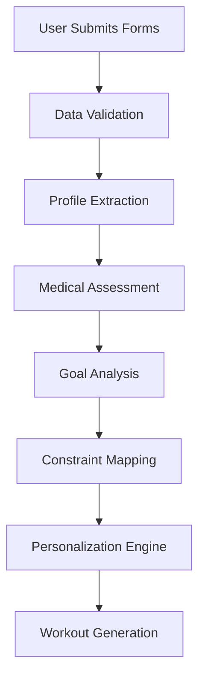
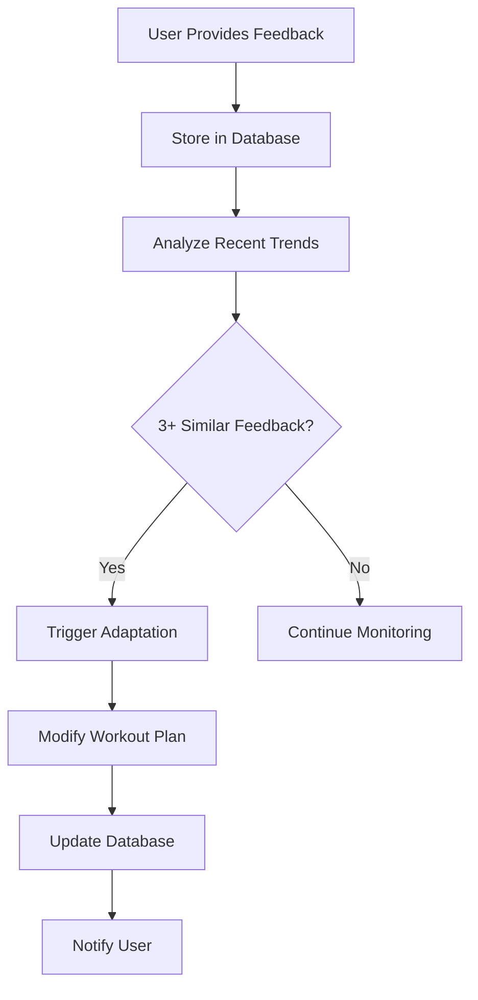

# VTrainer Pro Backend - Comprehensive System Overview

## 📋 Table of Contents
- [🎯 Project Summary](#project-summary)
- [🏗️ System Architecture](#system-architecture)
- [Data Collection & Processing](#data-collection--processing)
- [Knowledge Base Integration](#knowledge-base-integration)
- [AI-Powered Workout Generation](#ai-powered-workout-generation)
- [Adaptive Feedback System](#adaptive-feedback-system)
- [Technical Implementation](#technical-implementation)
- [Key Features](#key-features)
- [Business Value](#business-value)
- [Future Capabilities](#future-capabilities)

---

## 🎯 Project Summary

**VTrainer Pro** is a sophisticated **closed AI fitness system** that generates hyper-personalized workout plans using only internal knowledge sources. The system processes 25 comprehensive intake forms and creates tailored fitness programs without relying on external AI APIs.

### Core Philosophy
- **Personalization First**: Every workout plan is unique to the individual
- **Safety Above All**: Medical considerations and contraindications built-in
- **Adaptive Learning**: Plans evolve based on user feedback and progress
- **Evidence-Based**: All recommendations grounded in fitness science

---

## 🏗️ System Architecture

### High-Level Architecture Diagram
```
┌─────────────────┐    ┌─────────────────┐    ┌─────────────────┐
│   Frontend      │    │   API Layer     │    │   Business      │
│   (Flutter)     │◄──►│   (FastAPI)     │◄──►│   Logic Layer   │
└─────────────────┘    └─────────────────┘    └─────────────────┘
                                │                       │
                                ▼                       ▼
                       ┌─────────────────┐    ┌─────────────────┐
                       │   Database      │    │   Knowledge     │
                       │   (MongoDB)     │    │   Base          │
                       └─────────────────┘    └─────────────────┘
```

### Core Components

#### 1. **API Layer (FastAPI)**
- **High-performance REST API**
- **Authentication**: Firebase token verification
- **Request/Response handling**: Structured data validation
- **Error handling**: Comprehensive error management

#### 2. **Business Logic Layer**
- **AdvancedWorkoutGenerator**: Main AI engine
- **FeedbackService**: User feedback processing
- **SummaryService**: User insights generation
- **Database Interface**: Data abstraction layer

#### 3. **Data Layer**
- **MongoDB**: User profiles, workout plans, feedback history
- **Knowledge Base**: Internal fitness algorithms and data
- **File System**: Exercise database, sample templates

---

## 📊 Data Collection & Processing

### 25 Comprehensive Intake Forms

The system collects data through 25 meticulously designed forms covering every aspect of user fitness:

#### **Personal Information (Forms 1-2)**
| Form | Purpose | Key Fields |
|------|---------|------------|
| Form 1 | Basic Info | Full name, email, contact details |
| Form 2 | Physical Measurements | Age, height, weight, gender, measurement system |

#### **Fitness Goals (Forms 3-4)**
| Form | Purpose | Key Fields |
|------|---------|------------|
| Form 3 | Exercise Goals | Strength, endurance, weight loss, etc. |
| Form 4 | Desired Outcomes | Specific fitness objectives |

#### **Current Status (Forms 5-8)**
| Form | Purpose | Key Fields |
|------|---------|------------|
| Form 5 | Fitness Level | Beginner, intermediate, advanced |
| Form 6 | Exercise Frequency | Days per week, session duration |
| Form 7 | Current Activities | Types of exercise currently engaged |
| Form 8 | Schedule & Time | Available days, preferred times |

#### **Environment (Form 9)**
| Form | Purpose | Key Fields |
|------|---------|------------|
| Form 9 | Location & Equipment | Gym/home, available equipment |

#### **Medical Assessment (Forms 10-22)**
| Form | Purpose | Key Fields |
|------|---------|------------|
| Form 10 | General Health | Overall health status |
| Form 11 | Cardiovascular | Heart conditions, chest pain |
| Form 12 | Respiratory | Breathing issues, asthma |
| Form 13 | Musculoskeletal | Joint problems, injuries |
| Form 14 | Neurological | Balance, dizziness, seizures |
| Form 15 | Metabolic | Diabetes, thyroid issues |
| Form 16 | Medications | Current medications, dosages |
| Form 17 | Blood Pressure | BP readings, hypertension |
| Form 18 | Cholesterol | Lipid profile, cardiovascular risk |
| Form 19 | Medical Supervision | Doctor clearance, supervision needs |
| Form 20 | Pregnancy | Pregnancy status, trimester |
| Form 21 | Postpartum | Postpartum timeline, recovery |
| Form 22 | Breastfeeding | Breastfeeding status, considerations |

#### **Lifestyle & Barriers (Forms 23-25)**
| Form | Purpose | Key Fields |
|------|---------|------------|
| Form 23 | Exercise Barriers | Time, motivation, knowledge, equipment |
| Form 24 | Immediate Goals | Short-term objectives |
| Form 25 | Pain Points | Current pain, injuries, limitations |

### Data Processing Pipeline



---

## 🧠 Knowledge Base Integration

### Internal Knowledge Sources

The system operates as a **closed AI system** using only internal knowledge:

#### **1. Cardiovascular Database (`cardio_old.json`)**
- **Heart rate zones** and calculations
- **MET values** for different activities
- **Training protocols** and progression
- **Safety guidelines** and contraindications

#### **2. Algorithm Documents (12 .docx files)**
| Document | Purpose | Application |
|----------|---------|-------------|
| `1RM-determination-application.docx` | Strength assessment | One-rep max calculations |
| `Alg-Code-HIIT Training.docx` | High-intensity training | Interval protocols |
| `Alg-Code-Muscular Endurance.docx` | Endurance training | Stamina development |
| `ALG-Code-Periodization-Training.docx` | Training cycles | Progressive overload |
| `Alg-Code-ProgressiveOverload.docx` | Strength progression | Gradual intensity increase |
| `ALG-CODE-Pyramid Training.docx` | Pyramid methods | Volume/intensity variation |
| `Alg-Exercise-Intensity-Code.docx` | Intensity management | RPE and heart rate zones |
| `Alg-Injury-Assessment-Code.docx` | Injury prevention | Risk assessment |
| `Alg-Tracking Code Variable.docx` | Progress tracking | Performance metrics |
| `Movement Foundations.docx` | Movement patterns | Exercise selection |
| `training program.docx` | Program design | Overall structure |
| `warm-up program creation.docx` | Warm-up protocols | Preparation routines |

#### **3. Exercise Database (`EXERCISES.xlsx`)**
- **192 exercises** with detailed metadata
- **Categories**: Strength, cardio, flexibility, balance
- **Equipment needs**: Gym, home, bodyweight
- **Muscle groups**: Primary and secondary targets
- **MET values**: Energy expenditure calculations
- **Contraindications**: Medical restrictions
- **Intensity levels**: Beginner to advanced

#### **4. Sample Templates (Workout Logs)**
- **Real workout logs** from various users
- **Different fitness levels**: Beginner, intermediate, advanced
- **Proven structures**: Tested workout formats
- **Progression examples**: Real-world adaptations

### Semantic Search Engine

```python
# Semantic search implementation
def semantic_search_algorithm_docs(query: str, top_k: int = 3):
    # 1. Encode user query
    query_embedding = embedding_model.encode(query)
    
    # 2. Calculate similarities with all algorithm docs
    scores = {}
    for filename, doc_embedding in alg_embeddings.items():
        score = cosine_similarity(query_embedding, doc_embedding)
        scores[filename] = score
    
    # 3. Return top-k most relevant algorithms
    top_files = sorted(scores.items(), key=lambda x: x[1], reverse=True)[:top_k]
    return [{"filename": fname, "score": score, "text": algorithms[fname]} 
            for fname, score in top_files]
```

---

## 🤖 AI-Powered Workout Generation

### Multi-Stage Generation Process

#### **Stage 1: User Profile Extraction**
```python
def extract_comprehensive_user_profile(form_data):
    return {
        "age": calculate_age(form_data["date_of_birth"]),
        "fitness_level": form_data["fitness_level"],
        "goals": form_data["exercise_goals"],
        "medical_conditions": extract_medical_data(form_data),
        "equipment": form_data["home_equipment"],
        "available_days": form_data["available_exercise_days"],
        "daily_time": form_data["daily_exercise_time_in_minutes"],
        "location": form_data["exercise_location"],
        "pain_points": form_data["pain_points"],
        "medications": form_data["medications"],
        "pregnancy_status": form_data["pregnant"],
        # ... 40+ additional fields
    }
```

#### **Stage 2: Knowledge Base Retrieval**
```python
def prepare_llm_context(form_data):
    user = extract_comprehensive_user_profile(form_data)
    
    # Create semantic search query
    algo_query = f"{user['fitness_level']} {user['goals']} {user['medical_conditions']} {user['pregnancy_status']} {user['pain_points']} {user['exercise_barriers']} {user['immediate_goals']} {user['currently_engaged_types']} {user['exercise_location']} {user['home_equipment']} {user['age']} {user['gender']} {user['medications']} {user['blood_pressure']} {user['has_chest_pain']} {user['has_dizziness']} {user['has_physical_issues']} {user['has_medically_supervised']} {user['bp_cholesterol']}"
    
    # Retrieve relevant algorithms
    relevant_algorithms = semantic_search_algorithm_docs(algo_query, top_k=2)
    
    # Select appropriate sample template
    user_type = determine_user_type(user['fitness_level'])
    sample_template = select_sample_template(user_type)
    
    # Get exercises by focus
    focuses = create_focus_rotation(user)
    exercises_by_focus = {}
    for focus in focuses:
        exercises_by_focus[focus] = semantic_search_exercises(user['fitness_level'], focus)
    
    return {
        "user": user,
        "relevant_algorithms": relevant_algorithms,
        "sample_template": sample_template,
        "exercises_by_focus": exercises_by_focus
    }
```

#### **Stage 3: Exercise Filtering**
```python
def semantic_search_exercises(user_fitness_level: str, focus: str):
    # Multi-stage filtering
    filtered_exercises = []
    
    for exercise in all_exercises:
        # 1. Equipment compatibility
        if matches_equipment(user_equipment, exercise):
            # 2. Medical safety
            if not contraindicated(user_medical_conditions, exercise):
                # 3. Fitness level appropriateness
                if appropriate_intensity(user_fitness_level, exercise):
                    # 4. Goal alignment
                    if matches_goals(user_goals, exercise):
                        filtered_exercises.append(exercise)
    
    return filtered_exercises
```

#### **Stage 4: Workout Plan Generation**
```python
def generate_workout_plan_advanced(form_data):
    # 1. Prepare context
    context = prepare_llm_context(form_data)
    
    # 2. Generate personalized plan
    plan = generate_personalized_plan_with_grok(context)
    
    # 3. Post-process and validate
    validated_plan = validate_workout_plan(plan)
    
    return {"user_workout_plan": validated_plan}
```

### Variable Correlation System

The system correlates user variables across multiple dimensions:

#### **Physical Variables**
| Variable | Impact | Application |
|----------|--------|-------------|
| **Age** | Heart rate calculations, exercise intensity | MHR = 220 - age |
| **Height/Weight** | BMI calculations, exercise modifications | BMI = weight(kg) / height(m)² |
| **Gender** | Gender-specific recommendations | Different strength standards |

#### **Medical Variables**
| Variable | Impact | Application |
|----------|--------|-------------|
| **Medications** | Drug-exercise interactions | Beta-blockers affect heart rate |
| **Blood Pressure** | Intensity limits | High BP = lower intensity |
| **Pain Points** | Exercise modifications | Avoid aggravating movements |
| **Pregnancy Status** | Specialized protocols | Avoid supine exercises |

#### **Lifestyle Variables**
| Variable | Impact | Application |
|----------|--------|-------------|
| **Available Time** | Workout duration optimization | 30min vs 60min sessions |
| **Equipment** | Exercise selection | Gym vs home vs bodyweight |
| **Location** | Workout type recommendations | Indoor vs outdoor activities |
| **Fitness Level** | Intensity and complexity | Beginner vs advanced protocols |

### Focus Rotation Algorithm

```python
def create_focus_rotation(user):
    base_focuses = ["strength", "cardio"]
    goals = user.get('goals', [])
    goals_text = " ".join(goals).lower()
    
    if "strength" in goals_text:
        base_focuses.extend(["strength", "strength"])
    elif "endurance" in goals_text or "aerobic" in goals_text:
        base_focuses.extend(["cardio", "cardio"])
    else:
        base_focuses.extend(["strength", "cardio"])
    
    return base_focuses
```

---

## 🔄 Adaptive Feedback System

### Real-Time Adaptation Engine

#### **Feedback Collection**
```python
class WorkoutFeedbackRequest(BaseModel):
    date: str
    block_id: str
    feedback_type: str  # 'completed', 'skipped', 'too_easy', 'too_hard'
    comment: Optional[str] = None
```

#### **Trend Detection Algorithm**
```python
def detect_feedback_trends(feedback_history):
    # Only consider last 7 days
    last_7_days = [(datetime.now() - timedelta(days=i)).date().isoformat() 
                   for i in range(7)]
    recent_feedback = [f for f in feedback_history 
                      if f.get("date") in last_7_days]
    
    too_easy_count = sum(1 for f in recent_feedback 
                        if f.get("feedback_type") == "too_easy")
    too_hard_count = sum(1 for f in recent_feedback 
                        if f.get("feedback_type") == "too_hard")
    
    return {
        "too_easy_count": too_easy_count,
        "too_hard_count": too_hard_count,
        "needs_adaptation": too_easy_count >= 3 or too_hard_count >= 3
    }
```

#### **Adaptation Logic**
```python
def update_workout_based_on_feedback(workout_plan, feedback):
    if feedback.get("difficulty") == "too_hard":
        workout_plan = reduce_intensity(workout_plan)
    elif feedback.get("difficulty") == "too_easy":
        workout_plan = increase_intensity(workout_plan)
    
    if feedback.get("duration") == "too_long":
        workout_plan = reduce_duration(workout_plan)
    
    return workout_plan

def reduce_intensity(workout_plan):
    for day in workout_plan.get("workout_plan_for_total_days", []):
        for exercise in day.get("exercises", []):
            if exercise.get("sets"):
                exercise["sets"] = max(1, exercise["sets"] - 1)
            if exercise.get("reps"):
                # Reduce rep ranges
                current_reps = exercise["reps"]
                if isinstance(current_reps, str) and "-" in current_reps:
                    min_reps, max_reps = current_reps.split("-")
                    new_min = max(8, int(min_reps) - 2)
                    new_max = max(10, int(max_reps) - 2)
                    exercise["reps"] = f"{new_min}-{new_max}"
    return workout_plan
```

### Feedback Processing Pipeline



---

## ⚙️ Technical Implementation

### Backend Technology Stack

| Component | Technology | Purpose |
|-----------|------------|---------|
| **API Framework** | FastAPI | High-performance REST API |
| **Database** | MongoDB | User data and workout storage |
| **Authentication** | Firebase Auth | Secure user management |
| **AI Engine** | Sentence Transformers | Local semantic search |
| **Data Processing** | Pandas | Exercise filtering and analysis |
| **Validation** | Pydantic | Request/response validation |
| **Deployment** | Docker | Containerized deployment |

### Database Schema

#### **User Collection**
```json
{
  "_id": "ObjectId",
  "uid": "Firebase UID",
  "form1": {
    "completion_status": true,
    "form_data": {
      "fullname": "John Doe",
      "email": "john@example.com"
    }
  },
  "form2": { /* Physical measurements */ },
  // ... forms 3-25
  "workout_plan": {
    "generated_workout": "JSON string",
    "last_updated": "2024-01-15T10:00:00Z"
  },
  "feedback_history": [
    {
      "date": "2024-01-15",
      "feedback_type": "too_hard",
      "timestamp": "2024-01-15T10:00:00Z"
    }
  ],
  "user_summary": { /* AI-generated summary */ }
}
```

### API Endpoints Structure

#### **User Management**
| Endpoint | Method | Purpose |
|----------|--------|---------|
| `/user/forms/{form_id}` | POST | Submit intake form |
| `/user/model` | GET | Retrieve user profile |
| `/user/model` | PUT | Update user profile |
| `/user/forms` | GET | Get all user forms |

#### **Workout Generation**
| Endpoint | Method | Purpose |
|----------|--------|---------|
| `/user/generate_workout` | POST | Generate workout plan |
| `/user/workout` | GET | Retrieve current workout |
| `/user/workout/feedback` | POST | Submit workout feedback |
| `/user/workout/analytics` | GET | Get workout analytics |

#### **Multi-Week Plans**
| Endpoint | Method | Purpose |
|----------|--------|---------|
| `/user/workout/plan` | POST | Create new plan |
| `/user/workout/plan` | GET | Get current plan |
| `/user/workout/plan` | PATCH | Mark day completed |
| `/user/workout/plan/complete` | POST | Complete plan |

#### **Analytics & Progress**
| Endpoint | Method | Purpose |
|----------|--------|---------|
| `/user/analytics/progress` | GET | Progress analytics |
| `/user/analytics/plan_effectiveness` | GET | Plan effectiveness |
| `/user/summary` | GET | User summary |

### Performance Optimizations

#### **1. Caching Strategy**
```python
@lru_cache(maxsize=128)
def semantic_search_exercises(user_fitness_level: str, focus: str):
    # Cache exercise searches for performance
    cache_key = f"{user_fitness_level}_{focus}"
    if cache_key in exercise_cache:
        return exercise_cache[cache_key]
    # ... search logic
```

#### **2. Lazy Loading**
```python
def __init__(self):
    self._initialized = False
    self.embedding_model = None  # Load only when needed

def _initialize_resources(self):
    if self._initialized:
        return
    # Load heavy models only when first needed
    self.embedding_model = SentenceTransformer('all-MiniLM-L6-v2')
    self._initialized = True
```

#### **3. Batch Processing**
```python
def prepare_llm_context(self, form_data):
    # Process multiple operations in parallel
    user = self._extract_comprehensive_user_profile(form_data)
    relevant_algorithms = self.semantic_search_algorithm_docs(algo_query, top_k=2)
    sample_template = self._select_sample_template(user_type)
    exercises_by_focus = self._get_exercises_by_focus(focuses)
    
    return {
        "user": user,
        "relevant_algorithms": relevant_algorithms,
        "sample_template": sample_template,
        "exercises_by_focus": exercises_by_focus
    }
```

---

## ✨ Key Features

### 1. Hyper-Personalization

#### **Individualized Workout Plans**
- **No generic templates**: Every plan is unique
- **50+ variables considered**: Age, medical conditions, goals, equipment
- **Dynamic adaptation**: Plans evolve with user progress
- **Context-aware**: Considers user's current situation

#### **Medical Safety Integration**
```python
def check_medical_contraindications(user, exercise):
    contraindications = []
    
    # Pregnancy considerations
    if user.get('pregnancy_status') == 'Yes':
        if exercise.get('position') == 'supine':
            contraindications.append("Avoid supine position during pregnancy")
    
    # Cardiovascular considerations
    if user.get('has_chest_pain') == 'Yes':
        if exercise.get('intensity') == 'high':
            contraindications.append("High intensity may aggravate chest pain")
    
    # Medication interactions
    if 'beta_blocker' in user.get('medications', []):
        if exercise.get('type') == 'cardio':
            contraindications.append("Monitor heart rate with beta blockers")
    
    return contraindications
```

### 2. Intelligent Adaptation

#### **Real-Time Learning**
- **Feedback analysis**: Processes user feedback within seconds
- **Trend detection**: Identifies patterns over 7-day periods
- **Automatic adjustment**: Modifies plans without user intervention
- **Progressive overload**: Gradually increases difficulty

#### **Adaptation Examples**
| User Feedback | System Response | Plan Modification |
|---------------|----------------|-------------------|
| "Too hard" | Reduce intensity | Decrease sets/reps, lower weight |
| "Too easy" | Increase intensity | Add sets/reps, increase weight |
| "Too long" | Reduce duration | Shorter exercises, fewer exercises |
| "Boring" | Add variety | New exercises, different formats |

### 3. Comprehensive Analytics

#### **Progress Tracking**
```python
def calculate_progress_metrics(user_id):
    user_data = get_user_data(user_id)
    plan = user_data.get("current_plan", {})
    progress = plan.get("progress", {})
    
    total_days = len(plan.get("plan_data", {}).get("weeks", [])) * 7
    completed_days = sum(1 for status in progress.values() 
                        if status == "completed")
    
    adherence_percent = (completed_days / total_days) * 100
    
    # Calculate streak
    streak = 0
    today = date.today()
    for i in range(100):
        day = (today - timedelta(days=i)).isoformat()
        if progress.get(day) == "completed":
            streak += 1
        else:
            break
    
    return {
        "total_days": total_days,
        "completed_days": completed_days,
        "adherence_percent": round(adherence_percent, 2),
        "streak": streak
    }
```

#### **Plan Effectiveness Metrics**
- **Adaptation count**: How often plans were modified
- **Feedback trends**: Distribution of difficulty feedback
- **Completion rates**: Workout adherence statistics
- **Progress velocity**: Rate of improvement over time

### 4. Multi-Week Planning

#### **Intelligent Program Design**
- **AI-determined duration**: Optimal program length (4-12 weeks)
- **Progressive overload**: Systematic intensity increases
- **Recovery integration**: Built-in rest and recovery periods
- **Goal alignment**: Programs designed for specific objectives

#### **Program Structure**
```json
{
  "duration_weeks": 8,
  "days_per_week": 4,
  "rationale": "8-week program for intermediate user with strength goals",
  "weeks": [
    {
      "week_number": 1,
      "focus": "Foundation building",
      "days": [
        {
          "day": "Monday",
          "workout_name": "Upper Body Strength",
          "exercises": [...]
        }
      ]
    }
  ]
}
```

---

## 💼 Business Value

### For End Users

#### **Personalized Experience**
- **No cookie-cutter workouts**: Every plan is tailored
- **Medical safety**: Built-in health considerations
- **Adaptive learning**: Plans grow with user capabilities
- **Motivation support**: Personalized encouragement

#### **Convenience & Accessibility**
- **Anywhere, anytime**: Home, gym, or outdoor workouts
- **Equipment flexibility**: Works with available resources
- **Time optimization**: Efficient, effective sessions
- **Progress tracking**: Clear visibility into improvements

### For Business

#### **Scalability & Efficiency**
- **Automated generation**: No manual trainer intervention needed
- **Consistent quality**: AI ensures standardized excellence
- **Rapid deployment**: New users get plans instantly
- **Cost-effective**: Reduces need for human trainers

#### **Data-Driven Insights**
- **User behavior analysis**: Understanding engagement patterns
- **Success metrics**: Identifying what works best
- **Market intelligence**: User preferences and trends
- **Product optimization**: Data-driven improvements

#### **Risk Management**
- **Medical safety**: Built-in contraindication checking
- **Liability reduction**: Evidence-based recommendations
- **Compliance**: Medical guidelines integration
- **Documentation**: Complete audit trail

#### **Competitive Advantages**
- **Unique technology**: Closed AI system differentiation
- **Comprehensive approach**: 25-form deep profiling
- **Adaptive intelligence**: Learning and improving over time
- **Medical integration**: Safety-first approach

### Return on Investment

#### **User Retention**
- **Higher engagement**: Personalized plans increase adherence
- **Better results**: Tailored programs improve outcomes
- **User satisfaction**: Adaptive system meets evolving needs
- **Long-term loyalty**: Continuous value delivery

#### **Operational Efficiency**
- **Reduced support**: Fewer user questions and complaints
- **Automated scaling**: Handle more users without proportional cost increase
- **Quality consistency**: AI ensures uniform excellence
- **Faster onboarding**: Immediate plan generation

---

## 🔮 Future Capabilities

### Phase 1: Enhanced Personalization

#### **Wearable Integration**
- **Heart rate monitoring**: Real-time intensity adjustment
- **Activity tracking**: Automatic workout logging
- **Sleep data**: Recovery optimization
- **Step counting**: Daily activity integration

#### **Advanced Analytics**
- **Predictive modeling**: Anticipate user needs
- **Performance forecasting**: Predict future capabilities
- **Injury prevention**: Risk assessment algorithms
- **Optimal timing**: Best workout scheduling

### Phase 2: Social & Community

#### **Social Features**
- **Workout sharing**: Users can share successful plans
- **Community challenges**: Group fitness activities
- **Peer motivation**: Social accountability
- **Expert consultation**: Connect with trainers

#### **Gamification**
- **Achievement system**: Milestones and rewards
- **Progress competitions**: Friendly challenges
- **Streak tracking**: Consistency motivation
- **Virtual coaching**: AI-powered encouragement

### Phase 3: Advanced AI

#### **Predictive Intelligence**
- **Plateau prediction**: Anticipate when users will stall
- **Optimal progression**: AI-determined best next steps
- **Injury risk assessment**: Proactive safety measures
- **Recovery optimization**: Smart rest and recovery

#### **Multi-Modal Integration**
- **Voice interaction**: Natural language workout guidance
- **Video analysis**: Form checking and correction
- **Image recognition**: Equipment identification
- **Gesture control**: Hands-free operation

### Phase 4: Ecosystem Expansion

#### **Nutrition Integration**
- **Meal planning**: Complementary nutrition programs
- **Supplement recommendations**: Evidence-based suggestions
- **Hydration tracking**: Fluid intake optimization
- **Macro calculations**: Personalized nutrition targets

#### **Recovery & Wellness**
- **Sleep optimization**: Recovery-focused recommendations
- **Stress management**: Mental wellness integration
- **Mobility work**: Flexibility and movement quality
- **Recovery protocols**: Post-workout optimization

---

## 📈 Success Metrics

### User Engagement
- **Workout completion rate**: Target >80%
- **User retention**: 6-month retention >70%
- **Feedback frequency**: Average 2+ feedback points per week
- **Plan adherence**: >75% of planned workouts completed

### Business Performance
- **User acquisition**: Monthly growth rate
- **Revenue per user**: Subscription value optimization
- **Support ticket reduction**: <5% of users need support
- **User satisfaction**: >4.5/5 average rating

### Technical Performance
- **API response time**: <200ms average
- **System uptime**: >99.9% availability
- **Data accuracy**: <1% error rate in recommendations
- **Scalability**: Support 10,000+ concurrent users

---

## 🎯 Conclusion

VTrainer Pro represents a **revolutionary approach to fitness technology**, combining:

- **Advanced AI** with **medical expertise**
- **Personalization** with **safety**
- **Adaptive learning** with **evidence-based methods**
- **Scalable technology** with **human-centered design**

The system delivers **truly personalized fitness experiences** that adapt to individual needs, medical considerations, and progress patterns, making it a **game-changing solution** in the fitness technology landscape.

**Key Differentiators:**
1. **Closed AI System**: No external dependencies, complete control
2. **25-Form Profiling**: Unprecedented depth of personalization
3. **Medical Safety Integration**: Built-in health considerations
4. **Real-Time Adaptation**: Continuous learning and improvement
5. **Comprehensive Analytics**: Data-driven insights and optimization

This technology positions VTrainer Pro as a **leader in the fitness industry**, offering a solution that is both **technologically advanced** and **practically effective** for real-world fitness applications. 
