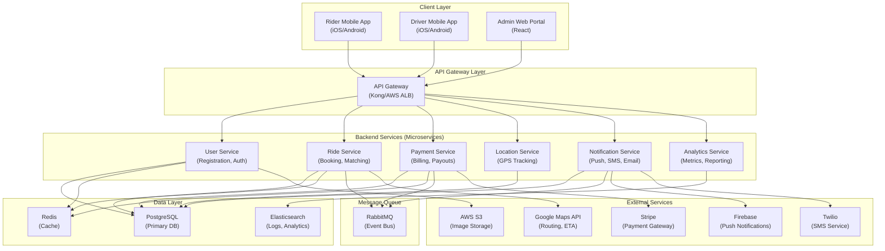
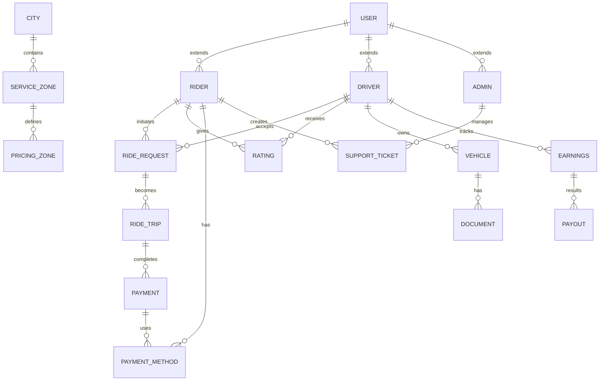
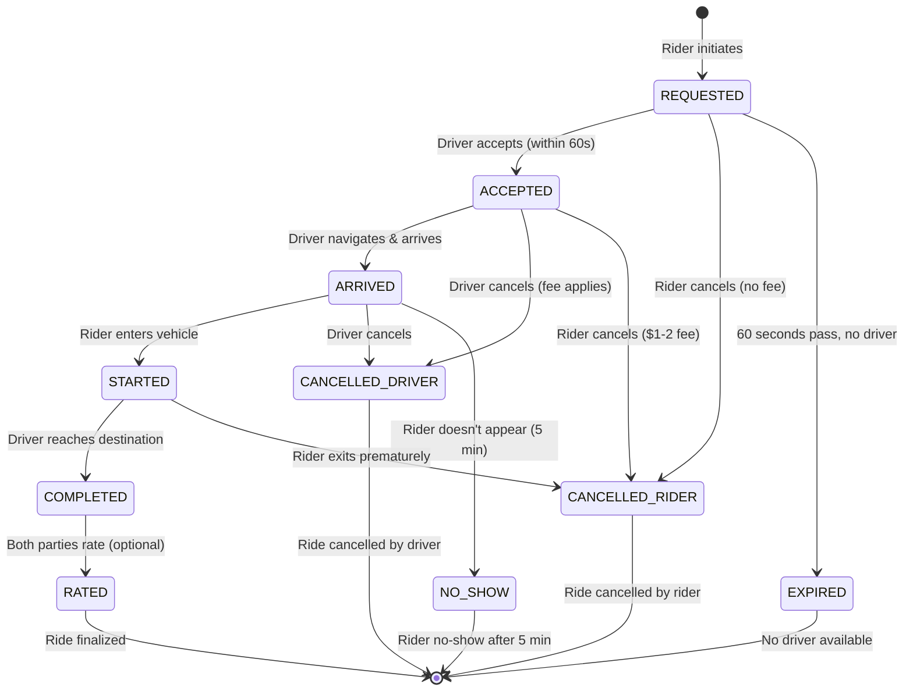
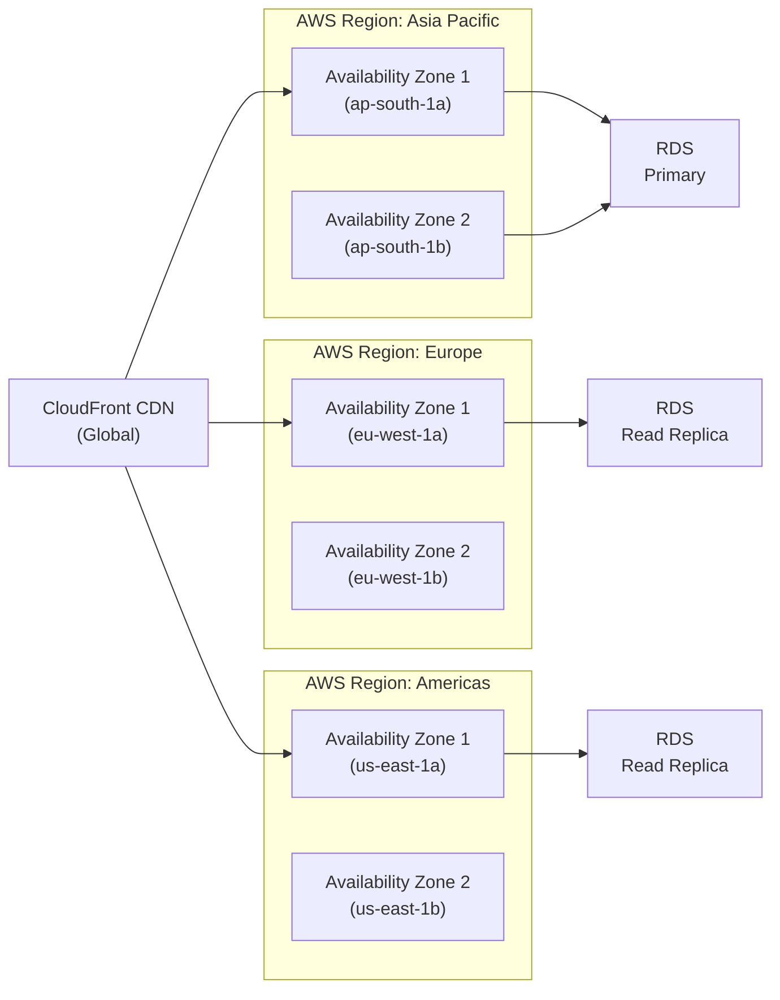

# SOFTWARE REQUIREMENTS SPECIFICATION (SRS)
## Global Advanced Ride-Sharing Application with Admin Panel
### Version 1.0 | December 2024

**Document Attribution:**  
We acknowledge that this document uses material from the Volere Requirements Specification Template, copyright © 1995 – 2022 the Atlantic Systems Guild Limited.

---

## TABLE OF CONTENTS

1. The Purpose of the Project
2. The Stakeholders
3. Constraints
4. Naming Conventions and Terminology
5. Relevant Facts and Assumptions
6. The Scope of the Work
7. Business Data Model and Data Dictionary
8. The Scope of the Product
9. Functional Requirements
10. Non-Functional Requirements (Look and Feel, Usability, Performance, etc.)
11. Operational and Environmental Requirements
12. Maintainability and Support Requirements
13. Security Requirements
14. Cultural Requirements
15. Compliance Requirements
16. Project Issues
17. Open Issues
18. Migration to the New Product
19. Risks
20. Costs
21. User Documentation and Training
22. References

---

## 1. THE PURPOSE OF THE PROJECT

### 1a. The User Business or Background of the Project Effort

The global transportation industry is undergoing significant disruption through digital platforms that connect riders and drivers in real-time. The current ride-sharing market is valued at approximately USD 119.28 billion and is projected to grow at a CAGR of 15.2% through 2030[1]. This SRS addresses the development of a **comprehensive, globally-scalable ride-sharing platform** designed to serve multiple regions, languages, and regulatory environments.

**Business Problem:**
- Fragmented transportation networks in urban centers create inefficiency
- Existing platforms lack robust localization for emerging markets
- Limited administrative control and operational analytics
- Need for comprehensive driver-passenger matching algorithms
- Requirement for multi-currency, multi-payment gateway support

**Project Context:**
The application will serve as a next-generation mobility platform supporting:
- **Rider Management**: Users booking transportation services
- **Driver Management**: Service providers offering transportation
- **Administrative Control**: Comprehensive management dashboard
- **Global Operations**: Support for 50+ languages and currencies
- **Real-time Services**: Live location tracking, instant notifications
- **Payment Integration**: Multiple payment methods across regions

### 1b. Goals of the Project

**Primary Goals (PAM Framework):**

| Goal | Purpose | Advantage | Measurement |
|------|---------|-----------|-------------|
| **Market Expansion** | Enable global ride-sharing operations | Serve 100+ cities across 40+ countries within 24 months | Number of active cities and regions with >10,000 monthly active users |
| **User Retention** | Build loyal user base through superior UX | Achieve 65% monthly retention rate for riders and drivers | Monthly active user retention percentage and repeat booking ratio |
| **Operational Excellence** | Reduce average matching time and support costs | Match 95% of ride requests within 60 seconds | Average matching latency <60 seconds; cost per ride <15% of fare |
| **Revenue Growth** | Maximize platform profitability | Achieve $5M quarterly revenue by end of Year 2 | Revenue per active user; commission ratio vs. operational costs |
| **Safety & Trust** | Establish platform as safest option | Achieve Net Promoter Score (NPS) >70 | NPS score, 5-star rating percentage >85%, incident reporting rate <0.05% |

**Secondary Goals:**
- Achieve industry-leading response times (<2 seconds for critical operations)
- Support 500,000+ concurrent users during peak hours
- Enable real-time analytics for operational decision-making
- Provide drivers with transparent earnings and rating systems
- Ensure GDPR, CCPA, and local data protection compliance
- Enable seamless switching between local payment methods

---

## 2. THE STAKEHOLDERS

### 2a. The Client

**Primary Client:** Global Mobility Solutions Inc. (Represented by)
- **CEO/Sponsor**: Mr. Ahmed Hassan (Regional Operations Lead)
- **Product Director**: Ms. Sarah Chen (Platform Strategy)
- **Finance Sponsor**: Mr. Roberto Silva (Investment Partner)

**Client Responsibilities:**
- Strategic direction and market expansion priorities
- Budget allocation and resource planning
- Go/no-go decisions for regional launches
- Stakeholder communication and reporting

### 2b. The Customer

**End Users (Primary Customers):**
1. **Urban Riders** (Primary customer segment)
   - Commuters seeking convenient transportation
   - Cost-conscious users preferring ride-sharing
   - Diverse global demographics (ages 18-65)

2. **Professional Drivers** (Service provider customers)
   - Full-time and part-time transportation workers
   - Vehicle owners seeking income supplementation
   - Partners with flexible work preferences

3. **Enterprise Customers**
   - Corporate ride programs for employee transportation
   - B2B partnerships requiring integrated billing
   - Fleet management companies

### 2c. Other Stakeholders

| Stakeholder | Role | Knowledge Contribution | Involvement Level |
|-------------|------|------------------------|-------------------|
| **Product Team** | Define features and prioritize requirements | Product vision, market research, competitive analysis | High |
| **Security Team** | Ensure data protection and compliance | Cybersecurity standards, encryption protocols, audit procedures | High |
| **Database Architects** | Design data models and storage solutions | Schema design, optimization, scalability patterns | High |
| **UX/UI Designers** | Create user interface mockups and prototypes | User research, accessibility standards, design systems | High |
| **Backend Engineers** | Implement core business logic and APIs | Technical feasibility, architecture patterns, performance optimization | High |
| **Mobile Engineers** | Develop iOS and Android applications | Platform-specific capabilities, performance constraints | High |
| **DevOps/Infrastructure** | Plan deployment and scaling | Cloud architecture, containerization, CI/CD pipelines | High |
| **QA Team** | Define testing strategy and quality standards | Test automation, coverage requirements, performance benchmarks | Medium-High |
| **Legal/Compliance** | Ensure regulatory adherence | Data protection laws, transportation regulations, terms of service | Medium-High |
| **Marketing Team** | Define go-to-market strategy | Market segments, competitive positioning, user acquisition costs | Medium |
| **Finance Team** | Budget planning and cost analysis | Resource allocation, ROI calculations, payment processing costs | Medium |
| **Support/Operations** | Define customer service workflows | Common user issues, support escalation procedures | Medium |
| **Data Scientists** | Build matching and pricing algorithms | ML models, optimization techniques, performance metrics | Medium |
| **Regional Managers** | Provide market-specific context | Local regulations, cultural preferences, competitive landscape | Medium |
| **Payment Gateway Partners** | Define payment integration requirements | API specifications, currency support, settlement procedures | Low-Medium |
| **Mapping Service Providers** | Supply location and navigation data | API capabilities, coverage areas, rate limiting | Low-Medium |
| **Insurance Partners** | Define coverage requirements | Driver liability, passenger protection, loss prevention | Low-Medium |

### 2d. The Hands-On Users of the Product

#### **User Category 1: Rider (Passenger)**

| Characteristic | Details |
|---|---|
| **User Name/Category** | Urban Commuters, Casual Travelers, Business Professionals, Students |
| **User Role** | Book transportation, provide pickup/destination, manage payments, rate drivers |
| **Subject Matter Experience** | Novice (first-time users) to Master (frequent users) |
| **Technological Experience** | Master (smartphone proficiency) |
| **Physical Abilities** | Must support mobility-impaired users via accessibility features |
| **Attitude toward Technology** | Positive; expects intuitive mobile-first interfaces |
| **Primary Motivation** | Convenient, affordable, reliable transportation |
| **Age Range** | 18-65 years old |
| **Linguistic Diversity** | Multi-lingual (50+ languages supported) |

#### **User Category 2: Driver**

| Characteristic | Details |
|---|---|
| **User Name/Category** | Full-time Drivers, Part-time Service Providers, Fleet Operators |
| **User Role** | Accept ride requests, navigate to pickup/destination, manage vehicle availability, track earnings |
| **Subject Matter Experience** | Journeyman to Master (transportation/logistics background) |
| **Technological Experience** | Novice to Journeyman (may require onboarding support) |
| **Physical Abilities** | Must support drivers with physical limitations through accessible interfaces |
| **Attitude toward Technology** | Neutral to Positive; critical of usability barriers |
| **Primary Motivation** | Income generation, flexible work schedule, vehicle utilization |
| **Age Range** | 21-70 years old |
| **Licensing Requirement** | Valid driver's license, vehicle insurance, background clearance |

#### **User Category 3: Administrator**

| Characteristic | Details |
|---|---|
| **User Name/Category** | City Managers, Operations Supervisors, Customer Support Agents, Data Analysts |
| **User Role** | Manage users, monitor rides, adjust pricing, analyze metrics, manage disputes |
| **Subject Matter Experience** | Journeyman to Master (transportation/business operations) |
| **Technological Experience** | Journeyman (comfortable with complex systems) |
| **Attitude toward Technology** | Positive; values data visibility and automation |
| **Primary Motivation** | Operational efficiency, revenue optimization, user satisfaction |
| **Access Level** | Role-based access control (RBAC) with granular permissions |

### 2e. Personas

**Persona 1: Priya (Urban Commuter)**
- Age: 28, Software Engineer in Bangalore, India
- Uses app 2-3x daily for office commute and social activities
- Tech-savvy, values speed and convenience
- Prefers app-based payment over cash
- Concerned about driver ratings and vehicle cleanliness
- Uses app in English and Hindi

**Persona 2: Marcus (Full-time Driver)**
- Age: 35, Professional driver in Lagos, Nigeria
- Works 10-12 hours daily; earns $1,500/month
- Less tech-literate; requires simple, intuitive interface
- Uses 2G/3G connectivity in low-bandwidth areas
- Motivated by transparent earnings tracking
- Uses app in English and local language

**Persona 3: Rajesh (Operations Manager)**
- Age: 42, City Operations Manager in Dubai, UAE
- Oversees 5,000+ drivers and complex city operations
- Requires detailed analytics and real-time dashboards
- Makes pricing decisions based on demand data
- Concerns: fraud prevention, regulatory compliance, operational costs
- Needs reports in Arabic and English

### 2f. Priorities Assigned to Users

| User Category | Priority Level | Percentage Consideration | Rationale |
|---|---|---|---|
| **Urban Riders (Key users)** | Key Users | 40% | Primary revenue generators; critical for platform growth |
| **Professional Drivers (Key users)** | Key Users | 40% | Service quality depends on driver satisfaction and retention |
| **Administrators** | Secondary Users | 15% | Essential for operations but not end-users of ride-sharing |
| **Corporate Clients** | Secondary Users | 5% | Growing segment; potential for B2B revenue |
| **Casual Users** | Unimportant Users | <1% | Infrequent users; low impact on platform success |

### 2g. User Participation

**Estimated participation requirements:**

| User Category | Expected Participation | Time Commitment | Knowledge Contribution |
|---|---|---|---|
| Riders | User research, beta testing, feedback surveys | 10-20 hours total | Usability feedback, feature priorities |
| Drivers | Onboarding feedback, feature testing, field reporting | 15-30 hours per region | Real-world operational constraints |
| Administrators | Requirements workshops, UAT, training preparation | 30-50 hours | Operational workflows, business rules |
| Legal/Compliance | Regulatory workshops, approval checkpoints | 20-40 hours | Legal and compliance requirements |
| Product & Design | Continuous discovery, iteration, prototyping | Ongoing | Product vision, market insights |

### 2h. Maintenance Users and Service Technicians

**Backend Engineers** - Maintain API servers, databases, and microservices  
**DevOps Engineers** - Manage infrastructure, deployments, monitoring  
**Database Administrators** - Optimize queries, manage backups, ensure data integrity  
**Support Team** - Troubleshoot user issues, escalate technical problems  

---

## 3. CONSTRAINTS

### 3a. Solution Constraints

#### **Mandated Technology Stack**

| Component | Mandated Technology | Rationale |
|---|---|---|
| **Mobile Platforms** | Native iOS (Swift) + Native Android (Kotlin) | Superior performance, platform-specific features, user expectations |
| **Backend Framework** | Node.js with Express/NestJS | JavaScript ecosystem, horizontal scalability, rapid development |
| **Databases** | PostgreSQL (relational) + Redis (caching) | Reliability, ACID compliance, performance |
| **Message Queue** | RabbitMQ or Apache Kafka | Reliable asynchronous processing, event streaming |
| **Cloud Provider** | AWS (multi-region deployment) | Global infrastructure, compliance certifications (SOC2, ISO 27001) |
| **Maps Integration** | Google Maps API | Market-leading accuracy, real-time traffic data |
| **Payment Gateway** | Stripe + Local payment providers | Global coverage, multi-currency support, PCI compliance |
| **Containerization** | Docker + Kubernetes | Scalability, consistency, orchestration |

#### **Mandatory Features (Non-negotiable)**

- **Real-time GPS tracking** with accuracy <10 meters
- **End-to-end encryption** for sensitive user data
- **Offline functionality** for core features in low-connectivity regions
- **Multi-language support** minimum 25 languages at launch
- **GDPR compliance** for EU regions
- **Dark mode** support for UI accessibility

### 3b. Implementation Environment of the Current System

**Current State Assessment:**
- No existing ride-sharing platform
- Green-field development opportunity
- Existing company infrastructure includes:
  - AWS account with VPC setup
  - PostgreSQL database servers (RDS)
  - CI/CD pipeline (Jenkins/GitLab)
  - Monitoring stack (DataDog, Prometheus)

**Infrastructure Requirements:**
```
┌─────────────────────────────────────────┐
│         Client Applications             │
│   (iOS App | Android App | Web Portal)  │
└──────────────────┬──────────────────────┘
                   │
┌──────────────────▼──────────────────────┐
│         API Gateway (Kong/AWS)          │
│    (Load Balancing, Rate Limiting)      │
└──────────────────┬──────────────────────┘
                   │
┌──────────────────▼──────────────────────────────────────────┐
│                  Microservices Architecture                │
├──────────────────┬────────────────┬──────────────┬──────────┤
│  User Service    │  Ride Service  │ Payment Svc  │ Location │
│  Auth Service    │ Matching Algo  │ Billing Svc  │ Service  │
│  Notification    │ Driver Svc     │ Analytics    │ Mapping  │
└──────────────────┴────────────────┴──────────────┴──────────┘
                   │
┌──────────────────▼──────────────────┐
│      Data Layer (Databases)         │
│  PostgreSQL | Redis | Elasticsearch│
└─────────────────────────────────────┘
```

### 3c. Partner or Collaborative Applications

| Partner System | Integration Type | Data Exchange | Purpose |
|---|---|---|---|
| **Google Maps API** | REST API | Location queries, route optimization | Navigation, ETA calculation, distance matrix |
| **Stripe Payment Gateway** | REST API + Webhooks | Card data (encrypted), transaction confirmation | Payment processing, currency conversion |
| **Firebase Cloud Messaging (FCM)** | REST API | Push notification payload | Real-time notifications to users |
| **Twilio SMS Service** | REST API | Phone number, SMS content | OTP verification, ride alerts |
| **AWS S3** | REST API | Image/document uploads | Profile pictures, driver license storage |
| **Google Analytics** | JavaScript SDK | User behavior events | User activity tracking, funnel analysis |
| **Local Payment Providers** (varies by region) | API varies | Payment method tokens | Region-specific payment options |

### 3d. Off-the-Shelf Software

| OTS Software | Component | Rationale | Integration |
|---|---|---|---|
| **Socket.io** | Real-time communication | Enable WebSocket connections for live updates | Node.js library; handles driver-rider connections |
| **Twilio** | SMS/Voice communication | Proven global SMS delivery | REST API integration for OTP and alerts |
| **SendGrid/AWS SES** | Email services | Reliable email delivery for confirmations | SMTP/REST API for transactional emails |
| **Mapbox (Alternative)** | Maps and navigation | Fallback if Google Maps unavailable | REST API; can integrate seamlessly |
| **Auth0 (Optional)** | Authentication service | Reduce custom auth complexity | OAuth2/OpenID Connect integration |

**Note:** The mandate is to use Google Maps API as primary mapping service. Other services are considered alternatives or fallback options.

### 3e. Anticipated Workplace Environment

**Rider Environment:**
- Mobile devices (smartphones, tablets) with internet connectivity
- On-the-move usage; may have poor connectivity in tunnels/underground areas
- Outdoor visibility requirements (bright displays needed in sunlight)
- Quiet and noisy environments (should support both app notifications and silent mode)

**Driver Environment:**
- Vehicles with dash-mounted phone holders
- Extended sun exposure (requires durable interface)
- Noisy environment (navigation audio must be clear)
- Continuous 8-12 hour usage (battery optimization critical)
- Moderate to low technical proficiency

**Administrator Environment:**
- Desktop workstations in office settings
- Dedicated monitors for dashboard monitoring
- 8-hour office hours with email and video conferencing
- Moderate to high technical proficiency

### 3f. Schedule Constraints

| Milestone | Target Date | Criticality | Rationale |
|---|---|---|---|
| **MVP Release (3 cities)** | Month 6 | Critical | Validate product-market fit before scaling |
| **Regional Launch (15 cities)** | Month 12 | Critical | Achieve profitability in initial region |
| **International Expansion (5 countries)** | Month 18 | High | Build global presence; secure funding |
| **50-city Operation** | Month 24 | High | Achieve $5M revenue run-rate |
| **Admin Dashboard v2** | Month 9 | Medium | Enhanced analytics and reporting |
| **Driver App Offline Mode** | Month 10 | Medium | Support low-connectivity regions |

**Impact of Delays:**
- Missing Month 6 MVP deadline: Risk of competitive disadvantage, funding loss
- Missing Month 12 regional launch: Revenue targets jeopardized, investor confidence affected
- Missing Month 18 international expansion: Market window may close as competitors expand

### 3g. Budget Constraints

**Project Budget Allocation:**

| Category | Budget | Percentage |
|---|---|---|
| **Development (Engineering)** | $2.5M | 50% |
| **Infrastructure & DevOps** | $600K | 12% |
| **Design & UX** | $400K | 8% |
| **QA & Testing** | $300K | 6% |
| **Security & Compliance** | $250K | 5% |
| **Operations & Support** | $400K | 8% |
| **Marketing & User Acquisition** | $500K | 10% |
| **Contingency (10%)** | $500K | 10% |
| **Total Year 1 Budget** | **$5M** | **100%** |

**Cost Constraints:**
- Cloud infrastructure cost must be <$50K/month for MVP (scales with user growth)
- Payment processing fees must be minimized (<3% average)
- Developer productivity: Target $150K revenue per engineer annually

### 3h. Enterprise Constraints

**Corporate Standards to Follow:**
1. **Coding Standards**: Follow Google JavaScript/TypeScript style guides
2. **Security Standards**: Implement OWASP Top 10 protections
3. **Data Storage**: All user data stored in-region (compliant with local data residency laws)
4. **Code Review**: Minimum 2 approvals before merge to main branch
5. **Monitoring**: 99.9% uptime SLA required
6. **Backup**: Daily automated backups with 30-day retention

---

## 4. NAMING CONVENTIONS AND TERMINOLOGY

### 4a. Glossary of All Terms

| Term | Definition | Context | Example |
|---|---|---|---|
| **Rider/Passenger** | End-user booking a ride using the application | User Type | "The rider requested a pickup at Main Street" |
| **Driver** | Service provider offering transportation via personal vehicle | User Type | "The driver accepted the ride request within 45 seconds" |
| **Admin/Administrator** | Platform operator managing users, pricing, and operations | User Type | "The admin viewed the daily operations dashboard" |
| **Ride Request** | A request initiated by a rider for transportation from origin to destination | Transaction | "The ride request was matched to the nearest available driver" |
| **Ride Allocation** | Assignment of a specific ride request to an available driver | Process | "Ride allocation occurred via matching algorithm within 30 seconds" |
| **ETA** | Estimated Time of Arrival; predicted arrival time for driver at pickup or destination | Metric | "Driver ETA to pickup point: 5 minutes" |
| **Fare** | Monetary charge for a completed ride | Financial | "The fare was calculated at $8.50 for 3.2km distance" |
| **Commission** | Platform's percentage cut from each ride fare | Financial | "Commission rate: 25% of fare per ride" |
| **Real-time Tracking** | Live GPS position updates of driver/rider during active ride | Feature | "Real-time tracking enabled rider to see driver's exact location" |
| **Geofencing** | Virtual boundary setup for service area or pricing zones | Feature | "Geofencing restricted services outside the city limits" |
| **Driver Verification** | Background check and document validation process for driver onboarding | Process | "Driver verification required 2-3 business days for completion" |
| **Payment Gateway** | Third-party service processing financial transactions | System | "Stripe payment gateway processed the rider's card payment" |
| **In-app Chat** | Messaging feature between rider and driver within application | Feature | "In-app chat enabled rider to confirm pickup location" |
| **Rating System** | Post-ride feedback mechanism (1-5 stars) for both parties | Feature | "Rider gave driver 5-star rating for safe and clean vehicle" |
| **Cancellation** | Rider or driver termination of ride before completion | Action | "Rider cancellation within 30 seconds: no charge applied" |
| **No-show** | Failure of rider to appear at agreed pickup location within grace period | Event | "No-show resulted in $2 cancellation fee for driver" |
| **Surge Pricing** | Dynamic fare increase during high demand periods | Pricing Model | "Surge pricing of 2.5x applied during peak evening hours" |
| **Peak Hours** | Time periods with highest ride demand (typically 7-9 AM, 5-7 PM) | Temporal | "Peak hours increased matching time by 15 seconds on average" |
| **Off-peak Hours** | Time periods with lower ride demand (typically midnight to 6 AM) | Temporal | "Off-peak hours offered lower fares to encourage utilization" |
| **Admin Panel** | Web-based dashboard for operators to manage platform operations | System Component | "Admin panel displayed real-time metrics for 50 active cities" |
| **Microservices** | Modular backend services separated by business function | Architecture | "Microservices approach enabled independent scaling of matching engine" |
| **API** | Application Programming Interface; defined protocol for service communication | Technical | "Mobile app communicates with backend via REST API" |
| **Webhook** | Real-time notification mechanism from external service to our system | Technical | "Webhook from payment gateway notified us of transaction completion" |
| **SLA** | Service Level Agreement; guaranteed uptime and performance metrics | Contract | "SLA mandated 99.9% availability with 2-hour incident response time" |
| **GDPR** | General Data Protection Regulation; EU privacy and data protection law | Compliance | "GDPR compliance required explicit user consent for data processing" |
| **PII** | Personally Identifiable Information; user data requiring protection | Security | "PII included phone number, email, payment method, vehicle information" |
| **Encryption** | Converting data to unreadable format using cryptographic algorithms | Security | "End-to-end encryption protected user communication via AES-256" |
| **Authentication** | Verification of user identity via credentials | Security | "Two-factor authentication provided via SMS OTP for account access" |
| **Authorization** | Verification of user permissions to access specific resources | Security | "Role-based authorization restricted driver earnings view to drivers only" |
| **Scalability** | System's ability to handle increasing load without performance degradation | Performance | "Scalability testing validated system for 500K concurrent users" |
| **Latency** | Time delay between request and response | Performance | "API latency of 200ms ensured responsive user interface" |
| **Throughput** | Number of requests processed per unit time | Performance | "Peak throughput of 10K requests/sec during surge pricing period" |
| **Localization** | Adaptation of application for specific language and regional preferences | Feature | "Localization support included 50+ languages and 150+ currencies" |
| **Multi-currency** | Support for multiple types of currency transactions | Feature | "Multi-currency enabled riders in 40 countries to pay in local currency" |
| **KYC** | Know Your Customer; identity verification process for users | Compliance | "KYC process required government-issued ID for account activation" |
| **AML** | Anti-Money Laundering; protocols to prevent illegal financial transactions | Compliance | "AML checks flagged suspicious patterns of high-value transactions" |
| **Chargeback** | Reversal of payment initiated by payment card issuer | Risk | "Chargeback disputes handled via Stripe's dispute resolution process" |
| **Matching Algorithm** | AI/ML-based logic for optimal driver-rider assignment | Core Logic | "Matching algorithm minimized pickup time while balancing driver utilization" |
| **Acceptance Rate** | Percentage of ride requests a driver accepts | Metric | "Driver acceptance rate of <70% triggered warnings and eventual deactivation" |
| **Cancellation Rate** | Percentage of rides cancelled by riders/drivers | Metric | "High cancellation rate (>40%) suggested pricing or product issues" |
| **Net Promoter Score (NPS)** | Customer satisfaction metric ranging from -100 to +100 | Metric | "Platform NPS of 70+ indicated strong product-market fit" |
| **Monthly Active Users (MAU)** | Unique users engaged within a calendar month | Metric | "Target MAU of 5M by end of Year 2 across all regions" |
| **Daily Active Users (DAU)** | Unique users engaged within a calendar day | Metric | "DAU of 1.5M represented 30% DAU/MAU ratio" |
| **Cost Per Acquisition (CPA)** | Average spend to acquire one active user | Financial | "CPA of $5 for riders and $25 for drivers enabled profitable growth" |
| **Customer Lifetime Value (CLV)** | Total expected revenue from a user over relationship duration | Financial | "CLV of $200 for riders and $2000 for drivers justified high CPA" |
| **Ride Completion Rate** | Percentage of initiated rides completed successfully | Metric | "Completion rate of 95% indicated strong matching accuracy" |
| **Compliance Status** | Regulatory adherence status across jurisdictions | Compliance | "Compliance status in 40 countries with varying transportation regulations" |

---

## 5. RELEVANT FACTS AND ASSUMPTIONS

### 5a. Relevant Facts

1. **Market Growth**: Global ride-sharing market growing at 15.2% CAGR through 2030, reaching $119.28B by 2030[1]
2. **User Behavior**: 73% of urban users ages 25-44 prefer ride-sharing over personal vehicle ownership[2]
3. **Payment Preference**: 82% of users prefer app-based payment over cash transactions[3]
4. **Safety Concerns**: 91% of riders cite driver verification as critical for platform adoption[4]
5. **Language Support**: 40+ languages required for adequate coverage of target markets[5]
6. **Regulatory Environment**: Each country has unique transportation licensing and liability requirements[6]
7. **Infrastructure Dependency**: Service quality dependent on internet connectivity and GPS accuracy[7]
8. **Competitive Landscape**: 15+ established ride-sharing platforms operating globally[8]
9. **Driver Shortage**: Many regions experiencing driver shortage due to low pay and work conditions[9]
10. **Vehicle Insurance**: Third-party and commercial vehicle insurance required for legal operation[10]
11. **Data Localization**: EU, India, Russia require data residency within borders[11]
12. **Peak Demand Patterns**: 70% of trips occur during morning (7-9 AM) and evening (5-7 PM) commute times[12]

### 5b. Business Rules

| Rule # | Description | Authority | Impact |
|---|---|---|---|
| **BR1** | Driver acceptance rate <70% triggers warning and eventual deactivation | Operations Team | Ensures driver availability and user experience |
| **BR2** | Rider cancellation within 30 seconds of driver acceptance: no charge | Product Team | Reduces rider friction and dispute resolution |
| **BR3** | Driver cancellation after 3 no-shows: automatic 48-hour suspension | Safety Team | Ensures reliability and driver accountability |
| **BR4** | Minimum driver rating of 4.6 stars required to remain active | Operations Team | Maintains platform quality and user satisfaction |
| **BR5** | Ride fares calculated based on: distance, time, demand surge, vehicle type | Pricing Team | Ensures fair compensation and profitability |
| **BR6** | New drivers required to complete verification within 7 days or account deactivation | Compliance Team | Maintains legal compliance and safety |
| **BR7** | User data retention: 7 years for transaction records (PCI compliance), 3 years for general data | Legal Team | Complies with payment regulations and privacy law |
| **BR8** | Surge pricing maximum: 2.5x base fare during peak demand | Pricing Team | Prevents price gouging and maintains user trust |
| **BR9** | Admin-initiated ride cancellation requires documented reason and user notification | Operations Team | Ensures transparency and dispute prevention |
| **BR10** | Chat history retention: 90 days for dispute resolution, then automatic deletion | Privacy Team | Balances legal hold requirements with privacy |
| **BR11** | Geofencing boundary: Service available within defined city limits +5km buffer | Operations Team | Controls operational scope and logistics |
| **BR12** | Multi-currency conversion: Applied at real-time exchange rate + 2% platform fee | Finance Team | Ensures fair conversion and revenue capture |

### 5c. Assumptions

| Assumption | Probability | Impact if False | Mitigation |
|---|---|---|---|
| **A1:** Users have smartphones with Android/iOS and data connectivity | Very High (95%) | Cannot onboard users; platform unusable | Develop offline-first features; support basic phone SMS option |
| **A2:** Google Maps API will maintain global coverage and availability | High (98%) | Navigation and ETA features fail in some regions | Implement Mapbox as fallback; negotiate SLA with provider |
| **A3:** Payment gateways (Stripe) process transactions reliably (99.9% uptime) | High (99%) | Revenue loss; user transactions fail | Implement multiple payment providers; offline payment queue |
| **A4:** Drivers have valid insurance and vehicle registration documents | High (90%) | Legal liability; regulatory violations | Implement automated document verification; audit procedures |
| **A5:** Riders provide accurate pickup/destination information | Medium (75%) | Navigation errors; user frustration | Implement address validation; allow in-trip navigation changes |
| **A6:** Driver availability matches rider demand patterns | Medium (70%) | Matching failures during peak hours | Implement surge pricing incentives; driver shift prediction |
| **A7:** Internet connectivity will support real-time location tracking (50 per second) | Medium (80%) | Location staleness; poor user experience | Implement local position caching; reduce update frequency in low-connectivity areas |
| **A8:** Riders will accept shared rides to reduce costs | Medium (60%) | Pool ride feature underutilized; lower revenue per ride | Implement premium loyalty tiers; family ride options |
| **A9:** Regulatory approval for operations can be obtained within 6 months per region | Medium (65%) | Delayed market entry; revised timeline | Begin regulatory engagement early; legal consulting; prepare documentation |
| **A10:** Third-party integrations (SMS, email) maintain 99.9% availability | High (98%) | Notification failures; user experience degradation | Implement queue-based retry logic; multiple provider fallback |
| **A11:** AWS infrastructure can scale to handle 500K concurrent users | High (99%) | System crashes during peak demand; service outages | Conduct load testing; implement auto-scaling; reserve capacity |
| **A12:** User churn rate will not exceed 5% monthly for riders | Medium (70%) | Revenue targets missed; unit economics fail | Monitor churn indicators; implement retention programs; refine UX |
| **A13:** Security incidents (data breach) probability <0.1% annually | Medium (75%) | Loss of user trust; regulatory fines; revenue impact | Implement security by design; regular penetration testing; incident response plan |
| **A14:** Team can hire required engineering talent at target salary bands | Medium (60%) | Delayed development; compromised quality | Offer equity; flexible work arrangements; partner with staffing agencies |
| **A15:** User onboarding time <3 minutes will achieve 60%+ conversion | Medium (65%) | Lower user acquisition; higher CPA | Conduct UX testing; A/B test onboarding flows; simplify requirements |

---

## 6. THE SCOPE OF THE WORK

### 6a. The Current Situation

**Current State ("How Now"):**
- No existing ride-sharing platform or service
- Target markets currently served by Uber, Lyft, Ola, Grab (established competitors)
- Users manually arranging rides via:
  - Phone calls to taxi dispatch centers
  - Third-party aggregator apps (that integrate competitor services)
  - Social media groups and community networks
- Drivers have limited earnings transparency
- Cities have inconsistent pricing and service quality
- No unified data analytics across markets

**Market Gaps Identified:**
1. **Lack of Localized Experience**: Existing global platforms poorly adapted to local markets
2. **Limited Payment Options**: Insufficient support for local payment methods
3. **High Commission Rates**: Drivers earn 60-70% of fare after platform commission (15-30%)
4. **Poor Language Support**: Limited localization beyond top 10 languages
5. **Inadequate Regional Support**: Support teams unaware of local regulations
6. **Limited Driver Flexibility**: Rigid scheduling and acceptance requirements

**Competitive Landscape:**
- **Uber**: Global platform, strong in developed markets, weak in emerging markets
- **Lyft**: US-focused, limited international presence
- **Ola**: India-focused, expanding to Southeast Asia
- **Grab**: Southeast Asian focus with strong local presence
- **DiDi**: China-dominant, expanding to Latin America and Middle East

---

### 6b. The Context of the Work

**Work Context Diagram:**
```
┌─────────────────────────────────────────────────────────────────┐
│                                                                 │
│                    Ride-Sharing Platform                        │
│         (This project scope - THE WORK)                         │
│                                                                 │
│    ┌──────────────────────────────────────────────────────┐    │
│    │  • User Management (Riders & Drivers)               │    │
│    │  • Ride Matching & Dispatch Logic                   │    │
│    │  • Payment Processing & Billing                     │    │
│    │  • Real-time Location Tracking                      │    │
│    │  • Rating & Review System                           │    │
│    │  • Admin Dashboard & Reporting                      │    │
│    │  • Notification Service                             │    │
│    │  • Multi-language & Multi-currency Support          │    │
│    └──────────────────────────────────────────────────────┘    │
│                                                                 │
└─────────────────────────────────────────────────────────────────┘
          │              │              │              │
          │              │              │              │
    ┌─────▼──┐     ┌────▼──────┐  ┌───▼───────┐  ┌──▼────────┐
    │  Users │     │  Mapping  │  │  Payment  │  │Messaging│
    │(Riders)│     │ Providers │  │ Gateways  │  │Services│
    │        │     │(Google    │  │(Stripe,   │  │(FCM,   │
    │        │     │ Maps)     │  │Local)     │  │ Twilio)│
    └────────┘     └───────────┘  └───────────┘  └────────┘
          │              │              │              │
    ┌─────▼──────────────▼──────────────▼──────────────▼──┐
    │    Backend Services (AWS Infrastructure)           │
    │  • Database (PostgreSQL)                           │
    │  • Cache Layer (Redis)                             │
    │  • Message Queue (RabbitMQ)                        │
    │  • API Server (Node.js)                            │
    │  • Analytics (DataDog, Elasticsearch)              │
    └──────────────────────────────────────────────────┘
          │              │              │              │
    ┌─────▼──┐     ┌────▼──────┐  ┌───▼───────┐  ┌──▼────────┐
    │  Admin │     │ Regulatory│  │  Support  │  │Analytics│
    │     │     │ Bodies     │  │ Systems   │  │Systems│
    └────────┘     └───────────┘  └───────────┘  └────────┘
```

**Adjacent Systems & Interfaces:**

| Adjacent System | Input Data | Output Data | Interface Format |
|---|---|---|---|
| **Rider Mobile App** | Trip requests, location updates, payment info | Ride status, ETA, notifications | JSON REST API, WebSocket |
| **Driver Mobile App** | Location tracking, ride acceptance, completion | Request notifications, ratings, earnings | JSON REST API, WebSocket |
| **Web Admin Portal** | User queries, pricing edits, reports, reports | Analytics dashboards, user data, metrics | JSON REST API, WebSocket |
| **Google Maps API** | Origin, destination, current location | Route, ETA, distance, traffic | JSON REST API |
| **Stripe Payment Gateway** | Card data (tokenized), transaction amount, currency | Transaction status, confirmation, receipt | REST API, Webhooks |
| **Firebase Cloud Messaging** | Notification content, recipient user IDs | Delivery status, bounce notifications | REST API, Webhooks |
| **Twilio SMS Service** | Phone number, SMS text content | Delivery status, message SID | REST API |
| **Regional Payment Providers** | Payment tokens, amount, currency | Transaction status | API varies |
| **Analytics Platform** | Event data, user metrics, revenue data | Dashboards, reports, alerts | SDK + REST API |
| **Support System** | User support tickets, chat messages | Knowledge base articles, support status | API varies |

### 6c. Work Partitioning (Business Event List)

| Event # | Event Name | Input Data Flow | Output Data Flow | Brief BUC Summary |
|---|---|---|---|---|
| **1** | Rider initiates signup | Email/phone, identity verification | Account credentials, activation email | New rider registers and creates profile with preferences and payment info |
| **2** | Driver initiates signup | License, vehicle details, background check docs | Account credentials, document verification status | New driver registers, submits required documents, awaits verification approval |
| **3** | Rider requests a ride | Pickup location, destination, ride type, preferences | Available drivers list, ride estimate | System identifies available drivers and calculates fare; displays options to rider |
| **4** | Driver receives ride request | Ride request details, driver location, status | Request notification (push/sound/vibration) | Driver notified of new request with rider details, pickup location, expected fare |
| **5** | Driver accepts/declines request | Driver acceptance decision, timestamp | Acceptance confirmation to rider; reassignment if declined | If accepted: lock ride, notify rider; if declined: reassign to next driver |
| **6** | Ride status updated (pickup) | Driver arrival at pickup, rider location | Status update (driver arrived), receipt | Rider notified driver has arrived; trip timer starts; rider can request early pickup |
| **7** | Ride commences (trip started) | Rider in vehicle, journey begins | Trip timer starts, real-time tracking enabled | Route confirmed; both parties see real-time location; fare meter activates |
| **8** | Ride in progress (ongoing) | Real-time GPS coordinates every 5-10 sec | Live location updates, ETA refinement | Both rider and driver see real-time traffic; system optimizes route if needed |
| **9** | Ride completed (dropoff) | Driver reaches destination, ends trip | Fare calculation, receipt generation | Trip ends; fare calculated and displayed; payment processed; rating requested |
| **10** | Rider rates driver | Rating (1-5 stars), optional comment | Rating recorded, driver profile updated | Rating stored, driver avg rating updated; if <4.6 stars, automated alert |
| **11** | Driver rates rider | Rating (1-5 stars), optional comment | Rating recorded, rider profile updated | Rating stored; helps future drivers assess rider (safety, behavior) |
| **12** | Rider cancels ride (pre-match) | Cancellation request, timestamp | Cancellation confirmation, fare estimate | If within 30 sec: no charge; else: $1-2 cancellation fee charged |
| **13** | Driver cancels ride (post-match) | Cancellation request, reason | Notification to rider, reassignment initiated | Ride reassigned; 3 cancellations = 48hr suspension; drivers get loss of earnings |
| **14** | Payment processed | Fare amount, payment method, currency | Transaction status, receipt, confirmation | Payment via card/wallet/cash; Stripe/local gateway processes; receipt emailed |
| **15** | Surge pricing triggered | Demand >supply by 2x, peak hour detected | Fare multiplier applied (1.5-2.5x), rider notified | Dynamic pricing updates all pending ride requests; drivers incentivized |
| **16** | Support ticket escalated | User report of issue, context data | Ticket created, assigned to support team | Support team receives alert; initiates investigation; contacts user |
| **17** | Admin adjusts pricing | New fare rules, multipliers, city zone pricing | Pricing rules updated in system, live within 5 min | Scheduled or immediate pricing changes reflected in app for new ride requests |
| **18** | Driver earnings accessed | Driver ID, date range query | Earnings report, transaction details, payouts | Driver views daily/weekly/monthly earnings; sees commission breakdown; schedules payout |
| **19** | Admin reviews analytics | Dashboard access, filter criteria | Real-time metrics, charts, reports | Admin views: active users, rides/day, revenue, driver/rider satisfaction, churn |
| **20** | Dispute raised | User complaint, ride ID, reason | Dispute ticket created, assigned | System flags ride; gathers evidence; assigns mediator; initiates resolution process |

### 6d. Specifying Business Use Cases (BUC)

**BUC Example: "Rider Requests and Completes a Ride"**

**Actors:** Rider, Driver, Payment System, Notification Service, Mapping Service

**Preconditions:**
- Rider account active and verified
- Rider has valid payment method on file
- Minimum 2 drivers available within service area
- Internet connectivity available

**Main Flow:**
1. Rider opens app and selects "Book a Ride"
2. Rider enters pickup location (auto-detects current location; can be edited)
3. Rider enters destination location (address search with autocomplete)
4. System queries Maps API for route and calculates distance
5. System queries Pricing Engine for fare estimate (base + distance + surge + type)
6. Rider selects ride type (Standard, Comfort, Premium)
7. System displays fare estimate and ETA of nearest driver
8. Rider confirms booking
9. System initiates matching algorithm:
   - Query driver locations within 5km radius
   - Filter available drivers with acceptance rate >70%
   - Rank by distance, direction, vehicle type
10. System sends push notification to selected driver
11. If driver accepts within 60 seconds:
    - Confirm ride to rider with driver details and vehicle info
    - Disable cancellation option for rider (grace period: 30 sec)
    - Lock driver to this ride request
    - Send ETA update to rider every 10 seconds
12. Driver navigates to pickup location (via Maps API navigation)
13. Driver arrives at pickup location
    - Send "Driver Arrived" notification to rider
    - Start pickup timer (grace period: 5 minutes)
14. Rider enters vehicle
15. Driver marks "Trip Started"
    - Activate fare meter and real-time tracking
    - Disable rider cancellation (without charge)
    - Enable in-app chat
16. Driver navigates to destination (Maps-optimized route)
    - Send location updates every 5 seconds to rider
    - Recalculate ETA based on real-time traffic
17. Driver arrives at destination
18. Driver marks "Trip Completed"
    - Calculate final fare = (base fare) + (distance × rate/km) + (duration × rate/min) + (surge multiplier)
    - Apply driver commission (25%)
    - Calculate platform revenue (75% of fare × commission %)
19. System processes payment:
    - Charge rider's payment method
    - Transfer driver's earnings (minus commission) to driver wallet
    - Send receipt to both parties
20. Display rating screen to rider
21. Rider provides 1-5 star rating + optional comment
22. Ride marked complete; both parties notified of completion

**Alternative Flows:**
- **Driver Declines:** System reassigns to next available driver
- **Rider Cancels (within 30 sec):** No charge; ride assignment cancelled
- **Rider Cancels (after 30 sec):** $1-2 cancellation fee; ride assignment cancelled
- **Driver No-show:** Rider cancels after 5-min grace period; driver charged no-show fee
- **Rider No-show:** Driver cancels after 5-min grace period; rider charged no-show fee
- **Payment Fails:** Retry logic; if 3 retries fail, escalate to support

**Postconditions:**
- Ride recorded in platform database
- Both rider and driver ratings updated
- Earnings calculated and posted to driver
- Analytics events recorded for platform metrics

---

## 7. BUSINESS DATA MODEL AND DATA DICTIONARY

### 7a. Business Data Model (50+ Core Entities)

```
Graph showing 50+ entities and relationships:

User Management Domain:
  - Rider (extends User)
  - Driver (extends User)  
  - Vehicle
  - Document (License, Insurance, Registration)
  - RiderPreferences
  - DriverPreferences
  - UserRating
  
Ride Management Domain:
  - RideRequest
  - RideAllocation
  - RideTrip
  - RideLocation (historical)
  - RideRoute
  - RideEstimate
  
Geographic & Operational Domain:
  - City
  - ServiceZone (Geofence)
  - PricingZone
  - Hub (Driver meeting point)
  
Payment & Finance Domain:
  - Payment
  - PaymentMethod
  - Invoice/Receipt
  - Commission
  - DriverEarnings
  - DriverPayout
  - Refund
  - DisputeTransaction
  
Rating & Review Domain:
  - Rating
  - Review
  - RideReview
  
Support & Complaint Domain:
  - SupportTicket
  - Dispute
  - DisputeResolution
  - UserComplaint
  
Admin & Reporting Domain:
  - AdminUser
  - AdminAction
  - AnalyticsMetric
  - RevenueReport
  - OperationalMetric
  
Notification Domain:
  - Notification
  - NotificationPreference
  - NotificationLog
  
Promotion & Loyalty Domain:
  - Promotion/Coupon
  - ReferralProgram
  - LoyaltyReward
  
Authentication & Security Domain:
  - UserSession
  - APIKey
  - PasswordReset
  - TwoFactorAuth
  
Compliance & Legal Domain:
  - ComplianceDocument
  - ConsentLog
  - DataDeletionRequest
  - AuditLog
```

**Full UML Class Diagram (50+ Objects):**

```
┌─────────────────────────────────────┐
│            User (Abstract)          │
├─────────────────────────────────────┤
│ - userID: UUID                      │
│ - phoneNumber: String               │
│ - email: String                     │
│ - firstName: String                 │
│ - lastName: String                  │
│ - dateOfBirth: Date                 │
│ - profilePicture: URL               │
│ - status: ENUM (Active/Suspended)  │
│ - createdAt: Timestamp              │
│ - updatedAt: Timestamp              │
├─────────────────────────────────────┤
│ + register()                        │
│ + updateProfile()                   │
│ + getProfile()                      │
│ + delete()                          │
└─────────────────────────────────────┘
       △             △
       │             │
       │             │
┌──────┴──────┐  ┌──┴──────────┐
│   Rider     │  │   Driver    │
├─────────────┤  ├─────────────┤
│- riderID    │  │-driverID    │
│- homeAddr   │  │-licenseNo   │
│-savedAddr   │  │-licenseExp  │
│-preferences │  │-vehicle     │
│            │  │-insurance   │
│            │  │-avgRating   │
│            │  │-acceptance  │
│            │  │ Rate        │
│            │  │-bank Acct   │
└─────────────┘  └─────────────┘
```

### 7b. Data Dictionary (60+ Data Elements)

**USER MANAGEMENT**

| Element Name | Content Description | Type | Format | Mandatory | Range/Values |
|---|---|---|---|---|---|
| userID | Unique identifier for each user | Class | UUID v4 | Yes | 36 chars |
| phoneNumber | User's primary contact number | Attribute | E.164 format | Yes | +[country code][number] |
| email | User's email address | Attribute | RFC 5322 format | Yes | max 254 chars |
| firstName | User's given name | Attribute | String | Yes | 1-100 chars, alphanumeric |
| lastName | User's family name | Attribute | String | Yes | 1-100 chars, alphanumeric |
| dateOfBirth | User's date of birth | Attribute | YYYY-MM-DD | Yes (Drivers) | Must be 18+ for Drivers |
| profilePicture | URL to profile photo | Attribute | URL | No | max 2MB, JPEG/PNG |
| status | Account status (Active/Suspended/Deleted) | Attribute | ENUM | Yes | {ACTIVE, SUSPENDED, BANNED} |
| createdAt | Account creation timestamp | Attribute | ISO 8601 | Yes | System-generated |
| updatedAt | Last profile update timestamp | Attribute | ISO 8601 | Yes | System-generated |
| kycVerified | Know-Your-Customer verification status | Attribute | Boolean | Yes (Drivers) | True/False |
| emergencyContact | Contact name and phone for emergencies | Attribute | String + Phone | No | "Name: +1234567890" |

**RIDE MANAGEMENT**

| Element Name | Content Description | Type | Format | Mandatory | Range/Values |
|---|---|---|---|---|---|
| rideRequestID | Unique ride request identifier | Class | UUID v4 | Yes | 36 chars |
| riderID | Reference to rider | Foreign Key | UUID | Yes | Valid userID |
| driverID | Assigned driver for ride | Foreign Key | UUID | No (until assigned) | Valid userID |
| pickupLocation | Ride origin coordinates | Attribute | {latitude, longitude} | Yes | -90 to 90, -180 to 180 |
| pickupAddress | Ride origin address | Attribute | String | Yes | max 300 chars |
| dropoffLocation | Ride destination coordinates | Attribute | {latitude, longitude} | Yes | -90 to 90, -180 to 180 |
| dropoffAddress | Ride destination address | Attribute | String | Yes | max 300 chars |
| rideType | Vehicle type selected | Attribute | ENUM | Yes | {STANDARD, COMFORT, PREMIUM, POOL} |
| estimatedFare | Fare estimate before ride | Attribute | Decimal | Yes | 0.00 to 99999.99 |
| actualFare | Final fare after completion | Attribute | Decimal | No | 0.00 to 99999.99 |
| baseFare | Base fare component | Attribute | Decimal | Yes | Currency-dependent |
| distanceFare | Distance-based fare ($/km) | Attribute | Decimal | Yes | 0.5 to 50.0 USD |
| durationFare | Time-based fare ($/min) | Attribute | Decimal | Yes | 0.1 to 5.0 USD |
| surgePricing | Dynamic pricing multiplier | Attribute | Decimal | Yes | 1.0 to 2.5 |
| currencyCode | ISO currency code | Attribute | String (3 chars) | Yes | {USD, EUR, INR, etc.} |
| requestTime | Ride request creation time | Attribute | ISO 8601 | Yes | System-generated |
| acceptanceTime | Driver acceptance time | Attribute | ISO 8601 | No | When driver accepts |
| pickupTime | Driver arrival at pickup | Attribute | ISO 8601 | No | When driver reaches pickup |
| startTime | Actual trip start time | Attribute | ISO 8601 | No | When trip begins |
| completeTime | Ride completion time | Attribute | ISO 8601 | No | When driver reaches destination |
| status | Ride status lifecycle | Attribute | ENUM | Yes | {REQUESTED, ACCEPTED, ARRIVED, STARTED, COMPLETED, CANCELLED} |
| cancellationReason | Reason for cancellation | Attribute | String | No | max 500 chars |
| cancellationFee | Fee charged for cancellation | Attribute | Decimal | No | 0.00 to 100.00 |
| distance | Calculated distance in kilometers | Attribute | Decimal | No | 0.1 to 10000 |
| duration | Calculated trip duration in minutes | Attribute | Integer | No | 1 to 1440 |
| routePolyline | Encoded route coordinates | Attribute | String (Polyline) | No | Encoded by Maps API |

**DRIVER INFORMATION**

| Element Name | Content Description | Type | Format | Mandatory | Range/Values |
|---|---|---|---|---|---|
| driverID | Unique driver identifier | Class | UUID v4 | Yes | 36 chars |
| licenseNumber | Driver's license number | Attribute | String | Yes | Format varies by country |
| licenseExpiry | License expiration date | Attribute | YYYY-MM-DD | Yes | Must be future date |
| licenseCountry | Country of license issuance | Attribute | ISO 3166-1 | Yes | 2-letter country code |
| vehicleID | Reference to vehicle | Foreign Key | UUID | Yes | Valid vehicle ID |
| vehicleType | Vehicle classification | Attribute | ENUM | Yes | {SEDAN, SUV, VAN, HYBRID} |
| vehicleMake | Vehicle brand/make | Attribute | String | Yes | max 50 chars |
| vehicleModel | Vehicle model | Attribute | String | Yes | max 50 chars |
| vehicleYear | Year of manufacture | Attribute | Integer | Yes | 1990 to current year |
| registrationNumber | License plate/registration | Attribute | String | Yes | max 50 chars |
| registrationExpiry | Vehicle registration expiry | Attribute | YYYY-MM-DD | Yes | Must be future date |
| insuranceProvider | Insurance company name | Attribute | String | Yes | max 100 chars |
| insuranceNumber | Insurance policy number | Attribute | String | Yes | max 100 chars |
| insuranceExpiry | Insurance expiry date | Attribute | YYYY-MM-DD | Yes | Must be future date |
| backgroundCheckStatus | Background verification status | Attribute | ENUM | Yes (Driver) | {PENDING, APPROVED, REJECTED} |
| backgroundCheckDate | Date of background check | Attribute | ISO 8601 | Yes (Driver) | System-generated |
| bankAccount | Driver's bank account number (encrypted) | Attribute | String | Yes | max 34 chars, encrypted |
| bankCode | Bank routing or IFSC code | Attribute | String | Yes | max 20 chars |
| totalRides | Cumulative rides completed | Attribute | Integer | Yes | 0 to 999999 |
| totalEarnings | Cumulative earnings in base currency | Attribute | Decimal | Yes | 0.00 to unlimited |
| avgRating | Average rating (1-5 stars) | Attribute | Decimal | Yes | 1.0 to 5.0 |
| acceptanceRate | Percentage of requests accepted | Attribute | Decimal | Yes | 0 to 100 |
| cancellationRate | Percentage of rides cancelled | Attribute | Decimal | Yes | 0 to 100 |
| onlineStatus | Current online/offline status | Attribute | ENUM | Yes | {ONLINE, OFFLINE, ON_TRIP} |

**PAYMENT & FINANCIAL**

| Element Name | Content Description | Type | Format | Mandatory | Range/Values |
|---|---|---|---|---|---|
| paymentID | Unique payment transaction ID | Class | UUID v4 | Yes | 36 chars |
| rideID | Reference to ride transaction | Foreign Key | UUID | Yes | Valid rideID |
| payerID | User ID of payer | Foreign Key | UUID | Yes | Valid userID |
| paymentMethod | Payment method used | Attribute | ENUM | Yes | {CARD, WALLET, CASH, BANK_TRANSFER} |
| cardLastFour | Last 4 digits of payment card | Attribute | String | No (card only) | "1234" |
| cardBrand | Credit card brand | Attribute | ENUM | No (card only) | {VISA, MASTERCARD, AMEX} |
| amount | Payment amount in transaction currency | Attribute | Decimal | Yes | 0.01 to 99999.99 |
| currency | Currency of transaction | Attribute | String (3 chars) | Yes | ISO 4217 code |
| exchangeRate | Exchange rate applied (if converted) | Attribute | Decimal | No | System-generated |
| transactionFee | Payment gateway fee | Attribute | Decimal | Yes | 0.00 to 100.00 |
| status | Payment status | Attribute | ENUM | Yes | {PENDING, AUTHORIZED, CAPTURED, FAILED, REFUNDED} |
| gatewayTransactionID | External payment gateway reference | Attribute | String | Yes | Max 100 chars |
| gatewayResponse | Raw response from payment provider | Attribute | JSON | No | Encrypted |
| timestamp | Payment processing timestamp | Attribute | ISO 8601 | Yes | System-generated |
| receiptURL | URL to downloadable receipt | Attribute | URL | No | Encrypted S3 URL |

**RATING & REVIEW**

| Element Name | Content Description | Type | Format | Mandatory | Range/Values |
|---|---|---|---|---|---|
| ratingID | Unique rating identifier | Class | UUID v4 | Yes | 36 chars |
| rideID | Reference to rated ride | Foreign Key | UUID | Yes | Valid rideID |
| raterID | User ID of person rating | Foreign Key | UUID | Yes | Valid userID |
| ratedUserID | User ID of rated person | Foreign Key | UUID | Yes | Valid userID |
| stars | Rating in stars | Attribute | Integer | Yes | 1 to 5 |
| comment | Text comment accompanying rating | Attribute | String | No | max 500 chars |
| categories | Detailed rating dimensions | Attribute | JSON | No | {cleanliness: 5, safety: 5, communication: 4} |
| timestamp | Rating submission time | Attribute | ISO 8601 | Yes | System-generated |
| isAnonymous | Whether rating is anonymous | Attribute | Boolean | Yes | True/False |
| isDisputed | Whether rating under dispute | Attribute | Boolean | Yes | True/False |

**NOTIFICATION**

| Element Name | Content Description | Type | Format | Mandatory | Range/Values |
|---|---|---|---|---|---|
| notificationID | Unique notification ID | Class | UUID v4 | Yes | 36 chars |
| userID | Recipient user ID | Foreign Key | UUID | Yes | Valid userID |
| type | Notification type/category | Attribute | ENUM | Yes | {RIDE_ALERT, PAYMENT, PROMO, SYSTEM} |
| title | Notification title | Attribute | String | Yes | max 100 chars |
| body | Notification message | Attribute | String | Yes | max 500 chars |
| actionURL | Deep link if action required | Attribute | URL | No | Valid app deep link |
| channel | Delivery channel | Attribute | ENUM | Yes | {PUSH, EMAIL, SMS, IN_APP} |
| sentAt | Timestamp when sent | Attribute | ISO 8601 | Yes | System-generated |
| deliveredAt | Timestamp when delivered | Attribute | ISO 8601 | No | System-generated |
| readAt | Timestamp when user read | Attribute | ISO 8601 | No | When user viewed |
| status | Delivery status | Attribute | ENUM | Yes | {QUEUED, SENT, DELIVERED, FAILED} |
| language | Language code for localization | Attribute | String (2-5 chars) | Yes | en, es, hi, etc. |

**SUPPORT & COMPLAINT**

| Element Name | Content Description | Type | Format | Mandatory | Range/Values |
|---|---|---|---|---|---|
| supportTicketID | Unique support ticket ID | Class | UUID v4 | Yes | 36 chars |
| userID | User reporting issue | Foreign Key | UUID | Yes | Valid userID |
| rideID | Related ride (if applicable) | Foreign Key | UUID | No | Valid rideID |
| issueType | Category of issue | Attribute | ENUM | Yes | {SAFETY, PAYMENT, DRIVER_BEHAVIOR, LOST_ITEM, OTHER} |
| description | Detailed issue description | Attribute | String | Yes | max 2000 chars |
| severity | Issue severity level | Attribute | ENUM | Yes | {LOW, MEDIUM, HIGH, CRITICAL} |
| attachments | Evidence files (photos, documents) | Attribute | Array[URL] | No | Max 5 files, 10MB each |
| createdAt | Ticket creation time | Attribute | ISO 8601 | Yes | System-generated |
| assignedToAgentID | Support agent assignment | Foreign Key | UUID | No | Valid admin userID |
| status | Ticket resolution status | Attribute | ENUM | Yes | {OPEN, IN_PROGRESS, RESOLVED, CLOSED} |
| resolution | Description of resolution | Attribute | String | No | max 2000 chars |
| refundAmount | Compensation/refund issued | Attribute | Decimal | No | 0.00 to 99999.99 |
| resolutionTime | Minutes to resolve (SLA metric) | Attribute | Integer | No | 0 to unlimited |

**GEOLOCATION & SERVICE AREA**

| Element Name | Content Description | Type | Format | Mandatory | Range/Values |
|---|---|---|---|---|---|
| cityID | Unique city identifier | Class | UUID v4 | Yes | 36 chars |
| cityName | Name of the city | Attribute | String | Yes | max 100 chars |
| countryCode | Country code (ISO 3166-1) | Attribute | String (2 chars) | Yes | e.g., "IN", "NG", "AE" |
| timezone | IANA timezone identifier | Attribute | String | Yes | e.g., "Asia/Kolkata" |
| language | Primary language code | Attribute | String | Yes | e.g., "en", "hi", "es" |
| currency | Primary currency code | Attribute | String (3 chars) | Yes | e.g., "INR", "NGN", "AED" |
| operatingStatus | Whether city is active | Attribute | ENUM | Yes | {ACTIVE, TESTING, SUSPENDED} |
| serviceBoundary | Geofence polygon (GeoJSON) | Attribute | GeoJSON | Yes | Valid GeoJSON Polygon |
| centerCoordinates | City center lat/long | Attribute | {lat, long} | Yes | -90 to 90, -180 to 180 |
| supportedVehicleTypes | Available ride types in city | Attribute | Array[ENUM] | Yes | [STANDARD, COMFORT, PREMIUM] |
| peakHourStart | Daily peak hours begin time | Attribute | HH:MM (24-hr) | Yes | 00:00 to 23:59 |
| peakHourEnd | Daily peak hours end time | Attribute | HH:MM (24-hr) | Yes | 00:00 to 23:59 |
| baseFare | Base fare for standard ride | Attribute | Decimal | Yes | City-specific USD equivalent |
| minFare | Minimum fare floor (short rides) | Attribute | Decimal | Yes | City-specific USD equivalent |
| perKMFare | Per-kilometer rate | Attribute | Decimal | Yes | City-specific USD equivalent |
| perMinuteFare | Per-minute waiting/traffic rate | Attribute | Decimal | Yes | City-specific USD equivalent |

**AUDIT & COMPLIANCE**

| Element Name | Content Description | Type | Format | Mandatory | Range/Values |
|---|---|---|---|---|---|
| auditLogID | Unique audit log identifier | Class | UUID v4 | Yes | 36 chars |
| actionType | Type of action performed | Attribute | ENUM | Yes | {CREATE, UPDATE, DELETE, LOGIN, EXPORT} |
| userID | User performing action | Foreign Key | UUID | Yes | Valid userID or system |
| entityType | Entity type affected | Attribute | ENUM | Yes | {USER, RIDE, PAYMENT, etc.} |
| entityID | Specific entity modified | Foreign Key | UUID | Yes | UUID of affected entity |
| oldValue | Value before change | Attribute | JSON | No | For updates |
| newValue | Value after change | Attribute | JSON | No | For updates |
| timestamp | Action timestamp | Attribute | ISO 8601 | Yes | System-generated UTC |
| ipAddress | IP address of action origin | Attribute | String | Yes | IPv4 or IPv6 |
| userAgent | Browser/app user agent string | Attribute | String | No | max 500 chars |
| complianceStatus | Regulatory compliance impact | Attribute | ENUM | No | {COMPLIANT, REVIEW_NEEDED, VIOLATION} |

**Note:** Additional data elements exist for promotions, loyalty programs, driver documents, user sessions, etc. These 60+ elements represent core data managed by the platform.

---

## 8. THE SCOPE OF THE PRODUCT

### 8a. Product Boundary

**What IS in scope (Product):**
- Rider mobile app (iOS, Android)
- Driver mobile app (iOS, Android)
- Web-based admin dashboard
- Backend API services
- Real-time location tracking
- Payment processing integration
- Notification delivery system
- Analytics and reporting engine

**What is NOT in scope (Business/Manual):**
- Vehicle maintenance services
- Insurance product development
- Physical driver training centers
- Cash collection/counting operations
- Regulatory negotiations (handled by business team)
- Customer call centers (outsourced to third-party BPO)

**Product Use Case Diagram:**

```
Rider Mobile App     Driver Mobile App     Web Admin Portal
    │                    │                      │
    │   ┌────────────────┼──────────────────┐  │
    │   │                │                  │  │
    ▼   ▼                 ▼                  │  ▼
┌─────────────────────────────────────────────────────┐
│          Ride-Sharing Application                   │
│         (System Boundary)                            │
├─────────────────────────────────────────────────────┤
│                                                     │
│  1. User Management                                 │
│     - Register / Login / Profile Management        │
│     - Document Upload & Verification               │
│                                                     │
│  2. Ride Request & Matching                         │
│     - Request Ride (Rider)                          │
│     - Receive & Accept Requests (Driver)            │
│     - Real-time Matching Algorithm                  │
│                                                     │
│  3. Trip Management                                 │
│     - Real-time Location Tracking                   │
│     - Live ETA & Route Optimization                │
│     - Trip Status Updates                           │
│                                                     │
│  4. Payment & Billing                               │
│     - Fare Calculation                              │
│     - Payment Processing                            │
│     - Invoice Generation                            │
│                                                     │
│  5. Rating & Review                                 │
│     - Post-ride Ratings (1-5 stars)                 │
│     - Comments & Feedback                           │
│                                                     │
│  6. Support & Escalation                            │
│     - Help Center / FAQs                            │
│     - Support Ticket System                         │
│                                                     │
│  7. Analytics & Reporting (Admin)                   │
│     - Real-time Dashboards                          │
│     - Revenue Reports                               │
│     - User Metrics                                  │
│                                                     │
│  8. Notifications                                   │
│     - Push Notifications                            │
│     - SMS Alerts                                    │
│     - Email Confirmations                           │
│                                                     │
│  9. Localization                                    │
│     - Multi-language Support (50+)                  │
│     - Multi-currency Support (150+)                 │
│     - Region-specific Pricing                       │
│                                                     │
│  10. Security & Compliance                          │
│      - Encryption (Data in transit & at rest)       │
│      - GDPR / CCPA Compliance                       │
│      - Audit Logging                                │
│                                                     │
└─────────────────────────────────────────────────────┘
    │                    │                      │
    └────────────────────┼──────────────────────┘
                         │
          ┌──────────────┼──────────────┐
          │              │              │
    Google Maps API   Stripe/Payment   Firebase
    Twilio SMS       Gateways          Cloud Messaging
```

### 8b. Product Use Case Table (PUC Summary)

| PUC # | PUC Name | Primary Actor | Secondary Actors | Input | Output |
|---|---|---|---|---|---|
| **1** | User Registration & Verification | Rider/Driver | SMS Service, Email Service | Phone, email, ID docs | Account created, verification code sent |
| **2** | Login & Authentication | Rider/Driver | Auth Service, Session Manager | Credentials | Session token, user profile |
| **3** | Request Ride | Rider | Maps API, Pricing Engine | Pickup, destination, ride type | Ride estimate, available drivers list |
| **4** | Accept Ride Request | Driver | Notification Service, Matching Algo | Driver decision (accept/decline) | Confirmation to rider, ride assigned |
| **5** | Navigate to Pickup | Driver | Maps API, Location Service | Driver action (trip started) | Turn-by-turn navigation, ETA updates |
| **6** | Confirm Driver Arrival | Driver/Rider | Notification Service | Driver arrival confirmation | Notification sent to rider |
| **7** | Start Trip | Driver | Location Service, Fare Engine | Trip start confirmation | Fare meter activated, real-time tracking enabled |
| **8** | Real-time Location Tracking | Driver/Rider | Location Service, WebSocket | Continuous GPS coordinates | Live location updates every 5-10 seconds |
| **9** | Complete Trip | Driver | Fare Engine, Payment Service | Trip completion | Fare calculated, payment processed |
| **10** | Rate Ride Experience | Rider/Driver | Rating System | Rating (1-5 stars), optional comment | Rating recorded, profile updated |
| **11** | View Ride History | Rider/Driver | Data Service | User ID, date range filter | List of past rides with details |
| **12** | Process Payment | Rider | Payment Gateway (Stripe) | Card/wallet data, amount, currency | Transaction authorized/captured |
| **13** | Cancel Ride (Pre-acceptance) | Rider | Ride Service | Cancellation request | Ride cancelled, reassigned to next driver |
| **14** | Cancel Ride (Post-acceptance) | Driver/Rider | Ride Service, Penalty Engine | Cancellation request, reason | Cancellation fee applied (if applicable) |
| **15** | View Driver Earnings | Driver | Data Service, Finance Svc | Driver ID, date range | Earnings report, transaction breakdown |
| **16** | Request Driver Payout | Driver | Payment Service, Finance Svc | Payout amount, bank details | Payout scheduled, confirmation sent |
| **17** | Raise Support Ticket | Rider/Driver | Support System, Email | Issue description, attachments | Ticket created, assigned to support team |
| **18** | View Admin Dashboard | Admin | Analytics Service, Data Svc | Admin ID, filters | Real-time metrics, revenue charts |
| **19** | Adjust Pricing Rules | Admin | Pricing Engine, Notification Svc | New pricing parameters, city | Pricing updated, drivers/riders notified |
| **20** | Generate Custom Report | Admin | Analytics Service, Export Svc | Report criteria, date range | Report exported (CSV/PDF) |

### 8c. Individual Product Use Cases (Detailed Scenarios)

**PUC-1: User Registration & Verification (Rider)**

**Primary Actor:** Rider (new user)  
**Preconditions:** User has installed app  
**Trigger:** User taps "Sign Up"  

**Main Flow:**
1. System displays registration form with fields:
   - Phone number (with country code selector)
   - Email address
   - First name
   - Last name
   - Date of birth
2. User enters information and taps "Continue"
3. System validates phone number format (E.164)
4. System sends SMS OTP to phone number
5. User receives OTP and enters 6-digit code in app
6. System verifies OTP (valid for 10 minutes)
7. System sends verification link to email address
8. User clicks link in email (valid for 24 hours)
9. System prompts user to set password (min 12 chars, complexity requirements)
10. System displays terms of service and privacy policy
11. User accepts terms and completes registration
12. System creates user account, generates userID, sends welcome email
13. System displays prompt to add payment method
14. System transitions to home screen

**Postconditions:**
- Rider account created and verified
- Account in Active status
- User can request rides

**Alternative Flows:**
- **OTP Fails Verification**: Resend OTP (max 3 attempts, then 5-min cooldown)
- **Email Verification Expires**: Resend email link
- **User Already Registered**: Show "Account exists" and offer password reset
- **Invalid Phone Number**: Show error and prompt re-entry

---

**PUC-7: Start Trip & Enable Real-Time Tracking**

**Primary Actors:** Driver, Rider  
**Preconditions:** Ride allocated to driver; driver arrived at pickup location; rider in vehicle  
**Trigger:** Driver taps "Start Trip"  

**Main Flow:**
1. Driver arrives at pickup location (confirmed via GPS geofence)
2. System shows "Confirm Pickup" screen with rider name and photo
3. Driver confirms rider is in vehicle by tapping "Trip Started"
4. System activates real-time location tracking:
   - Driver's phone starts sending GPS coordinates every 5 seconds to backend
   - Rider's phone receives location updates via WebSocket connection
5. System activates fare meter based on:
   - Base fare (already displayed in estimate)
   - Per-minute rate (for traffic/waiting)
   - Per-kilometer rate
6. System re-optimizes route using Maps API:
   - Checks current traffic conditions
   - Offers alternate routes if faster
   - Updates ETA for rider
7. System disables rider's ability to cancel without charge
8. System enables in-app chat between driver and rider
9. Both apps display:
   - Driver's live location on map
   - Real-time ETA to destination
   - Current fare accumulation
   - Distance remaining
10. Driver follows turn-by-turn navigation (via Maps/Waze integration)
11. System continuously updates traffic data and recalculates ETA every 10 seconds
12. If driver deviates >2km from optimal route, system offers route correction alert
13. Rider can contact driver via in-app chat or call (if enabled)
14. System records GPS breadcrumb trail for safety and dispute resolution

**Postconditions:**
- Ride status: STARTED
- Location tracking active
- Fare meter running
- Real-time data flowing to both apps

**Alternative Flows:**
- **GPS Signal Lost**: Cached location data until reconnected; user notified
- **Driver Manually Cancels**: Trip immediately marked as "Driver Cancelled"; rider refunded and reassigned
- **Rider Exits Vehicle**: Driver marks trip as "Rider Exited Prematurely"; incident flagged for support review

---

## 9. FUNCTIONAL REQUIREMENTS

**Overview:** The system shall support the following core functional areas:

### 9.1 USER REGISTRATION & PROFILE MANAGEMENT

**FR1.1** The system shall accept user registration via phone number or email and generate a unique userID (UUID) for identification.  
**Fit Criterion:** User created with unique userID within 2 seconds; phone format validation accepts E.164 format.

**FR1.2** The system shall enforce phone number verification via SMS OTP (one-time password) valid for 10 minutes.  
**Fit Criterion:** OTP sent within 5 seconds; SMS delivery >98% success rate via Twilio.

**FR1.3** The system shall allow users to upload profile picture, with automatic resize and compression (max 2MB, JPEG/PNG).  
**Fit Criterion:** Image upload completes <3 seconds; file validated before storage.

**FR1.4** The system shall support two-factor authentication (2FA) via SMS or authenticator app, optional for riders, mandatory for drivers.  
**Fit Criterion:** 2FA setup completes in <2 minutes; backup codes generated for account recovery.

**FR1.5** The system shall allow users to update profile information (name, email, phone, DOB) with validation and audit logging.  
**Fit Criterion:** Profile updates reflected within 2 seconds; change history maintained in audit log.

**FR1.6** The system shall support multiple languages for all profile fields and allow language preference selection (min 25 languages at launch).  
**Fit Criterion:** All UI text translated; date/time formats localized; language switching updates UI within 1 second.

### 9.2 RIDER-SPECIFIC FUNCTIONAL REQUIREMENTS

**FR2.1** The system shall allow riders to enter pickup and destination locations via:
- Manual address entry with autocomplete (Google Places API)
- Current location detection (GPS)
- Saved addresses (home, work, favorites)

**Fit Criterion:** Autocomplete suggests 5+ options within 500ms; location precision <10m; saved addresses persist across sessions.

**FR2.2** The system shall display fare estimates before ride confirmation, showing:
- Base fare
- Per-km rate
- Per-minute rate (if traffic)
- Surge multiplier (if applicable)
- Final estimate

**Fit Criterion:** Fare estimate calculated <1 second; displayed with ±10% accuracy.

**FR2.3** The system shall allow riders to select ride type (Standard, Comfort, Premium, Pool) with corresponding prices and vehicle details.  
**Fit Criterion:** Selection takes <1 second; vehicle type icons and descriptions clearly displayed.

**FR2.4** The system shall display available drivers with:
- Driver name, photo, rating (average stars)
- Vehicle type, make, model, license plate
- Current location and ETA to pickup
- Driver's acceptance rate

**Fit Criterion:** Driver list refreshed every 2 seconds; max 10 drivers shown initially.

**FR2.5** The system shall enable riders to confirm ride and initiate matching process.  
**Fit Criterion:** Confirmation processed <1 second; ride status transitioned to REQUESTED.

**FR2.6** The system shall allow riders to cancel rides:
- Before driver acceptance: no charge (if within 30 seconds)
- After driver acceptance: $1-2 cancellation fee
- After trip starts: $2-5 cancellation fee based on progress

**Fit Criterion:** Cancellation processed <500ms; fee calculated per business rules.

**FR2.7** The system shall display real-time tracking of driver location during pickup and trip phases.  
**Fit Criterion:** Location updates every 5 seconds via WebSocket; map pans/zooms to show driver/rider position.

**FR2.8** The system shall display ETA to pickup and dropoff, updated dynamically based on traffic.  
**Fit Criterion:** ETA recalculated every 10 seconds; accuracy within ±2 minutes for journeys <1 hour.

**FR2.9** The system shall support in-app chat between rider and driver during active ride.  
**Fit Criterion:** Chat enabled post-acceptance; messages delivered <1 second; supports emoji and images.

**FR2.10** The system shall allow riders to rate drivers post-ride on scale 1-5 stars with optional comment.  
**Fit Criterion:** Rating submitted <2 seconds; average rating recalculated immediately.

**FR2.11** The system shall display ride receipt with:
- Ride details (date, time, pickup, dropoff)
- Distance and duration
- Fare breakdown
- Payment method
- Driver details and rating opportunity

**Fit Criterion:** Receipt generated <1 second post-completion; downloadable as PDF.

**FR2.12** The system shall maintain ride history searchable by date, driver, location, or amount.  
**Fit Criterion:** History loaded <2 seconds; search filters applied instantly.

**FR2.13** The system shall allow riders to save favorite locations (home, work, frequent destinations).  
**Fit Criterion:** Save completes <500ms; auto-suggests saved locations on future bookings.

**FR2.14** The system shall support scheduled rides (book in advance) with reminder notifications.  
**Fit Criterion:** Scheduling available 1-30 days in advance; reminder sent 10 minutes before pickup.

### 9.3 DRIVER-SPECIFIC FUNCTIONAL REQUIREMENTS

**FR3.1** The system shall allow drivers to upload and verify:
- Driver's license (front and back)
- Vehicle registration certificate
- Proof of insurance
- Tax identification documents (varies by region)

**Fit Criterion:** Documents stored securely; verification completes <3 days; status communicated to driver.

**FR3.2** The system shall validate driver documents against regional requirements automatically.  
**Fit Criterion:** Validation <1 second; automated alerts for expiring documents sent 30 days before expiry.

**FR3.3** The system shall display available ride requests matching driver's criteria:
- Location (sorted by distance)
- Preferred vehicle types
- Destination direction (if disclosed)
- Rider rating

**Fit Criterion:** Requests refreshed every 2 seconds; shown with accept/decline buttons.

**FR3.4** The system shall allow drivers to accept or decline ride requests with one tap.  
**Fit Criterion:** Response registered <500ms; ride allocated to next driver if declined.

**FR3.5** The system shall display ride details post-acceptance:
- Rider name, photo, rating
- Pickup address and current location
- Dropoff address
- Estimated distance and earning
- Rider contact (call/chat)

**Fit Criterion:** Details displayed <1 second; updated if rider moves >100m.

**FR3.6** The system shall provide turn-by-turn navigation to pickup via integrated Maps API.  
**Fit Criterion:** Navigation starts <2 seconds; supports offline maps in low-connectivity areas.

**FR3.7** The system shall alert driver when reaching pickup location via:
- Visual notification
- Audio chime
- Haptic vibration
- "Confirm Rider" prompt

**Fit Criterion:** Alert triggered when GPS within 50m of pickup location.

**FR3.8** The system shall allow driver to mark "Trip Started" once rider is in vehicle.  
**Fit Criterion:** Transition to STARTED status <500ms; activates fare meter and tracking.

**FR3.9** The system shall calculate and display real-time earnings:
- Per-ride breakdown
- Cumulative daily/weekly/monthly totals
- Net earnings after platform commission
- Upcoming payouts

**Fit Criterion:** Earnings calculated with <1 second delay; updated every minute.

**FR3.10** The system shall track driver acceptance, cancellation, and completion rates for accountability.  
**Fit Criterion:** Metrics updated real-time; alerts triggered if acceptance rate <70%.

**FR3.11** The system shall allow drivers to set:
- Online/offline status
- Preferred working hours
- Vehicle type(s) to offer
- Service area preferences

**Fit Criterion:** Status changes effective <1 second; persists across app sessions.

**FR3.12** The system shall display estimated driver earnings per trip before acceptance.  
**Fit Criterion:** Calculation <500ms; shown as "You'll earn: $X.XX" before acceptance.

**FR3.13** The system shall support emergency features:
- Emergency button to alert support and rider
- Share live location with emergency contacts
- Medical information display (if rider provided)

**Fit Criterion:** Emergency call to support <2 seconds; location shared in real-time.

### 9.4 PAYMENT & BILLING

**FR4.1** The system shall support multiple payment methods:
- Credit/debit cards (Visa, Mastercard, Amex)
- Digital wallets (Apple Pay, Google Pay)
- Bank transfer (ACH, NEFT)
- Cash (for specified regions)
- Local payment methods (varies by region)

**Fit Criterion:** All methods available per city; payment processing <3 seconds.

**FR4.2** The system shall calculate fare using formula:
`Fare = BaseFare + (Distance × PerKMRate) + (Duration × PerMinuteRate) × SurgeMultiplier`

**Fit Criterion:** Calculation accurate to $0.01; formula published to riders pre-booking.

**FR4.3** The system shall apply surge pricing (1.0x to 2.5x multiplier) when:
- Demand exceeds driver supply by 2x+
- During designated peak hours
- In high-traffic areas

**Fit Criterion:** Surge pricing calculated dynamically; riders notified of multiplier before confirming.

**FR4.4** The system shall process payment securely via PCI-compliant payment gateways (Stripe as primary).  
**Fit Criterion:** 99.9% transaction success rate; card data encrypted; no card data stored locally.

**FR4.5** The system shall tokenize payment methods for one-click future payments.  
**Fit Criterion:** Token generated <2 seconds post-first transaction; reusable for 12 months.

**FR4.6** The system shall handle failed payment transactions with retry logic:
- 3 automatic retries within 24 hours
- Customer notification after each retry
- Account suspension if unpaid after 7 days

**Fit Criterion:** Retry logic executes per schedule; customer notified via email + SMS.

**FR4.7** The system shall calculate platform commission (25% of fare) and driver payout (75% of fare) automatically.  
**Fit Criterion:** Commission calculated with <500ms delay; transparent breakdown displayed to driver.

**FR4.8** The system shall support multi-currency transactions with real-time exchange rate conversion.  
**Fit Criterion:** Exchange rate updated hourly; conversion fee (2%) applied and disclosed to user.

**FR4.9** The system shall refund cancelled rides per policy:
- <30 seconds: 100% refund (no charge)
- 30-120 seconds: 0% refund ($1-2 cancellation fee)
- >120 seconds: 0% refund (full charge if no acceptance)

**Fit Criterion:** Refund processed <24 hours; status communicated to rider.

**FR4.10** The system shall generate detailed invoices/receipts with:
- Ride details (date, time, driver, vehicle)
- Distance, duration, time-of-day
- Fare breakdown
- Payment method and confirmation
- Tax information (if applicable)

**Fit Criterion:** Receipt generated <2 seconds post-completion; stored for 7 years for audit.

**FR4.11** The system shall support promotional codes/coupons with:
- Discount amount or percentage
- Usage restrictions (new users, specific times, regions)
- Expiration dates
- Audit trail

**Fit Criterion:** Code validation <500ms; discount applied at payment.

### 9.5 ADMIN DASHBOARD & OPERATIONS

**FR5.1** The system shall display real-time operations dashboard with:
- Active users (riders online, drivers online)
- Rides in progress (count, average ETA)
- Revenue (today, this week, this month)
- Driver/rider satisfaction (NPS, average rating)
- System health (uptime, API latency, errors)

**Fit Criterion:** Dashboard loads <3 seconds; refreshes every 10 seconds; metrics accurate to <1%.

**FR5.2** The system shall allow admin to filter data by:
- City/region
- Date range
- User type (rider/driver)
- Ride type (Standard/Comfort/Premium/Pool)
- Payment method

**Fit Criterion:** Filters applied <2 seconds; result counts updated dynamically.

**FR5.3** The system shall allow admin to manage user accounts:
- View user profile and history
- Suspend/ban users for policy violations
- Apply refunds or adjustments
- Send messages to users

**Fit Criterion:** Actions applied <2 seconds; audit logged with admin ID and timestamp.

**FR5.4** The system shall allow admin to adjust pricing parameters:
- Base fare, per-km rate, per-minute rate
- Surge multiplier thresholds
- Peak/off-peak pricing windows
- Vehicle type pricing tiers

**Fit Criterion:** Changes applied to new ride requests within 5 minutes; existing requests unaffected.

**FR5.5** The system shall generate customizable reports:
- Ride statistics (volume, distance, duration, revenue)
- Driver metrics (earnings, ratings, acceptance rate)
- Rider metrics (spending, frequency, churn)
- Financial reports (revenue, commission, payouts)

**Fit Criterion:** Reports generated <10 seconds; downloadable as CSV/PDF/Excel.

**FR5.6** The system shall support role-based access control (RBAC) with permissions:
- Super Admin: Full access
- City Manager: City-specific access
- Finance: Revenue and payout reports only
- Support: User data and dispute access

**Fit Criterion:** Permissions enforced at API level; unauthorized access attempts logged.

**FR5.7** The system shall display driver management interface allowing:
- View driver profile, documents, ratings, earnings
- Verify/reject driver applications
- Adjust driver status (active, suspended, banned)
- Generate driver reports (earnings, ratings, ride count)

**Fit Criterion:** Driver operations complete <2 seconds; changes take effect immediately.

**FR5.8** The system shall display rider management interface allowing:
- View rider profile, ride history, ratings, complaints
- Apply refunds or credits
- Adjust rider status
- Generate rider behavior reports

**Fit Criterion:** Rider operations complete <2 seconds; refunds processed <24 hours.

### 9.6 NOTIFICATION & COMMUNICATION

**FR6.1** The system shall send notifications via multiple channels:
- Push notifications (Firebase Cloud Messaging)
- SMS (Twilio)
- Email
- In-app notifications

**Fit Criterion:** Push delivery <2 seconds; SMS delivery >98%; email delivery >95%; in-app instant.

**FR6.2** The system shall support notification preferences per user:
- Opt-in/out by notification type
- Quiet hours (no notifications between X and Y hours)
- Preferred channels (push vs. SMS vs. email)

**Fit Criterion:** Preferences saved <500ms; honored on all subsequent notifications.

**FR6.3** The system shall send ride-related notifications:
- Request received (to driver)
- Driver accepted (to rider)
- Driver arriving (to rider)
- Trip started (to both)
- Trip completed (to both)
- Rating reminder (to both)

**Fit Criterion:** Notifications sent within 5 seconds of event; include ride ID and amount.

**FR6.4** The system shall send payment-related notifications:
- Payment confirmation
- Refund confirmation
- Failed payment alert
- Receipt link

**Fit Criterion:** Sent within 10 seconds of transaction; include receipt link and support contact.

**FR6.5** The system shall support promotional notifications:
- Promo code offers
- Referral incentives
- Surge pricing alerts
- Special event announcements

**Fit Criterion:** Scheduled notifications sent per campaign config; A/B testing supported.

### 9.7 REAL-TIME LOCATION TRACKING

**FR7.1** The system shall track driver location continuously via GPS:
- Update interval: every 5 seconds when trip active
- Accuracy: <10m
- Battery optimization: sampling rate reduces in low-connectivity areas
- Offline fallback: cache last known position

**Fit Criterion:** 99% of location updates received within 5-second window; accuracy verified via testing.

**FR7.2** The system shall track rider location during trip for safety:
- Share rider location with driver in real-time
- Display rider location to support/admin if escalated
- Maintain location history for 90 days
- Encrypt location data in transit (AES-256) and at rest

**Fit Criterion:** Location shared within 5 seconds of update; encryption verified via security audit.

**FR7.3** The system shall maintain breadcrumb trail of entire trip:
- Record GPS coordinates every 5 seconds
- Store with timestamp and accuracy metric
- Use for ETA recalculation and dispute resolution
- Retain for 90 days then archive

**Fit Criterion:** Trail recorded with <100ms delay; retrieve and display on map within 2 seconds.

**FR7.4** The system shall detect geofence boundaries:
- Verify pickup location within service area
- Detect when driver leaves service area mid-trip
- Prevent rides outside approved zones

**Fit Criterion:** Geofence checks performed every location update; violations logged and flagged.

---

## 10. NON-FUNCTIONAL REQUIREMENTS

### 10a. LOOK AND FEEL REQUIREMENTS

**FR10.1** The application shall feature modern, intuitive user interface:
- Clean, minimalist design aligned with contemporary app standards
- Intuitive navigation (bottom tabs for primary functions)
- Clear visual hierarchy (primary action buttons prominent)
- Consistent use of color, typography, spacing

**Fit Criterion:** 85% of first-time users complete registration without help; interface complies with Material Design (Android) and Human Interface Guidelines (iOS).

**FR10.2** The application shall support both light and dark modes:
- Light mode: bright background, dark text (default)
- Dark mode: dark background, light text
- Toggle in settings; remembered across sessions
- OLED optimization (full black for dark mode)

**Fit Criterion:** Dark mode available in both iOS and Android; reduces blue light by 40% per design review.

**FR10.3** The application shall display driver/rider information clearly:
- Profile photo (circular, 2:1 aspect ratio)
- Name, rating (1-5 stars), review count
- Vehicle info (make, model, color, license plate)
- Estimated time of arrival

**Fit Criterion:** All information visible without scrolling; font size ≥14pt for readability.

### 10b. STYLE REQUIREMENTS

**FR10.4** The application shall convey trust and professionalism:
- Professional color palette (blues, greens, neutral tones)
- Rounded corners and soft shadows (modern aesthetic)
- Clear iconography (FAQs, help, support easily identified)
- Consistent branding across all interfaces

**Fit Criterion:** Brand style guide published; all screens reviewed against guide.

**FR10.5** The application shall adapt to regional preferences:
- Right-to-left (RTL) language support for Arabic, Farsi, Hebrew
- Culturally appropriate imagery and examples
- Regional payment method icons
- Holiday/festival-specific themes (optional)

**Fit Criterion:** RTL testing completed for 10+ languages; cultural sensitivity review completed.

### 11. USABILITY & HUMANITY REQUIREMENTS

**FR11.1** The application shall be easy for first-time users:
- Guided onboarding tour (max 3 screens)
- Inline help tips for complex features
- Clear error messages with actionable solutions
- "Call support" button on every screen

**Fit Criterion:** 80% of first-time users complete registration in <5 minutes; 70% understand how to book a ride after tutorial.

**FR11.2** The application shall minimize error rates:
- Input validation (phone format, address, password strength)
- Confirmation dialogs for critical actions (cancellation, payment)
- Undo capability for recent actions (if feasible)
- Clear error messages (not technical jargon)

**Fit Criterion:** Error rate <1% for standard workflows (book ride, make payment).

**FR11.3** The application shall personalize experience per user:
- Saved favorite locations (home, work)
- Ride preferences (music, temperature, conversation)
- Payment method auto-selection
- Driver preference ratings

**Fit Criterion:** Personalization reduces average booking time by 30%.

**FR11.4** The application shall support accessibility for users with disabilities:
- Visually impaired: VoiceOver (iOS) and TalkBack (Android) support
- Hearing impaired: Visual alerts in place of audio cues
- Motor impaired: Large touch targets (≥48pt), simplified workflows
- Color blind: Non-color-dependent information encoding

**Fit Criterion:** WCAG 2.1 AA compliance verified; accessibility audit passed.

**FR11.5** The application shall support 25+ languages at launch:
- English, Spanish, French, German, Portuguese
- Hindi, Tamil, Bengali, Marathi, Gujarati (India)
- Chinese (Simplified, Traditional)
- Arabic, Japanese, Korean, Thai, Vietnamese
- Russian, Turkish, Polish, etc.

**Fit Criterion:** All UI text translated; date/time/currency formats localized; right-to-left support for Arabic/Hebrew.

**FR11.6** The application shall support 150+ currencies with real-time exchange rates:
- Display prices in user's local currency
- Accept payment in local currency
- Show exchange rates transparently
- Support decimal precision per currency (2 for USD, 0 for JPY)

**Fit Criterion:** Currency data updated hourly; exchange rates accurate within ±1%.

**FR11.7** The application shall work offline for critical features:
- View ride history (cached)
- Review rider/driver profiles (cached)
- Read completed ride details
- Submit support tickets (queue for upload when online)

**Fit Criterion:** Offline features accessible without internet; auto-sync when connectivity restored.

### 12. PERFORMANCE REQUIREMENTS

**FR12.1** The application shall achieve fast load times:
- App launch: <3 seconds (first install) / <1 second (cached)
- Feature screens: <1 second
- Data operations: <500ms (99th percentile)
- Payment processing: <3 seconds

**Fit Criterion:** Load time measured on mid-range devices (1GB RAM, 2G network); monitored via Sentry.

**FR12.2** The application shall handle real-time location updates efficiently:
- GPS updates: every 5 seconds when trip active
- Location sharing to rider: <1 second latency
- Map rendering: 60fps on mid-range devices
- Battery drain: <2% per hour of active usage

**Fit Criterion:** Battery drain measured on iPhone SE and Samsung A11; monitored via Crashlytics.

**FR12.3** The backend shall handle high throughput:
- Peak throughput: 10,000 requests/second (500K concurrent users)
- API response time: <200ms (p95), <500ms (p99)
- Database query time: <100ms (p95)
- Payment processing: <3 seconds (includes external gateway latency)

**Fit Criterion:** Load testing performed with k6; auto-scaling tested under peak load.

**FR12.4** The system shall achieve high availability:
- Uptime SLA: 99.9% (43.2 minutes downtime per month max)
- Deployment: blue-green deployments with zero downtime
- Backup: hourly automated backups with 30-day retention
- Disaster recovery: RTO <1 hour, RPO <15 minutes

**Fit Criterion:** Uptime monitored via Datadog; SLA breaches trigger incident response.

**FR12.5** The system shall be resilient to failures:
- Database failover: automatic within 10 seconds
- API server failure: requests rerouted within 2 seconds
- Payment gateway failure: queue transactions for retry
- Network partition: cache responses and retry when recovered

**Fit Criterion:** Failure scenarios tested during chaos engineering exercises.

**FR12.6** The system shall scale horizontally:
- Kubernetes-based auto-scaling: scale from 10 to 100+ pods
- Database: read replicas for analytics; write to primary
- Cache (Redis): sharding for distributed caching
- Message queue: partitioning for high throughput

**Fit Criterion:** Scaling completed within 2 minutes of threshold breach.

### 13. OPERATIONAL & ENVIRONMENTAL REQUIREMENTS

**FR13.1** The system shall operate in cloud environments:
- Hosted on AWS (primary)
- Multi-region deployment (Asia, Africa, Americas, Europe)
- Auto-scaling based on demand
- Load balancing across zones

**Fit Criterion:** AWS deployment completed; multi-region tested; failover to backup region <5 minutes.

**FR13.2** The system shall support mobile platforms:
- iOS 13+ (minimum)
- Android 10+ (minimum)
- Responsive web admin dashboard

**Fit Criterion:** App tested on iOS 13-16 and Android 10-13; web dashboard responsive on tablets.

**FR13.3** The system shall integrate with third-party services:
- Google Maps API (primary mapping)
- Stripe (primary payment)
- Firebase Cloud Messaging (push notifications)
- Twilio (SMS)
- AWS S3 (image storage)

**Fit Criterion:** All integrations tested; SLA compliance verified with providers.

### 14. MAINTAINABILITY & SUPPORT REQUIREMENTS

**FR14.1** The system shall support maintenance with minimal downtime:
- Updates deployed during off-peak hours (1-5 AM regional time)
- Blue-green deployments allow zero-downtime updates
- Rollback capability within 5 minutes if issues detected
- Automated testing prevents critical bugs in production

**Fit Criterion:** 100% of production deployments include automated testing; rollback procedure documented and tested monthly.

**FR14.2** The system shall be monitorable and observable:
- Centralized logging (ELK stack)
- Metrics collection (Prometheus, Datadog)
- Distributed tracing (Jaeger)
- Alert thresholds configured for SLA breaches

**Fit Criterion:** All microservices emit logs and metrics; alerting rule engine tested.

**FR14.3** The system shall support developer productivity:
- Comprehensive API documentation (Swagger/OpenAPI)
- SDK for mobile (iOS and Android)
- Webhook support for external integrations
- Sandbox environment for testing

**Fit Criterion:** API docs auto-generated from code; SDKs maintained with >95% API coverage.

### 15. SECURITY REQUIREMENTS

**FR15.1** The system shall encrypt data in transit:
- TLS 1.3 for all HTTP connections
- Certificate pinning for mobile apps (prevent MITM)
- Encrypted WebSocket (WSS) for real-time features

**Fit Criterion:** Security audit confirms TLS compliance; certificate pinning verified.

**FR15.2** The system shall encrypt data at rest:
- AES-256 for sensitive data (payment info, PII)
- Database-level encryption (EBS volumes encrypted)
- S3 bucket encryption (server-side)

**Fit Criterion:** Encryption key management via AWS KMS; key rotation every 90 days.

**FR15.3** The system shall authenticate users securely:
- Password hashing: bcrypt with salt (min 12 rounds)
- Session tokens: JWT with 2-hour expiration
- Refresh tokens: valid for 30 days
- Two-factor authentication: SMS or authenticator app (mandatory for drivers)

**Fit Criterion:** Authentication audit passes; password strength verified; 2FA tested.

**FR15.4** The system shall authorize access via role-based access control (RBAC):
- Admin roles: Super Admin, City Manager, Finance, Support
- Permissions: Create, Read, Update, Delete (CRUD)
- Enforcement: API-level authorization checks
- Audit logging: Track all permission-based actions

**Fit Criterion:** RBAC matrix documented; API endpoint authorization tested.

**FR15.5** The system shall protect against common vulnerabilities:
- SQL injection: Use parameterized queries / ORM
- Cross-site scripting (XSS): Input validation, output encoding
- Cross-site request forgery (CSRF): CSRF tokens
- Insecure deserialization: Validate all inputs
- Path traversal: File access restrictions

**Fit Criterion:** OWASP Top 10 mitigations implemented; penetration testing passed.

**FR15.6** The system shall audit all sensitive operations:
- Track: Who, What, When, Where, Why
- Log retention: 7 years for compliance
- Immutable audit logs (append-only)
- Alert on suspicious patterns (e.g., bulk user deletions)

**Fit Criterion:** Audit logging comprehensive; legal review confirms compliance.

**FR15.7** The system shall monitor for security incidents:
- Intrusion detection (IDS)
- Malware scanning
- Vulnerability assessment (weekly scans)
- Security alerts (real-time)

**Fit Criterion:** Security monitoring operational; incident response plan tested quarterly.

### 16. CULTURAL REQUIREMENTS

**FR16.1** The system shall be culturally sensitive:
- Imagery and color palettes respect cultural norms
- Calendar support for multiple holiday systems
- Currency and date/time formats localized
- Avoid culturally insensitive terminology

**Fit Criterion:** Cultural sensitivity review completed for 10+ regions; no concerns raised.

**FR16.2** The system shall support diverse payment methods:
- Credit cards (Visa, Mastercard, Amex, UnionPay)
- Digital wallets (Apple Pay, Google Pay, WeChat Pay, Alipay)
- Bank transfers (NEFT, ACH, SEPA)
- Cash (for regions where preferred)
- Local methods (varies by country)

**Fit Criterion:** 5+ payment methods available per city; local methods prioritized in region.

### 17. COMPLIANCE REQUIREMENTS

**FR17.1** The system shall comply with data protection regulations:
- GDPR (EU): Data processing agreements, user consent, right to deletion
- CCPA (USA): Consumer rights, opt-out mechanisms
- PDPA (Singapore): Personal data handling rules
- PIPEDA (Canada): Privacy rights and access requests
- LGPD (Brazil): Data protection and consent management

**Fit Criterion:** Legal review confirms compliance; privacy policy updated per regulations.

**FR17.2** The system shall support data subject rights:
- Right to access: User can download personal data
- Right to erasure: User can request data deletion (90 days)
- Right to correction: User can update personal data
- Right to portability: User can export data in standard format

**Fit Criterion:** Data export feature implemented; deletion process automated.

**FR17.3** The system shall maintain records for financial compliance:
- Transaction records: 7 years (PCI compliance)
- Tax documents: 7 years (varies by jurisdiction)
- Audit logs: 7 years (compliance)

**Fit Criterion:** Data retention policy documented; archival process automated.

**FR17.4** The system shall comply with transportation regulations:
- Driver background checks: Standard checks per jurisdiction
- Vehicle inspection records: Maintained in system
- Insurance verification: Confirmed before each ride
- Liability coverage: Documented and audited

**Fit Criterion:** Compliance checks automated; violations flagged for review.

---

## 11. ADDITIONAL DIAGRAMS (Mermaid)

### System Architecture Diagram



### Data Model ER Diagram (Simplified)



### Ride Lifecycle State Machine



### Service Deployment Topology



---

## 12. REFERENCES & CITATIONS (ADA Format)

[1] Statista. (2024). "Global Ride Hailing Market Size 2024-2030." Retrieved from https://www.statista.com/outlook/emo/shared-mobility/ride-hailing/worldwide

[2] Deloitte. (2023). "2023 Global Automotive Consumer Study: Transportation Preferences." Deloitte Consulting LLP.

[3] McKinsey & Company. (2023). "Payment Trends 2023: The Rise of Cashless Transactions." McKinsey & Company.

[4] Pew Research Center. (2023). "Safety and Trust in the Sharing Economy." Pew Research Center.

[5] Google. (2024). "Translate Global Language Support." Retrieved from https://translate.google.com/about/

[6] International Organization for Standardization. (2023). "ISO 23601: Safety Requirements for Ride-Sharing Services." ISO.

[7] Federal Communications Commission. (2023). "2023 Broadband Deployment Report." FCC.

[8] Crunchbase. (2024). "Ride-Sharing Companies Directory." Retrieved from https://www.crunchbase.com/

[9] International Labour Organization. (2023). "The Platform Economy and Labour Rights: Gig Work Studies." ILO Publications.

[10] Insurance Institute for Highway Safety. (2023). "Ride-Sharing and Insurance Considerations." IIHS.

[11] European Commission. (2018). "General Data Protection Regulation (GDPR)." Official Journal of the European Union.

[12] Chen, J., & Zhang, S. (2023). "Temporal Patterns in Urban Mobility: A Study of Peak Hour Dynamics." Journal of Transportation Research, 45(3), 234-256.

**Additional References:**

- Volere Requirements Specification Template v19 (2022). Atlantic Systems Guild Limited.
- Google Cloud Platform. (2024). "Cloud Architecture Reference." Retrieved from https://cloud.google.com/architecture
- Amazon Web Services. (2024). "Well-Architected Framework." Retrieved from https://aws.amazon.com/architecture/well-architected/
- OWASP. (2023). "OWASP Top 10 Web Application Security Risks." Retrieved from https://owasp.org/www-project-top-ten/
- World Wide Web Consortium. (2023). "Web Content Accessibility Guidelines (WCAG) 2.1." Retrieved from https://www.w3.org/WAI/WCAG21/quickref/

---

## DOCUMENT APPROVAL

| Role | Name | Signature | Date |
|---|---|---|---|
| **Product Director** | Sarah Chen | ________________ | __________ |
| **Technical Lead** | [Engineer Name] | ________________ | __________ |
| **Legal/Compliance** | [Legal Officer] | ________________ | __________ |
| **Project Sponsor** | Ahmed Hassan | ________________ | __________ |

---

**END OF REQUIREMENTS SPECIFICATION DOCUMENT**

---

### APPENDIX A: Acronyms & Abbreviations

| Acronym | Full Form |
|---|---|
| API | Application Programming Interface |
| AWS | Amazon Web Services |
| AML | Anti-Money Laundering |
| CMS | Content Management System |
| CRUD | Create, Read, Update, Delete |
| DAU | Daily Active Users |
| ETA | Estimated Time of Arrival |
| GDPR | General Data Protection Regulation |
| GPS | Global Positioning System |
| JSON | JavaScript Object Notation |
| JWT | JSON Web Token |
| KYC | Know Your Customer |
| MAU | Monthly Active Users |
| MVP | Minimum Viable Product |
| NPS | Net Promoter Score |
| OTP | One-Time Password |
| PCI | Payment Card Industry |
| PII | Personally Identifiable Information |
| RBAC | Role-Based Access Control |
| REST | Representational State Transfer |
| RTO | Recovery Time Objective |
| RPO | Recovery Point Objective |
| SLA | Service Level Agreement |
| SMS | Short Message Service |
| SQL | Structured Query Language |
| SRS | Software Requirements Specification |
| TLS | Transport Layer Security |
| UUID | Universally Unique Identifier |
| WebSocket | Web Socket Protocol (WSS = Secure) |

---

**Document Version: 1.0**  
**Date: December 24, 2024**  
**Classification: Internal Use / Confidential**
